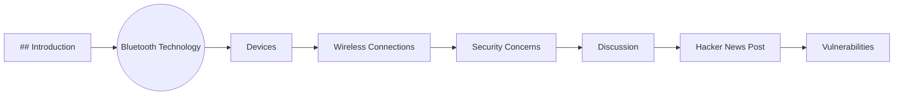
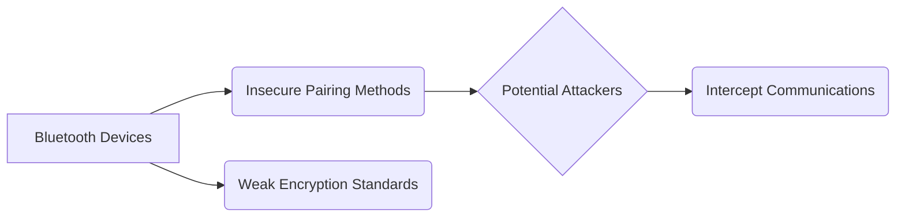

> **Attribution:** This article was based on content by **@transpute** on **hackernews**.  
> Original: https://www.semanticscholar.org/paper/Is-Your-Bluetooth-Chip-Leaking-Secrets-via-RF-Ji-Dubrova/c1d3ceb47ea6f9cc4f29929e2f97d36862a260a2

## Introduction

<!-- ASCII: ASCII network diagram for Introduction -->

<div align="center">

```
┌─────────┐      ┌─────────┐
│ Devices │──────│Bluetooth│
└─────────┘      └─────────┘
```

</div>

*Figure: Introduction*

<!-- MERMAID: Data flow/pipeline diagram for Introduction -->



In our increasingly connected world, Bluetooth technology plays a vital role in enabling seamless communication between devices. From headphones to smart home appliances, Bluetooth allows for convenient wireless connections. However, the very nature of Bluetooth's radio frequency (RF) signals raises significant security concerns. A recent discussion sparked by a Hacker News post titled “Is Your Bluetooth Chip Leaking Secrets via RF Signals?” highlights the vulnerabilities inherent in Bluetooth chips and their potential to leak sensitive information (transpute). This article dives into the intricacies of Bluetooth technology, examines the security vulnerabilities associated with RF signals, and offers practical insights for developers and tech professionals on how to mitigate these risks.

### Key Takeaways

- Bluetooth technology, while convenient, has inherent security vulnerabilities related to RF signal interception.
- Recent research has identified specific weaknesses in Bluetooth chips that can lead to data leakage.
- Best practices for securing Bluetooth devices include robust encryption, updated firmware, and careful management of device pairings.
- Understanding the differences between Bluetooth Classic and Bluetooth Low Energy (BLE) is crucial for addressing security concerns.

## Understanding Bluetooth Technology and Its Vulnerabilities

Bluetooth technology operates within the 2.4 GHz ISM band, allowing devices to connect and communicate over short distances using RF signals. It employs various protocols to establish secure connections, including encryption and authentication mechanisms. However, despite advancements, Bluetooth security remains a pressing issue due to its susceptibility to RF signal interception.

> Background: RF signals are electromagnetic waves used in wireless communication that can be intercepted by unauthorized parties.

### The Evolution of Bluetooth Security

Bluetooth has undergone significant evolution, with versions like Bluetooth 5.0 enhancing range, speed, and energy efficiency. However, these improvements have not entirely resolved security vulnerabilities. Notable incidents, such as the "BlueBorne" attack vector, have exemplified how attackers exploit weaknesses in Bluetooth implementations to gain unauthorized access to devices (Zhao et al., 2019).

Research by [Ji and Dubrova (2022)](https://arxiv.org/abs/2202.11549) specifically highlights concerns about data leakage through RF signals in Bluetooth chips. They found that certain devices, particularly those lacking robust security measures, are more vulnerable to data interception. This raises critical questions about the effectiveness of existing security protocols and the ongoing need for improvements in Bluetooth security practices.

### Types of Vulnerabilities in Bluetooth Chips

<!-- MERMAID: Data flow/pipeline diagram for Types of Vulnerabilities in Bluetooth Chips -->



Bluetooth devices face several types of vulnerabilities, including:

1. **Insecure Pairing Methods**: Many devices use pairing methods that do not adequately authenticate connections, allowing potential attackers to intercept communications. For example, Simple Secure Pairing (SSP) has been implemented in newer Bluetooth versions, but older devices may still rely on less secure methods.

1. **Weak Encryption Standards**: While modern Bluetooth versions support stronger encryption protocols, legacy devices may use outdated encryption methods, making them susceptible to attacks. Researchers have shown that weak encryption can be exploited to decipher sensitive data (Saha et al., 2021).

1. **RF Signal Interception**: The nature of RF signals makes them vulnerable to interception. Attackers can use specialized equipment to capture these signals and potentially extract transmitted data. This risk is particularly pronounced in crowded environments where multiple devices operate simultaneously.

## Practical Implications for Developers and Tech Professionals

For tech professionals and developers, understanding these vulnerabilities is crucial for creating secure Bluetooth applications. Here are several best practices to mitigate risks:

### 1. Implement Strong Encryption

Ensure that your Bluetooth applications use the latest encryption standards. Transitioning to protocols that support AES (Advanced Encryption Standard) can significantly enhance security. Regularly update your applications to incorporate the latest security patches and protocols.

### 2. Use Secure Pairing Methods

Encourage the adoption of secure pairing methods, such as SSP, to authenticate device connections. Avoid using legacy pairing methods that lack sufficient security measures and educate users about the importance of secure pairing.

### 3. Regular Firmware Updates

Encourage users to regularly update their device firmware. Many manufacturers release updates that address known vulnerabilities. Keeping devices updated is a critical step in maintaining security.

### 4. Educate Users on Bluetooth Security

Tech professionals should prioritize user education about Bluetooth security risks. Provide resources that inform users about best practices for managing Bluetooth connections, such as disabling Bluetooth when not in use and being cautious about pairing with unknown devices.

### 5. Monitor for Anomalous Behavior

Implement monitoring solutions that can detect unusual behavior in Bluetooth communications. This can help identify potential security breaches and allow for prompt intervention.

## Conclusion

The vulnerabilities associated with Bluetooth technology are a significant concern for both developers and users. While advancements in Bluetooth versions have improved security, issues related to RF signal interception and weak encryption persist. By understanding these vulnerabilities and implementing best practices, tech professionals can enhance the security of Bluetooth applications and protect user data.

As the landscape of wireless communication continues to evolve, ongoing research and development in Bluetooth security are crucial. Staying informed about the latest threats and mitigation strategies will empower developers to build more secure applications, ultimately fostering greater trust in Bluetooth technology.

### Further Reading

For those interested in exploring the research that sparked this discussion, you can read the original paper by Ji and Dubrova (2022) titled "Is Your Bluetooth Chip Leaking Secrets via RF Signals?" available at [Semantic Scholar](https://www.semanticscholar.org/paper/Is-Your-Bluetooth-Chip-Leaking-Secrets-via-RF-Ji-Dubrova/c1d3ceb47ea6f9cc4f29929e2f97d36862a260a2).

#### Source Attribution

This article was inspired by a Hacker News post by @transpute, discussing the potential vulnerabilities of Bluetooth chips in relation to RF signal leakage.


## References

- [Is Your Bluetooth Chip Leaking Secrets via RF Signals?](https://www.semanticscholar.org/paper/Is-Your-Bluetooth-Chip-Leaking-Secrets-via-RF-Ji-Dubrova/c1d3ceb47ea6f9cc4f29929e2f97d36862a260a2) — @transpute on hackernews

- [Ji and Dubrova (2022)](https://arxiv.org/abs/2202.11549)