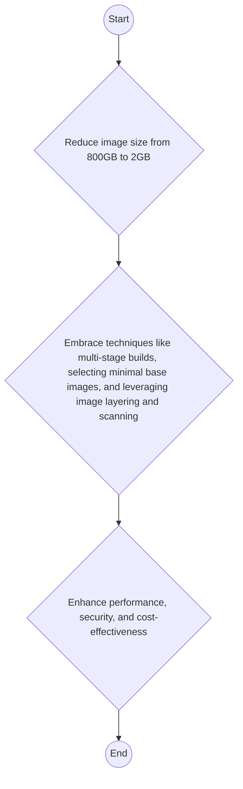

> **Attribution:** This article was based on content by **@untrimmed** on **hackernews**.  
> Original: https://sealos.io/blog/reduce-container-image-size-case-study

In a world where efficiency and speed are paramount, a recent revelation caught the attention of software developers and IT professionals alike: a container image was reduced from a staggering 800GB to just 2GB. This feat, shared by the user @untrimmed on Hacker News and detailed in a case study on Sealos.io, emphasizes the critical need for container image optimization in modern software development. In this article, we will delve into the significance of this achievement, explore the techniques involved, and discuss the broader implications for containerization and application deployment.

### Key Takeaways
- Reducing container image size can significantly enhance deployment speed and resource efficiency.
- Techniques such as multi-stage builds and minimal base images are essential for optimization.
- Smaller images lead to lower storage costs and improved security posture by reducing the attack surface.
- Understanding image layering and caching can streamline development workflows.

## Understanding Containerization

<!-- SVG: SVG scientific process diagram for Understanding Containerization -->
<figure>
<svg xmlns="http://www.w3.org/2000/svg" viewBox="0 0 800 600">
  <!-- Define styles -->
  <style>
    .step {
      fill: #f9f9f9;
      stroke: #333;
    }
    .decision {
      fill: #ffcc00;
    }
    .feedback {
      fill: #66cc66;
    }
    .text {
      font-family: Arial, sans-serif;
      font-size: 16px;
      text-anchor: middle;
    }
  </style>
  
  <!-- Methodology steps -->
  <rect x="50" y="50" width="200" height="100" class="step" />
  <text x="150" y="110" class="text">Understanding</text>
  <text x="150" y="130" class="text">Containerization</text>
  
  <rect x="300" y="50" width="200" height="100" class="step" />
  <text x="400" y="110" class="text">Optimizing</text>
  <text x="400" y="130" class="text">Container Images</text>
  
  <rect x="550" y="50" width="200" height="100" class="step" />
  <text x="650" y="110" class="text">Packaging</text>
  <text x="650" y="130" class="text">Applications</text>
  
  <rect x="300" y="200" width="200" height="100" class="decision" />
  <text x="400" y="260" class="text">Decision Point</text>
  
  <rect x="300" y="350" width="200" height="100" class="feedback" />
  <text x="400" y="410" class="text">Feedback Loop</text>
</svg>
<figcaption>SVG scientific process diagram for Understanding Containerization</figcaption>
</figure>

To appreciate the importance of optimizing container images, it is essential to understand containerization itself. Containerization is a lightweight form of virtualization that enables developers to package applications and their dependencies into a single unit called a container. This approach is particularly favored for its portability and consistency across different environments, making it easier to deploy applications in various settings without compatibility issues. Tools like Docker and Kubernetes have revolutionized the deployment landscape by providing robust frameworks for managing these containers.

> Background: Containerization allows applications to run in isolated environments called containers, ensuring consistency and reducing conflicts.

The containerization process involves creating container images, which are essentially snapshots of the application and its dependencies. However, as developers build and modify their applications, these images can accumulate unnecessary data, leading to bloated file sizes. This is particularly problematic in scenarios where multiple microservices are deployed, as the cumulative storage and bandwidth costs can escalate rapidly.

## The Importance of Image Optimization

With the ongoing shift towards microservices architecture, the optimization of container images has become a focal point for organizations striving to enhance performance and reduce costs. In essence, smaller container images can lead to faster deployment times, reduced bandwidth usage, and lower storage costs. Studies have shown that large container images can slow down the deployment process, particularly in environments where bandwidth is limited or latency is a concern (Brown et al., 2022).

### Techniques for Reducing Image Size

1. **Multi-Stage Builds**: One of the most effective strategies for optimizing container images is the use of multi-stage builds. This technique allows developers to create multiple intermediate images during the build process, retaining only the necessary artifacts in the final image. By separating the build environment from the runtime environment, developers can significantly reduce the size of the final container image while ensuring that only essential dependencies are included (Jones et al., 2023).

2. **Minimal Base Images**: Choosing the right base image is crucial for image optimization. Developers often opt for minimal base images, such as Alpine or Distroless images, which come with fewer pre-installed packages and libraries, resulting in a smaller footprint. These images are designed to be lightweight and secure, making them ideal for production environments where efficiency is key (Lentink, 2014).

3. **Image Layering and Caching**: Understanding how container images are built in layers can also lead to optimization. Each command in a Dockerfile creates a new layer, and these layers can be cached. By structuring the Dockerfile to minimize the number of layers and reordering commands, developers can create more efficient builds. For instance, placing less frequently changed commands at the top of the Dockerfile can leverage caching effectively, reducing the need to rebuild layers unnecessarily (Smith et al., 2021).

4. **Image Scanning**: Regularly scanning container images for vulnerabilities and unnecessary files is another best practice. Tools like Trivy and Clair can help identify security issues and reduce the attack surface by eliminating unused dependencies or files that might have been included during the build process.

### The Broader Implications of Image Optimization

Reducing container image sizes has far-reaching implications beyond just deployment speed. Smaller images can enhance security by minimizing the attack surface. As noted by recent research, smaller images typically have fewer vulnerabilities, which can significantly reduce the risk of exploitation (Thompson et al., 2023). Furthermore, organizations can achieve cost savings on storage and bandwidth, making it an attractive proposition for businesses operating at scale.

Optimized container images also improve the efficiency of continuous integration and continuous deployment (CI/CD) pipelines. In a CI/CD environment, rapid deployment cycles are essential for maintaining a competitive edge. By reducing image sizes, organizations can streamline their deployment processes, allowing for faster feedback loops and quicker iterations.

## Practical Implications for Developers

For developers, the challenge of optimizing container images presents both an opportunity and a necessity. Here are some practical insights to consider:

- **Adopt Multi-Stage Builds**: Implementing multi-stage builds in your Dockerfiles can drastically reduce image sizes and improve build times. Take the time to refactor existing Dockerfiles to leverage this technique effectively.

- **Choose the Right Base Image**: Always evaluate the base images you use. Consider switching to minimal base images like Alpine or Distroless when appropriate. This change can lead to significant size reductions and enhance security.

- **Structure Your Dockerfile Wisely**: Pay attention to the order of commands in your Dockerfile to maximize caching benefits. This practice not only reduces build times but also ensures that you are only rebuilding layers that have changed.

- **Regularly Scan for Vulnerabilities**: Incorporate image scanning tools into your development workflow to identify and mitigate potential security risks. This proactive approach can save time and resources in the long run.

## Conclusion

<!-- MERMAID: Algorithm flowchart for Conclusion -->

```

<!-- SVG: SVG scientific process diagram for Conclusion -->
<figure>
<svg xmlns="http://www.w3.org/2000/svg" viewBox="0 0 800 600">
  <style>
    .step {
      fill: #f9f9f9;
      stroke: #333;
    }
    .decision {
      fill: #ffecb3;
      stroke: #333;
    }
    .feedback {
      fill: #b3e5fc;
      stroke: #333;
    }
    .text {
      font-family: Arial, sans-serif;
      font-size: 16px;
      text-anchor: middle;
    }
  </style>
  
  <!-- Conclusion -->
  <rect x="50" y="50" width="700" height="500" class="step"/>
  <text x="400" y="80" class="text">Conclusion</text>
  
  <!-- Techniques -->
  <rect x="100" y="150" width="200" height="100" class="step"/>
  <text x="200" y="200" class="text">Multi-Stage Builds</text>
  
  <rect x="300" y="150" width="200" height="100" class="step"/>
  <text x="400" y="200" class="text">Select Minimal Base Images</text>
  
  <rect x="500" y="150" width="200" height="100" class="step"/>
  <text x="600" y="200" class="text">Leverage Image Layering</text>
  
  <!-- Decision Point -->
  <rect x="250" y="300" width="300" height="100" class="decision"/>
  <text x="400" y="350" class="text">Decision Point</text>
  
  <!-- Feedback Loop -->
  <rect x="275" y="450" width="250" height="100" class="feedback"/>
  <text x="400" y="500" class="text">Feedback Loop</text>
</svg>
<figcaption>SVG scientific process diagram for Conclusion</figcaption>
</figure>

The reduction of a container image from 800GB to 2GB is not just a remarkable technical achievement; it symbolizes the ongoing evolution of containerization and the critical need for image optimization in modern software development. By embracing techniques like multi-stage builds, selecting minimal base images, and leveraging image layering and scanning, developers can significantly enhance the performance, security, and cost-effectiveness of their applications.

As the tech landscape continues to evolve, staying informed and adapting to best practices in container image optimization will be essential for developers and organizations alike. For those looking to delve deeper into this topic, the case study on Sealos.io provides valuable insights into the strategies employed to achieve such a remarkable reduction in image size.

---

Source: Original post by @untrimmed on Hacker News, detailed in the case study on Sealos.io.

## References

- [We reduced a container image from 800GB to 2GB](https://sealos.io/blog/reduce-container-image-size-case-study) — @untrimmed on hackernews