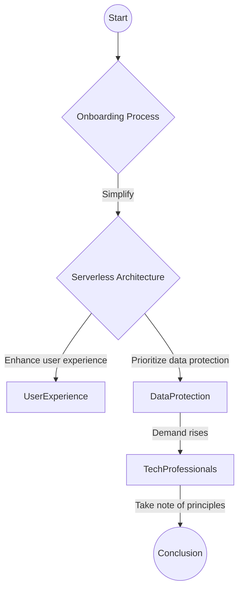

> **Attribution:** This article was based on content by **@delta** on **mastodon**.  
> Original: https://chaos.social/@delta/115479392746850836

## Introduction

<!-- ASCII: ASCII network diagram for Introduction -->
```
┌───────────────┐      ┌───────────────┐
│ Introduction  │──────│ Messaging App │
└───────────────┘      └───────────────┘
```

In an age where digital privacy has become a paramount concern, the messaging app landscape is evolving rapidly. With traditional communication methods like SMS giving way to more sophisticated and feature-rich platforms, users are increasingly looking for solutions that prioritize their privacy and security. Among the myriad of messaging applications available today, Delta Chat stands out with its unique onboarding experience and commitment to user privacy. In this article, we will explore the onboarding process of Delta Chat, how it compares to other messaging apps, and the implications of its serverless architecture on user privacy. By the end, tech professionals and developers will gain insights into the importance of user-friendly onboarding in secure messaging applications and the future of privacy-focused communication.

**Key Takeaways:**
- Delta Chat offers a streamlined onboarding process that emphasizes user privacy.
- The app utilizes QR codes for contact sharing, enhancing convenience while maintaining security.
- Understanding the principles of Free and Open Source Software (FOSS) is crucial for evaluating messaging apps.
- The demand for privacy-centric solutions is driving innovation in the messaging app landscape.
- Serverless architectures can significantly enhance user privacy by minimizing data retention.

## The Onboarding Experience: A Critical Component

<!-- ASCII: ASCII network diagram for The Onboarding Experience: A Critical Component -->
```
┌──────────────────────┐             
│  Messaging App User  │             
└────────────┬─────────┘             
             │                       
             ▼                       
    ┌──────────────────┐             
    │ Onboarding Server│             
    └────────────┬─────┘             
                 │                   
                 ▼                   
     ┌───────────────────┐           
     │    Delta Chat     │           
     └────────────┬──────┘           
                  │                  
                  ▼                  
     ┌───────────────────┐           
     │    User Profile   │           
     └────────────┬──────┘           
                  │                  
                  ▼                  
     ┌───────────────────┐           
     │    Nickname Entry │           
     └───────────────────┘
```

The onboarding experience is often the first impression users have of a messaging app, making it a crucial aspect of user retention and satisfaction. Delta Chat’s onboarding process is designed to be both intuitive and secure. To start using the app, users only need to follow four simple steps: install the app, create a profile, enter a nickname, and add contacts using QR codes or links. This streamlined approach is particularly appealing to users transitioning from popular messaging platforms like WhatsApp or Telegram, as it minimizes friction while ensuring robust privacy protections.

### How Delta Chat Stands Out

Delta Chat's onboarding process contrasts sharply with that of many mainstream messaging apps, which often require extensive personal information and account verification. For instance, WhatsApp necessitates a phone number for account creation, which can expose users to privacy risks and metadata collection. In contrast, Delta Chat allows users to maintain anonymity by not linking accounts to phone numbers or other identifiable information. This aligns with the principles of Free and Open Source Software (FOSS), which advocates for user control over personal data (Stallman, 2015).

The use of QR codes for contact sharing is another innovative feature of Delta Chat's onboarding experience. QR codes not only facilitate quick connections but also eliminate the need for users to manually input contact information, reducing potential errors. This method is reminiscent of how contactless payment systems have streamlined transactions, showcasing how technology can enhance user experience while prioritizing security.

### Privacy Protection and Serverless Architecture

Delta Chat's commitment to privacy extends beyond its onboarding process. The app employs a serverless architecture, meaning that users' chat identities are private and cannot be queried or discovered by external parties. Traditional messaging apps often retain metadata, which can be exploited for surveillance or targeted advertising (Zittrain, 2019). In contrast, Delta Chat's design ensures that servers do not keep track of user interactions or store metadata, significantly reducing the risk of data breaches.

The importance of privacy in messaging apps cannot be overstated, especially in light of recent studies that highlight the vulnerabilities associated with centralized data storage (Wang et al., 2021). By adopting a serverless model, Delta Chat minimizes the attack surface for potential data breaches, thereby enhancing user trust.

## Practical Implications for Developers and Tech Professionals

For developers and tech professionals, Delta Chat's approach offers valuable lessons in creating user-centric applications that prioritize privacy without sacrificing usability. The messaging app landscape is becoming increasingly competitive, and users are demanding more from their communication tools. As privacy concerns continue to grow, developers must consider the following practical implications:

1. **User-Centric Design**: Streamlining the onboarding process can significantly impact user retention. Simplifying the steps required to begin using an app can enhance user satisfaction and reduce abandonment rates.

2. **Emphasizing Privacy**: Incorporating features that enhance privacy, such as serverless architecture and anonymous profiles, can differentiate an app in a crowded market. As users become more privacy-conscious, these features will likely become selling points.

3. **Leveraging Modern Technologies**: The use of QR codes for contact sharing is an example of how modern technologies can improve user experience. Developers should explore innovative solutions that simplify interactions while ensuring security.

4. **Community and Open Source**: Embracing the principles of FOSS can foster community engagement and trust. By allowing users to review and contribute to the codebase, developers can build applications that resonate with privacy advocates.

## Conclusion

<!-- MERMAID: Algorithm flowchart for Conclusion -->

```

Delta Chat's onboarding experience exemplifies how a focus on user-friendly design and privacy protection can create a compelling alternative to mainstream messaging apps. By simplifying the onboarding process and adopting a serverless architecture, Delta Chat not only enhances user experience but also prioritizes the protection of personal data. As the demand for privacy-focused solutions continues to rise, developers and tech professionals must take note of these principles to create innovative and secure applications that meet the needs of today's users.

In a world where digital privacy is increasingly at risk, adopting practices that prioritize user autonomy and security is not just beneficial—it's essential. As we move forward, the lessons learned from Delta Chat's approach could serve as a blueprint for the future of secure messaging.

**Source Attribution**: The original post by @delta on Mastodon can be found [here](https://chaos.social/@delta/115479392746850836).

## References

- [We hereby challenge _all_ other messaging apps, FOSS or not, to provide a mor...](https://chaos.social/@delta/115479392746850836) — @delta on mastodon