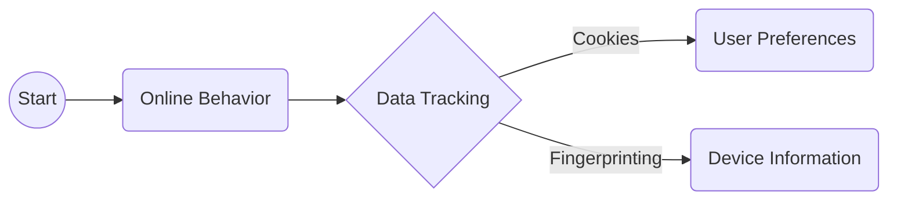
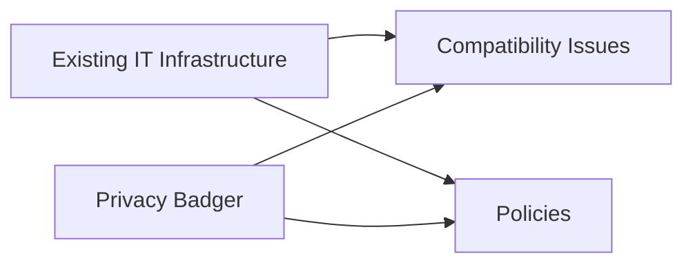

> **Attribution:** This article was based on content by **@eff** on **mastodon**.  
> Original: https://mastodon.social/@eff/115482124753215002

## Introduction

<!-- MERMAID: Data flow/pipeline diagram for Introduction -->

In an era where online privacy is under constant threat from pervasive data tracking, organizations like schools and libraries face unique challenges in safeguarding their users' personal information. The Electronic Frontier Foundation (EFF) has developed a powerful tool called Privacy Badger, a browser extension designed to block invisible trackers that compromise user privacy. This blog post will explore the significance of deploying Privacy Badger on managed devices in educational and public institutions, how it functions, and the broader implications for data security and IT management.

### Key Takeaways

- **Privacy Badger** automatically blocks trackers, enhancing user privacy in managed environments.
- Implementing Privacy Badger can help organizations comply with data protection regulations.
- IT teams play a crucial role in maintaining software solutions like Privacy Badger across devices.
- Understanding online privacy tools is essential for fostering digital literacy among users.
- The deployment of Privacy Badger can improve user experience while navigating educational and library content.

## Understanding Privacy and Data Tracking

<!-- MERMAID: Data flow/pipeline diagram for Understanding Privacy and Data Tracking -->

The contemporary digital landscape is fraught with privacy concerns as users navigate websites that often track their online behavior without explicit consent. Online tracking can take many forms, from cookies that remember user preferences to sophisticated fingerprinting techniques that create unique profiles based on device information (Mansfield-Devine, 2020).

> Background: Online tracking refers to the collection of data about users' online activities, often for advertising purposes.

Privacy Badger directly addresses these challenges by automatically identifying and blocking trackers that violate user privacy. Unlike traditional ad blockers that require user input to filter content, Privacy Badger employs an algorithm that learns from users' browsing habits, thus adapting its blocking capabilities over time (Electronic Frontier Foundation, 2023).

The significance of deploying such tools in managed environments, particularly in schools and libraries, cannot be overstated. Here, users often include minors who may not fully understand the implications of data tracking. Research by [Livingstone et al. (2017)](https://doi.org/10.5194/tc-2017-236-rc1) suggests that a lack of awareness regarding online privacy issues can lead to risky behavior among young internet users. Consequently, organizations have a responsibility to protect their users by implementing robust privacy solutions.

## The Role of IT Management in Deploying Privacy Tools

For organizations with managed devices, effective IT management is essential in deploying and maintaining privacy tools like Privacy Badger. IT teams must ensure that all devices across the network are equipped with the necessary software to safeguard user privacy. This involves not only the initial installation but also ongoing updates and monitoring to adapt to evolving privacy threats.

### Integration with Existing IT Infrastructure

<!-- MERMAID: System architecture diagram for Integration with Existing IT Infrastructure -->

Integrating Privacy Badger into existing IT frameworks requires careful planning and execution. Organizations should assess their current software ecosystem, identifying potential compatibility issues with browsers and operating systems. Additionally, IT teams should establish clear policies regarding the use of privacy tools, including guidelines for users on how to report issues or seek assistance.

Research by [Dehghantanha et al. (2018)](https://doi.org/10.1007/978-3-319-73951-9_10) highlights the importance of comprehensive IT policies in safeguarding organizational data. By implementing Privacy Badger, organizations not only enhance user privacy but also bolster their overall data security strategy.

### Training and Education

Beyond the technical deployment, IT departments should invest in training programs to educate users about the importance of privacy tools. Digital literacy is critical; as users become more informed about online privacy, they are better equipped to navigate the digital landscape safely. Training sessions can cover topics such as recognizing tracking attempts, understanding the functionality of Privacy Badger, and the ethical considerations surrounding data collection.

## Practical Implications for Organizations

The deployment of Privacy Badger in managed environments offers several practical benefits for organizations, particularly in the context of compliance with data protection regulations. With increasing scrutiny on data collection practices, organizations must ensure they are taking proactive steps to protect user information.

### Compliance with Data Protection Regulations

In many jurisdictions, data protection regulations such as the General Data Protection Regulation (GDPR) in Europe impose strict requirements on organizations handling personal data. By implementing Privacy Badger, organizations can demonstrate their commitment to user privacy, thereby mitigating potential legal risks associated with non-compliance (Regan, 2018).

### Enhancing User Experience

Another critical consideration is the potential impact on user experience. While some may worry that blocking trackers could limit access to certain content, Privacy Badger is designed to enhance the browsing experience by allowing users to access educational resources without being bombarded by intrusive ads or trackers. This is particularly important in educational settings where access to information is paramount.

### Fostering Trust

Finally, deploying Privacy Badger can foster trust between users and organizations. When users feel that their privacy is being respected, they are more likely to engage with the services offered by schools and libraries. Research by Dinev and Hart (2006) indicates that perceived privacy protection can significantly influence user satisfaction and loyalty.

## Conclusion

In a world where online privacy is increasingly under threat, organizations such as schools and libraries have a crucial role to play in protecting their users. Deploying Privacy Badger on managed devices not only enhances privacy but also aligns with broader data security strategies and regulatory compliance. By investing in IT management, user education, and privacy tools, organizations can create a safer and more trusting environment for their users.

As we move forward in this digital age, it is essential for tech professionals and developers to advocate for privacy-conscious practices. Engaging with tools like Privacy Badger and understanding their implications can empower organizations to take meaningful steps towards safeguarding user privacy.

### Source Attribution

This article is inspired by a social media post from the Electronic Frontier Foundation (EFF) on Mastodon, which emphasizes the importance of deploying Privacy Badger in managed environments (EFF, 2025). For more information, visit the original post [here](https://mastodon.social/@eff/115482124753215002).

## References

- [Schools, libraries, and other organizations can make private browsing the nor...](https://mastodon.social/@eff/115482124753215002) — @eff on mastodon

- [Livingstone et al. (2017)](https://doi.org/10.5194/tc-2017-236-rc1)
- [Dehghantanha et al. (2018)](https://doi.org/10.1007/978-3-319-73951-9_10)