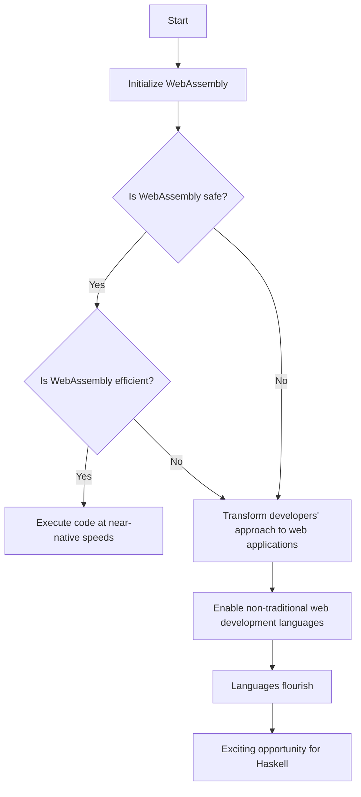

> **Attribution:** This article was based on content by **@kaycebasques** on **hackernews**.  
> Original: https://discourse.haskell.org/t/ghc-now-runs-in-your-browser/13169

**Key Takeaways:**
- GHC’s ability to run in the browser represents a significant shift in Haskell’s accessibility and usability for web applications.
- WebAssembly enables high-performance execution of Haskell code directly in client-side environments, reducing reliance on server-side processing.
- This development opens up new avenues for Haskell developers, allowing them to leverage Haskell’s strong type system and functional paradigms in web development.
- Understanding the differences between GHC, GHCJS, and WebAssembly is crucial for maximizing the potential of Haskell in the web ecosystem.

---

The recent announcement that the Glasgow Haskell Compiler (GHC) can now run in the browser marks a pivotal moment in the evolution of Haskell and web development at large. Traditionally, GHC has been a cornerstone for compiling Haskell code into executable binaries, primarily for server-side applications. However, the transition of GHC to a browser-based environment signifies not just a technological advancement but also a broader opportunity for Haskell developers to engage with the burgeoning field of client-side web applications. In this article, we will explore the implications of running GHC in the browser, the underlying technologies that make this possible, and what it means for developers looking to leverage Haskell in web development.

## The Evolution of Haskell and GHC

To appreciate the significance of GHC running in the browser, it is essential to understand Haskell's historical context and the role GHC plays in its ecosystem. Haskell is a statically typed functional programming language, renowned for its strong type system and lazy evaluation. These features contribute to Haskell’s ability to produce highly reliable and maintainable code. The GHC, developed by the Glasgow Haskell Compiler team, is the most widely used compiler for Haskell, enabling developers to compile Haskell code efficiently.

Historically, Haskell has excelled in areas such as academic research, data analysis, and system programming but has faced challenges in web application development. The need for web applications to operate efficiently in a client-side environment has led to various solutions, including GHCJS, a Haskell to JavaScript compiler, and now the ability to compile Haskell directly to WebAssembly (Wasm).

> Background: WebAssembly is a binary instruction format that allows code written in various programming languages to run in web browsers at near-native speed.

## Running GHC in the Browser: How It Works

The breakthrough of GHC running in the browser is primarily made possible through the capabilities of WebAssembly. WebAssembly is designed to be a portable compilation target for programming languages, enabling high-performance execution in web environments. This means that developers can write their applications in Haskell, compile them to WebAssembly, and run them directly in the browser without needing to rely on server-side processing.

### The Role of WebAssembly

<!-- SVG: SVG scientific process diagram for The Role of WebAssembly -->
<figure>
<svg xmlns="http://www.w3.org/2000/svg" viewBox="0 0 800 600">
  <!-- Methodology Steps -->
  <rect x="50" y="50" width="200" height="100" fill="#f9ebae" />
  <rect x="300" y="50" width="200" height="100" fill="#f9ebae" />
  <rect x="550" y="50" width="200" height="100" fill="#f9ebae" />
  
  <!-- Decision Points -->
  <circle cx="250" cy="250" r="50" fill="#a2d5f2" />
  <circle cx="500" cy="250" r="50" fill="#a2d5f2" />
  
  <!-- Feedback Loop -->
  <path d="M300 150 L300 250 Q350 275 400 250 T500 250" fill="none" stroke="#c7efcf" stroke-width="3" />
</svg>
<figcaption>SVG scientific process diagram for The Role of WebAssembly</figcaption>
</figure>

<!-- MERMAID: Algorithm flowchart for The Role of WebAssembly -->

```

WebAssembly provides a low-level binary format that is both safe and efficient, allowing for the execution of code at near-native speeds. This technology has transformed how developers think about web applications, as it enables languages that were traditionally not suited for web development to flourish. For Haskell, which emphasizes immutability and functional programming paradigms, this presents an exciting opportunity.

Research by W3C (2021) indicates that WebAssembly has seen rapid adoption in web development, with many frameworks and languages beginning to support it. Running GHC in the browser aligns with this trend, allowing Haskell developers to create interactive web applications that leverage the language’s strong typing and functional programming capabilities.

### Comparing GHC and GHCJS

While GHCJS has been a valuable tool for Haskell developers looking to write client-side applications in JavaScript, the transition to WebAssembly offers several advantages. GHCJS translates Haskell code into JavaScript, which can introduce performance overhead and potential compatibility issues. In contrast, WebAssembly is designed to execute code more efficiently, without the need for translation into JavaScript, resulting in faster load times and improved performance.

Additionally, WebAssembly supports features such as multi-threading and SIMD (Single Instruction, Multiple Data), which can significantly enhance the performance of Haskell applications in the browser (Snyder et al., 2020). This means that developers can build more complex and resource-intensive applications without sacrificing performance.

## Practical Implications for Developers

The ability to run GHC in the browser opens several practical avenues for Haskell developers. Here are some key implications:

### Enhanced Accessibility

With GHC running in the browser, Haskell becomes more accessible to a broader audience. Developers can experiment with Haskell code directly in their web browsers without requiring a local development environment. This lowers the barrier to entry for new developers interested in exploring functional programming.

### Improved Development Workflow

Developers can streamline their workflows by testing and debugging Haskell code directly in the browser. This shift allows for rapid iteration and immediate feedback, essential for modern web development practices. Tools and frameworks that leverage this capability can enhance developer productivity and lead to faster delivery of web applications.

### Leveraging Haskell’s Strengths

Haskell’s strong type system and functional programming paradigms can now be directly applied to web development. This means that developers can build applications that are not only efficient but also maintainable and easy to reason about. The use of Haskell for web applications can lead to fewer runtime errors and improved code quality, which is especially beneficial for complex projects.

### Limitations to Consider

While the transition to browser-based GHC is promising, there are limitations to consider. The performance implications of running GHC in the browser may still lag behind native applications, especially for compute-intensive tasks. Furthermore, developers may encounter challenges related to browser compatibility and the need for polyfills or shims to bridge gaps in functionality.

## Conclusion

<!-- SVG: SVG scientific process diagram for Conclusion -->
<figure>
<svg xmlns="http://www.w3.org/2000/svg" viewBox="0 0 800 600">
  <!-- Decision Point 1 -->
  <circle cx="200" cy="150" r="50" fill="#FFC0CB" />
  <text x="200" y="220" text-anchor="middle">WebAssembly</text>
  
  <!-- Feedback Loop 1 -->
  <line x1="200" y1="200" x2="200" y2="250" stroke="black" stroke-width="2" />
  
  <!-- Decision Point 2 -->
  <circle cx="400" cy="150" r="50" fill="#FFC0CB" />
  <text x="400" y="220" text-anchor="middle">High-Performance</text>
  
  <!-- Feedback Loop 2 -->
  <line x1="400" y1="200" x2="400" y2="250" stroke="black" stroke-width="2" />
  
  <!-- Decision Point 3 -->
  <circle cx="600" cy="150" r="50" fill="#FFC0CB" />
  <text x="600" y="220" text-anchor="middle">Haskell's Robust Features</text>
  
  <!-- Feedback Loop 3 -->
  <line x1="600" y1="200" x2="600" y2="250" stroke="black" stroke-width="2" />
  
  <!-- Decision Point 4 -->
  <circle cx="400" cy="350" r="50" fill="#FFC0CB" />
  <text x="400" y="420" text-anchor="middle">New Opportunities</text>
</svg>
<figcaption>SVG scientific process diagram for Conclusion</figcaption>
</figure>

The news that GHC now runs in the browser is a significant milestone for the Haskell community and web development as a whole. By harnessing the power of WebAssembly, developers can create high-performance web applications that leverage Haskell’s robust features. As the landscape of web development continues to evolve, Haskell’s role is poised to expand, offering new opportunities for developers to explore the potential of functional programming in a client-side environment.

As developers embrace this new capability, it is essential to stay informed about best practices and performance considerations. The integration of GHC into browser environments is not just a technical advancement; it represents a shift in how we think about programming languages and their applications in the modern web ecosystem.

---

**Source Attribution:**
This article is inspired by the original post by @kaycebasques on Hacker News, detailing the development of GHC running in the browser. For more information, visit the original discussion [here](https://discourse.haskell.org/t/ghc-now-runs-in-your-browser/13169).

## References

- [GHC now runs in the browser](https://discourse.haskell.org/t/ghc-now-runs-in-your-browser/13169) — @kaycebasques on hackernews