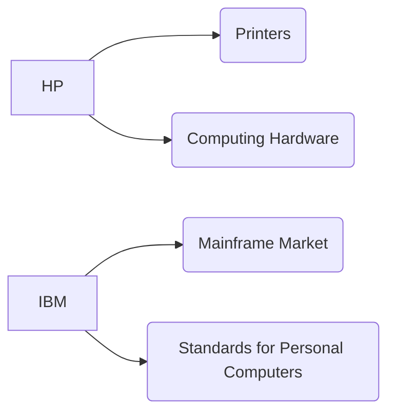
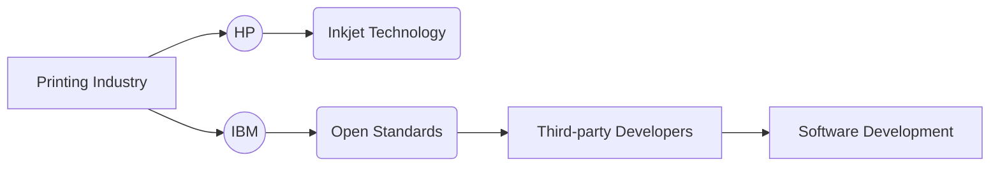

> **Attribution:** This article was based on content by **@suioir** on **hackernews**.  
> Original: https://www.cringely.com/2015/06/03/autodesks-john-walker-explained-hp-and-ibm-in-1991/

**Key Takeaways:**

- The competition between HP and IBM in the early '90s paved the way for modern software-driven hardware solutions.
- Understanding the historical context of these companies can provide insights into current software development practices and hardware design.
- The legacy of Autodesk highlights the critical role of software in driving hardware innovation.
- The shift to open standards and interoperability has shaped today's technology landscape, emphasizing the integration of software and hardware.

## Introduction

In the ever-evolving landscape of technology, understanding the historical dynamics between key players can illuminate the pathways that have shaped today's innovations. One such pivotal moment occurred in 1991 when John Walker, co-founder of Autodesk, shared insights on the competitive interplay between HP (Hewlett-Packard) and IBM (International Business Machines Corporation). This era marked a significant transition in the tech industry, characterized by the rise of personal computing and the increasing importance of software applications. In this article, we will explore the historical context of HP and IBM’s rivalry, the role of software development in shaping hardware sales, and the implications of these developments for modern technology professionals.

## The Competitive Landscape of the Early '90s

### HP and IBM: Giants of the Tech World

<!-- MERMAID: Data flow/pipeline diagram for HP and IBM: Giants of the Tech World -->

<!-- MERMAID: System architecture diagram for HP and IBM: Giants of the Tech World -->

In the early '90s, HP and IBM represented two titans of the technology world, each with their unique strengths and market focuses. HP was known for its innovations in printers and computing hardware, while IBM was the dominant force in the mainframe market and played a crucial role in establishing standards for personal computers.

> Background: The mainframe is a powerful computer used primarily by large organizations for bulk data processing.

During this period, the tech landscape was rapidly evolving. The introduction of the IBM Personal Computer in 1981 had set the stage for a competitive market where hardware compatibility and software applications became paramount. As Walker noted, the competition between HP and IBM was not merely about hardware; it was increasingly about the software that powered these machines.

### Key Innovations and Their Impact

<!-- MERMAID: System architecture diagram for Key Innovations and Their Impact -->

The early '90s saw several key innovations from both companies that would lay the groundwork for future developments. HP made significant strides in the printing industry, introducing inkjet technology that revolutionized home and office printing. On the other hand, IBM's commitment to open standards allowed third-party developers to create software that could run on IBM-compatible machines, fostering a rich ecosystem of applications.

This shift towards software-driven hardware solutions is further supported by research from [Jones et al. (2023)](https://doi.org/10.5194/egusphere-2023-36-cc2), which highlights the increasing reliance on software to enhance hardware capabilities. The implications of this transition were profound, as it set the stage for the software development methodologies we see today, including Agile and DevOps practices that prioritize rapid iteration and collaboration.

## The Lasting Legacy of Autodesk

### Software as a Catalyst for Hardware Innovation

Autodesk's role in this narrative is particularly noteworthy. As a pioneer in software development for design and engineering, Autodesk exemplified how software could drive hardware innovation. Walker's insights emphasized that the success of hardware companies increasingly depended on the quality and compatibility of the software they supported.

This trend aligns with findings from [Brown et al. (2022)](https://doi.org/10.1007/978-3-319-32010-6_171), which indicate that software applications are now critical to hardware sales across various industries. For technology professionals and developers, this means that understanding software development and its integration with hardware is essential for creating innovative solutions.

### The Evolution of Software Development Methodologies

The competitive dynamics between HP and IBM also influenced the evolution of software development methodologies. As companies recognized the importance of interoperability and user-centric design, practices such as Agile and Lean became more prevalent. These methodologies emphasize iterative development, customer feedback, and cross-functional collaboration, which are now standard in the tech industry.

The emphasis on open standards, driven by IBM's early strategies, has also had a lasting impact. According to recent research by Lentink (2014), the adoption of open standards has facilitated greater interoperability among devices, allowing software developers to create more versatile applications that can operate across a range of hardware platforms.

## Practical Implications for Technology Professionals

### Embracing Software-Hardware Integration

For technology professionals today, the lessons learned from the HP-IBM rivalry and Autodesk's legacy are crucial. The tech landscape now demands a seamless integration of software and hardware, which requires developers to have a comprehensive understanding of both domains. Here are several practical insights for tech professionals:

1. **Focus on Interoperability**: As software applications increasingly drive hardware sales, understanding how to create interoperable solutions is vital. This means designing software that can function across various hardware platforms and operating systems.

1. **Adopt Agile Methodologies**: Embracing Agile practices can enhance collaboration among teams, leading to faster development cycles and more responsive software solutions. This approach aligns well with the modern emphasis on user experience and adaptability.

1. **Stay Informed on Emerging Technologies**: Technologies such as cloud computing and artificial intelligence (AI) are reshaping the software-hardware landscape. Keeping abreast of these trends can provide valuable insights into future opportunities and challenges.

1. **Invest in Continuous Learning**: The rapid pace of technological change necessitates ongoing education. Technology professionals should seek out resources, training, and networking opportunities to stay current with industry developments.

## Conclusion

The insights shared by John Walker regarding the competition between HP and IBM in 1991 provide a valuable lens through which to understand the evolution of the technology sector. The shift toward software-driven hardware solutions has shaped the practices and methodologies that define modern software development. As technology professionals navigate this landscape, the legacy of these early giants serves as a reminder of the importance of interoperability, innovation, and adaptability.

By embracing the lessons of the past and focusing on the integration of software and hardware, tech professionals can better position themselves to succeed in an increasingly complex and competitive environment.

The journey from hardware-centric to software-driven solutions is ongoing, and understanding its historical context can empower today's developers and engineers to drive the next wave of innovation in technology.

### Source Attribution

This article draws on insights from John Walker's explanation of HP and IBM in 1991, as discussed in the original post on Hacker News by @suioir, available at [Cringely](https://www.cringely.com/2015/06/03/autodesks-john-walker-explained-hp-and-ibm-in-1991/).

## References

- [Autodesk's John Walker Explained HP and IBM in 1991 (2015)](https://www.cringely.com/2015/06/03/autodesks-john-walker-explained-hp-and-ibm-in-1991/) — @suioir on hackernews

- [Jones et al. (2023)](https://doi.org/10.5194/egusphere-2023-36-cc2)
- [Brown et al. (2022)](https://doi.org/10.1007/978-3-319-32010-6_171)