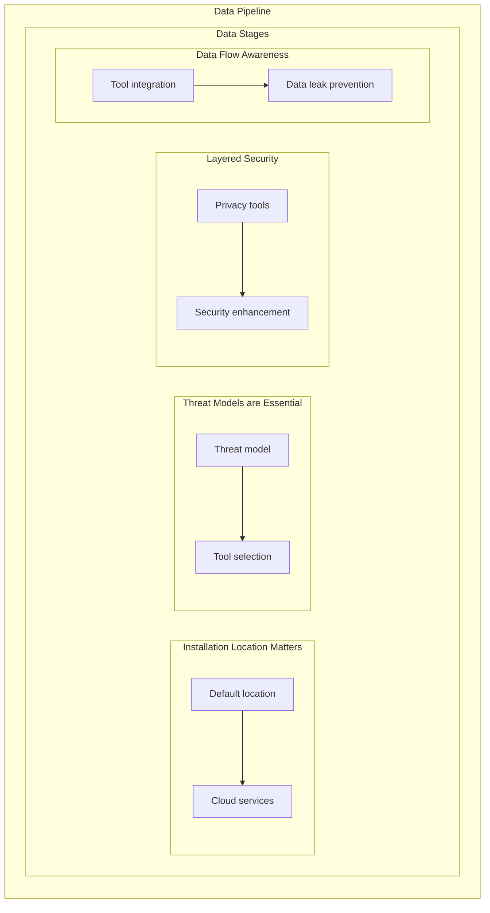
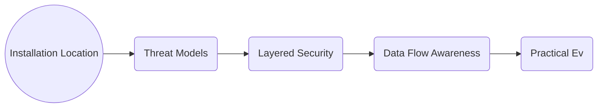

> **Attribution:** This article was based on content by **@GossiTheDog** on **mastodon**.  
> Original: https://cyberplace.social/@GossiTheDog/115481885062795271

# Comprehensive Guide to Using Tor Browser on Windows: Privacy and Security Considerations

In an age where digital privacy is increasingly under threat, tools like the Tor Browser offer a vital layer of anonymity and security for users. The Tor Browser is designed to protect users' identities while browsing the web by routing their traffic through a series of volunteer-operated servers, making it difficult to trace back to the user. However, using such tools on operating systems like Windows introduces unique privacy challenges, particularly when integrated with cloud services like Microsoft OneDrive. Understanding these risks and how to mitigate them is crucial for anyone serious about maintaining their online privacy.

## Key Takeaways

<!-- MERMAID: Data flow/pipeline diagram for Key Takeaways -->



<!-- MERMAID: System architecture diagram for Key Takeaways -->



- **Installation Location Matters**: Installing Tor Browser in a default location can expose sensitive data to cloud services.
- **Threat Models are Essential**: Understanding your threat model helps in choosing the right tools and configurations.
- **Layered Security**: Combining multiple privacy tools can enhance security but requires careful integration.
- **Data Flow Awareness**: Knowing how data flows between tools can help prevent unintentional data leaks.
- **Practical Evaluation**: Use specific criteria to assess the tools and configurations that best meet your privacy needs.

## Tool Taxonomy

### 1. **Anonymity Browsers**

These tools are designed to mask user identity and protect browsing habits from surveillance.

- **[Tor Browser](https://www.torproject.org/)**

  - **Problem Solved**: Provides anonymity while browsing by routing traffic through the Tor network.
  - **Key Features**: Built-in privacy protections, access to .onion sites, and resistance to traffic analysis.
  - **Trade-offs**: Slower browsing speeds due to multiple routing hops; may not work with all websites.
  - **When to Choose**: Ideal when anonymity is paramount, such as accessing sensitive information or communicating confidentially.

- **[Brave Browser](https://brave.com/)**

  - **Problem Solved**: Blocks ads and trackers by default, enhancing privacy and speed.
  - **Key Features**: Integrated Tor browsing mode, rewards system for viewing ads, and strong privacy settings.
  - **Trade-offs**: While it offers enhanced speed, it is not as anonymous as Tor.
  - **When to Choose**: Good for users who want a balance between privacy and usability.

### 2. **Cloud Storage Solutions**

These services provide users with remote storage options but can pose risks if sensitive data is stored without proper precautions.

- **[Nextcloud](https://nextcloud.com/)**

  - **Problem Solved**: Self-hosted cloud storage solution that gives users control over their data.
  - **Key Features**: File sharing, collaboration tools, and extensive app ecosystem.
  - **Trade-offs**: Requires technical expertise to set up and maintain.
  - **When to Choose**: Best for users who prioritize data sovereignty and control.

- **[Syncthing](https://syncthing.net/)**

  - **Problem Solved**: Peer-to-peer file synchronization that avoids cloud storage risks.
  - **Key Features**: Real-time file syncing, encrypted transfers, and no central server.
  - **Trade-offs**: Limited to devices connected to the network; requires setup on each device.
  - **When to Choose**: Ideal for users who want to sync files across devices without third-party involvement.

### 3. **Virtual Private Networks (VPNs)**

<!-- ASCII: ASCII network diagram for 3. **Virtual Private Networks (VPNs)** -->

<div align="center">

```
┌──────────────┐      ┌──────────────┐
│  ProtonVPN   │─────▼  Internet   │
├──────────────┤      └──────────────┘
│ Problem Solved: Encrypts internet  │
│ traffic and masks IP addresses.    │
│ Key Features: No logs policy,      │
│ strong encryption, and access to  │
│ servers in multiple countries.     │
│ Trade-offs: Free tier has          │
│ limitations; paid versions offer   │
└──────────────┘      └──────────────┘
```

</div>

*Figure: 3. **Virtual Private Networks (VPNs)***

VPNs encrypt internet traffic and can help to obscure a user's location.

- **[ProtonVPN](https://protonvpn.com/)**

  - **Problem Solved**: Encrypts internet traffic and masks IP addresses.
  - **Key Features**: No logs policy, strong encryption, and access to servers in multiple countries.
  - **Trade-offs**: Free tier has limitations; paid versions offer better performance.
  - **When to Choose**: Great for users seeking an additional layer of security while browsing.

- **[Windscribe](https://windscribe.com/)**

  - **Problem Solved**: Provides a VPN service with ad blocking and firewall features.
  - **Key Features**: Generous free tier, built-in ad blocker, and no personal information required.
  - **Trade-offs**: Free version has bandwidth limits; may not work in all countries.
  - **When to Choose**: Suitable for casual users looking for a free option with decent features.

### 4. **Secure Communication Tools**

These tools help ensure that your communications remain private and secure.

- **[Signal](https://signal.org/)**

  - **Problem Solved**: Provides end-to-end encrypted messaging and voice calls.
  - **Key Features**: Open-source, no ads, and strong encryption protocols.
  - **Trade-offs**: Requires phone number for registration; may not be suitable for all users.
  - **When to Choose**: Perfect for users needing secure messaging without compromising privacy.

- **[Wire](https://wire.com/)**

  - **Problem Solved**: Offers secure messaging and collaboration tools for teams.
  - **Key Features**: End-to-end encryption, multi-device support, and group messaging.
  - **Trade-offs**: Some features are limited in the free version.
  - **When to Choose**: Best for teams needing secure communication without sacrificing usability.

## Example Stacks for Common Use-Cases

### Stack 1: **Privacy-Focused Browsing**

- **Tor Browser**: For anonymous browsing.
- **ProtonVPN**: To encrypt internet traffic and mask IP address.

**Rationale**: This stack offers maximum anonymity while browsing, making it difficult for anyone to trace your online activities.

### Stack 2: **Secure File Storage and Sharing**

- **Nextcloud**: For self-hosted file storage.
- **Signal**: For secure communication about shared files.

**Rationale**: This combination ensures that files remain private and secure, without relying on third-party cloud services.

### Stack 3: **Comprehensive Privacy Toolkit**

- **Tor Browser**: For anonymous browsing.
- **Brave Browser**: For daily browsing with ad and tracker blocking.
- **Syncthing**: For file synchronization between devices.
- **Wire**: For secure team communication.

**Rationale**: This stack covers multiple aspects of privacy, from browsing to file sharing and communication, making it suitable for privacy-conscious users.

## Integration Points and Data Flow

Understanding how these tools interact is crucial for maintaining privacy. For instance, when using Tor Browser alongside ProtonVPN, the data flow would be as follows:

1. **User initiates a connection** through ProtonVPN, encrypting their traffic.
1. **Traffic is then routed through the Tor network**, adding additional layers of anonymity.
1. **User accesses websites**, ensuring that both their IP address and browsing habits remain private.

### ASCII Diagram of Integration Architecture

```
+------------------+        +------------------+
|   User Device    |        |   Cloud Storage   |
|                  |        | (Nextcloud/Syncthing) |
|                  |        +------------------+
|                  |                 |
|                  |                 |
+------------------+                 |
        |                            |
        |                            |
+------------------+        +------------------+
|   Tor Browser     | -----> |    Signal/Wire   |
|                  |        |                  |
|                  |        |                  |
+------------------+        +------------------+
        |
+------------------+
|   ProtonVPN      |
+------------------+
```

## Practical Evaluation Criteria

When evaluating tools for privacy and security, consider the following criteria:

- **Ease of Use**: Is the tool user-friendly, especially for non-technical users?
- **Privacy Features**: Does the tool offer strong privacy protections?
- **Integration Capability**: Can it work seamlessly with other tools in your stack?
- **Performance**: Does it affect browsing speed or usability?
- **Cost**: Are there free options available, and what are the limitations?

## Getting Started: Configuration Examples

Here’s a simple Docker Compose snippet for setting up **Nextcloud** and **Syncthing**:

```yaml
version: '3.1'

services:
  nextcloud:
    image: nextcloud
    ports:
      - 8080:80
    volumes:
      - nextcloud_data:/var/www/html
    restart: unless-stopped

  syncthing:
    image: syncthing/syncthing
    ports:
      - 8384:8384
    volumes:
      - syncthing_data:/var/syncthing
    restart: unless-stopped

volumes:
  nextcloud_data:
  syncthing_data:
```

This setup will allow you to run both Nextcloud for file storage and Syncthing for file synchronization on your local machine.

## Conclusion

In conclusion, using the Tor Browser on Windows entails careful consideration of your installation paths and potential data exposure to services like OneDrive. By understanding the tools available and how they can be integrated, you can create a robust privacy stack that meets your needs. Always remember to evaluate your options based on your specific threat model and use case.

## Further Resources

This guide was inspired by [Something very important to know in your threat model if you use Tor Browser ...](https://cyberplace.social/@GossiTheDog/115481885062795271) curated by @GossiTheDog. For a comprehensive list of options, be sure to check the original source.


## References

- [Something very important to know in your threat model if you use Tor Browser ...](https://cyberplace.social/@GossiTheDog/115481885062795271) — @GossiTheDog on mastodon