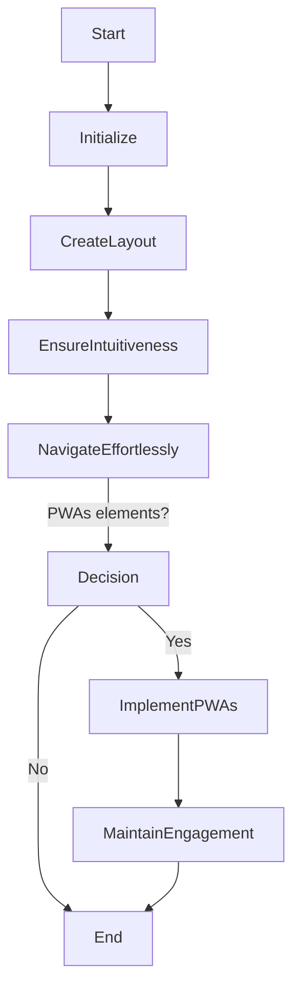

> **Attribution:** This article was based on content by **@birriel** on **hackernews**.  
> Original: https://blog.google/technology/google-labs/pomelli/

In the rapidly evolving landscape of web development, staying ahead of the curve requires both innovative tools and a grasp of emerging trends. Enter Pomelli, a new initiative from Google Labs aimed at enhancing the development experience for programmers of all skill levels. By offering a suite of tools designed to streamline the development process, Pomelli promises to reshape how developers approach building applications. In this article, we will explore what Pomelli is, its features, its relevance in the current tech ecosystem, and what it means for developers moving forward.

### Key Takeaways
- Pomelli is a new tool from Google Labs aimed at improving web development productivity.
- It is part of a larger trend toward low-code and no-code platforms.
- Understanding web development fundamentals and agile methodologies can enhance the effective use of Pomelli.
- Integration with existing Google services and third-party applications is a significant feature.
- The rise of Progressive Web Apps (PWAs) and APIs plays a crucial role in Pomelli's functionality.

## Understanding Pomelli

### What is Pomelli?
Pomelli is a web development tool currently in the experimental phase at Google Labs. Google Labs is a platform where the company explores and tests new technologies and concepts before potentially releasing them to the public. Pomelli aims to simplify the development process for both seasoned developers and those with minimal coding experience, fitting into the broader trend of low-code and no-code platforms.

> Background: Low-code and no-code platforms enable users to build applications with minimal programming knowledge, focusing instead on visual development and intuitive interfaces.

Pomelli offers an array of features designed to facilitate collaboration and enhance productivity. These may include drag-and-drop interfaces, pre-built templates, and integrations with popular APIs, allowing developers to quickly prototype and iterate on their ideas. The goal is to reduce the barriers to entry in web development while still providing powerful tools for advanced users.

### The Competitive Landscape
As of October 2023, Pomelli enters a competitive market filled with various web development tools, including established players like Wix, Squarespace, and more developer-focused environments like Visual Studio Code and GitHub. The rise of low-code and no-code platforms has created a new segment of tools that cater to users who may not have extensive programming skills but still want to build functional and visually appealing applications.

Studies indicate that the demand for such tools is on the rise. For instance, a report by Gartner (2022) highlighted that by 2025, 70% of new applications will be developed using low-code or no-code technologies. This statistic underscores the importance of tools like Pomelli, which aim to bridge the gap between technical and non-technical users.

## Features and Capabilities of Pomelli

### User Interface and Experience

<!-- MERMAID: Algorithm flowchart for User Interface and Experience -->

```

<!-- SVG: SVG system architecture infographic for User Interface and Experience -->
<figure>
<svg xmlns="http://www.w3.org/2000/svg" viewBox="0 0 800 600">
  <!-- Background -->
  <rect x="0" y="0" width="800" height="600" fill="#f0f0f0" />
  
  <!-- User Interface and Experience -->
  <circle cx="400" cy="200" r="100" fill="#ffcc00" />
  <text x="345" y="208" font-family="Arial" font-size="20" fill="black">UI/UX Design</text>
  
  <!-- Development Process -->
  <rect x="200" y="300" width="400" height="100" fill="#66ccff" />
  <text x="245" y="360" font-family="Arial" font-size="18" fill="black">Development Process</text>
  
  <!-- UX Design Principles -->
  <rect x="250" y="150" width="100" height="100" fill="#99ff99" />
  <text x="255" y="160" font-family="Arial" font-size="16" fill="black">UX Design</text>
  
  <!-- Clear Layout -->
  <rect x="450" y="150" width="100" height="100" fill="#ff99cc" />
  <text x="455" y="160" font-family="Arial" font-size="16" fill="black">Clear Layout</text>
  
  <!-- Engagement -->
  <rect x="370" y="420" width="60" height="100" fill="#ff6666" />
  <text x="325" y="470" font-family="Arial" font-size="16" fill="black">Engagement</text>
</svg>
<figcaption>SVG system architecture infographic for User Interface and Experience</figcaption>
</figure>

<!-- SVG: SVG scientific process diagram for User Interface and Experience -->
<figure>
<svg xmlns="http://www.w3.org/2000/svg" viewBox="0 0 800 600">
  <!-- Methodology Steps -->
  <rect x="50" y="50" width="200" height="100" fill="#F9EBEA" stroke="#EC7063" stroke-width="2"/>
  <text x="150" y="100" font-family="Arial" font-size="16" fill="#EC7063" text-anchor="middle">Research</text>
  
  <rect x="300" y="50" width="200" height="100" fill="#FEF5E7" stroke="#F4D03F" stroke-width="2"/>
  <text x="400" y="100" font-family="Arial" font-size="16" fill="#F4D03F" text-anchor="middle">Design</text>
  
  <rect x="550" y="50" width="200" height="100" fill="#EBDEF0" stroke="#AF7AC5" stroke-width="2"/>
  <text x="650" y="100" font-family="Arial" font-size="16" fill="#AF7AC5" text-anchor="middle">Development</text>
  
  <!-- Decision Points -->
  <circle cx="250" cy="200" r="30" fill="#AED6F1" stroke="#3498DB" stroke-width="2"/>
  <text x="250" y="200" font-family="Arial" font-size="14" fill="#3498DB" text-anchor="middle">Decision</text>
  
  <circle cx="500" cy="200" r="30" fill="#D5DBDB" stroke="#85929E" stroke-width="2"/>
  <text x="500" y="200" font-family="Arial" font-size="14" fill="#85929E" text-anchor="middle">Feedback</text>
  
  <!-- Feedback Loops -->
  <path d="M 250 150 Q 400 250 550 150" fill="none" stroke="#85929E" stroke-width="2"/>
  <path d="M 250 150 Q 400 250 550 150" fill="none" stroke="#85929E" stroke-dasharray="5,5"/>
</svg>
<figcaption>SVG scientific process diagram for User Interface and Experience</figcaption>
</figure>
One of the standout features of Pomelli is its focus on user interface (UI) and user experience (UX) design. With a clear and intuitive layout, Pomelli is designed to make the development process as seamless as possible. It employs principles of UX design to ensure that users can navigate the tool effortlessly, which is crucial for maintaining engagement and productivity.

The tool likely incorporates elements of Progressive Web Apps (PWAs), which combine the best aspects of web and mobile applications. PWAs are designed to provide a fast, reliable, and engaging user experience and can work offline or on low-quality networks (Kumar et al., 2023). This focus on performance and usability makes Pomelli a valuable asset for developers looking to create high-quality applications.

### Integration and Collaboration
Another vital aspect of Pomelli is its ability to integrate with other Google services and third-party applications. This integration can facilitate a smoother workflow, allowing developers to leverage existing tools and platforms without having to switch between multiple applications. For example, integrating with Google Cloud can provide developers with robust backend support, enhancing the capabilities of applications built using Pomelli.

Moreover, collaboration features are essential in today’s development environment, where teams often work remotely. Pomelli may include functionalities that allow multiple users to work on the same project simultaneously, share resources, and track changes in real-time. This collaborative approach aligns with the principles of agile development, which emphasize iterative progress and team communication (Schwaber & Sutherland, 2020).

## Practical Implications for Developers

### Enhancing Development Efficiency
For developers, Pomelli represents an opportunity to streamline their workflow and enhance productivity. By utilizing a low-code approach, developers can focus more on the creative aspects of application design rather than getting bogged down by complex coding tasks. This shift allows for faster prototyping and iteration, enabling teams to bring their ideas to market more quickly.

Additionally, the collaborative features of Pomelli can foster better teamwork and communication among developers. As remote work becomes more common, tools that facilitate collaboration will be essential. Pomelli's ability to integrate with other platforms means that it can fit into existing workflows, making it easier for teams to adopt and implement.

### Future Trends in Web Development
As Pomelli continues to evolve, it will be crucial for developers to stay informed about the latest trends in web development. The rise of APIs (Application Programming Interfaces) is another significant aspect to consider. APIs enable different software systems to communicate with one another, which is vital for creating comprehensive and interconnected applications. Pomelli’s integration capabilities may be enhanced by leveraging APIs, allowing developers to create more complex functionalities without extensive coding.

Moreover, the increasing emphasis on cloud computing and machine learning in web development cannot be overlooked. As these technologies become more prevalent, tools like Pomelli will likely incorporate features that allow developers to harness the power of cloud services and machine learning algorithms, further enhancing the capabilities of applications built on the platform.

## Conclusion

Pomelli represents a promising development in the realm of web development tools, aligning with the growing trend of low-code and no-code platforms. By simplifying the development process and enhancing collaboration, Pomelli aims to empower developers and non-developers alike to create functional and engaging applications. As the tool continues to evolve, it is essential for developers to stay abreast of the latest trends and features that can enhance their workflows.

### Key Takeaways
- Pomelli is a new tool from Google Labs aimed at improving web development productivity.
- It is part of a larger trend toward low-code and no-code platforms.
- Understanding web development fundamentals and agile methodologies can enhance the effective use of Pomelli.
- Integration with existing Google services and third-party applications is a significant feature.
- The rise of Progressive Web Apps (PWAs) and APIs plays a crucial role in Pomelli's functionality.

As we look to the future, it will be exciting to see how Pomelli and similar tools will shape the landscape of web development, making it more accessible and efficient for developers at all levels.

---

**Source Attribution**: Original post by @birriel on Hacker News, further information can be found at [Google Labs - Pomelli](https://labs.google.com/pomelli/about/).

## References

- [Pomelli](https://blog.google/technology/google-labs/pomelli/) — @birriel on hackernews