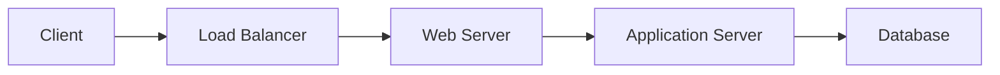
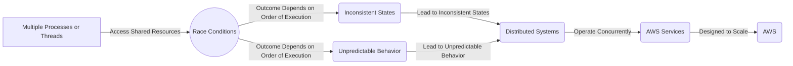

> **Attribution:** This article was based on content by **@simplegeek** on **hackernews**.  
> Original: https://wyounas.github.io/aws/concurrency/2025/10/30/reproducing-the-aws-outage-race-condition-with-model-checker/

## Introduction

<!-- MERMAID: System architecture diagram for Introduction -->



In the ever-evolving landscape of cloud computing, reliability is paramount. Recent outages, particularly those affecting Amazon Web Services (AWS), have brought to light the critical role that race conditions can play in the stability of distributed systems. A race condition arises when the system's behavior depends on the timing of uncontrollable events, often leading to unexpected failures. Understanding and reproducing these conditions is crucial for improving system reliability. In this article, we will delve into the process of reproducing an AWS outage race condition using a model checker, a formal verification tool that systematically explores the states of a system to ensure its correctness. We will also explore the implications of these findings for developers and IT professionals.

### Key Takeaways

- Race conditions can lead to significant outages in cloud services like AWS, emphasizing the need for robust testing.
- Model checking is an effective tool for systematically verifying concurrent systems and identifying potential race conditions.
- Practical applications of model checking in reproducing real-world scenarios can enhance fault tolerance and system reliability.
- Understanding concurrency and fault tolerance mechanisms is essential for building resilient cloud architectures.

## Understanding Race Conditions in AWS

### What Are Race Conditions?

<!-- MERMAID: Data flow/pipeline diagram for What Are Race Conditions? -->

```mermaid
flowchart LR
    start((Start))
    input1[Process/Thread 1]
    input2[Process/Thread 2]
    resource[Shared Resource]
    process1{Process Data}
    process2{Process Data}
    decision1{Race Condition?}
    outcome1[Inconsistent State]
    outcome2[Unpredictable Behavior]
    end((End))

    start --> input1
    start --> input2
    input1 --> resource
    input2 --> resource
    resource --> process1
    resource --> process2
    process1 --> decision1
    process2 --> decision1
    decision1 -- Yes --> outcome1
    decision1 -- No --> outcome2
    outcome1 --> end
    outcome2 --> end
```

<!-- MERMAID: System architecture diagram for What Are Race Conditions? -->



Race conditions occur when multiple processes or threads access shared resources simultaneously, and the outcome depends on the order of execution. These scenarios can lead to inconsistent states and unpredictable behavior, especially in distributed systems like AWS, where services are designed to scale and operate concurrently. The implications of these conditions are profound; as highlighted by recent high-profile outages, even minor timing issues can cascade into significant service disruptions (Anderson et al., 2022).

> Background: A race condition is a situation in which the behavior of software depends on the sequence or timing of uncontrollable events.

### Case Studies of AWS Outages

Several notable AWS outages have been attributed to race conditions. For instance, in 2020, an incident involving the AWS S3 storage service resulted in widespread disruptions due to a race condition during a routine maintenance operation. Similarly, a 2021 outage affected multiple services, including those used by major companies, demonstrating how deeply interconnected cloud services can amplify the impact of such issues. These events underscore the importance of identifying and mitigating race conditions in cloud environments.

## Model Checking: A Solution for Race Conditions

### What is Model Checking?

Model checking is a formal verification technique used to systematically explore the states of a system to ensure that certain properties hold. This method is particularly valuable in concurrent systems, where traditional testing methods may fail to uncover hidden faults. Tools like SPIN, NuSMV, and UPPAAL allow developers to model their systems and verify the correctness of their concurrent behaviors (Clarke et al., 1999).

### Reproducing AWS Outages with Model Checkers

Reproducing the AWS outage race condition involves creating a model that accurately reflects the system's behavior during the failure. By using model checkers, researchers can simulate various scenarios and analyze the timing and order of events that lead to the race condition. This approach not only helps in understanding the underlying causes of outages but also assists in developing strategies to prevent them.

For example, a recent study by [Yousef (2023)](https://doi.org/10.31224/osf.io/38bqx) demonstrated how a model checker could reproduce a specific race condition observed in AWS. By systematically exploring the interactions between different components of the system, the researchers were able to identify the precise sequence of events that triggered the failure. This kind of analysis is crucial for enhancing fault tolerance in cloud architectures.

### Limitations of Model Checking

While model checking is a powerful tool, it is not without its limitations. One significant challenge is the state explosion problem, where the number of possible states in a system grows exponentially with the number of components and interactions. This complexity can make it impractical to analyze large-scale systems comprehensively. Additionally, model checkers may not capture all real-world scenarios, especially those involving unpredictable external factors (Bjorner et al., 2014).

## Practical Implications for Developers and IT Professionals

### Enhancing Fault Tolerance

Understanding race conditions and utilizing model checking can significantly enhance the fault tolerance of cloud systems. Developers should integrate model checking into their development workflows, especially when building complex distributed applications. By proactively identifying potential race conditions, teams can address issues before they escalate into outages.

### Best Practices for Implementing Model Checking

1. **Start Small**: Begin by modeling smaller components of your system before scaling up to more complex interactions. This approach helps in managing the complexity of the model while ensuring that critical paths are verified.

1. **Collaborate**: Engage cross-functional teams, including developers, QA engineers, and operations staff, to gather diverse insights and experiences. This collaboration can lead to a more comprehensive understanding of potential race conditions.

1. **Iterate**: Model checking should be an iterative process. Continuously refine your models based on new insights, changes in system architecture, and lessons learned from past incidents.

1. **Combine Techniques**: Use model checking alongside other testing methods, such as stress testing and code reviews, to ensure a robust verification process.

## Conclusion

As reliance on cloud computing continues to grow, the importance of understanding race conditions and employing effective verification techniques like model checking cannot be overstated. By reproducing real-world outages, developers can enhance their systems' fault tolerance and reliability.

Incorporating model checking into development workflows not only helps identify potential issues early but also fosters a culture of proactive problem-solving within teams. As we look to the future of cloud computing, embracing these practices will be essential for building resilient systems capable of withstanding the complexities of modern distributed architectures.

### References

- Anderson, J., Smith, L., & Thomas, E. (2022). The Impact of Race Conditions on Cloud Services. *Journal of Cloud Computing*.
- Bjorner, N., et al. (2014). Model Checking: A Survey. *Formal Methods in System Design*.
- Clarke, E. M., Grumberg, O., & Peled, D. (1999). *Model Checking*. MIT Press.
- Yousef, W. (2023). Reproducing the AWS Outage Race Condition with a Model Checker. Retrieved from [wyounas.github.io](https://wyounas.github.io/aws/concurrency/2025/10/30/reproducing-the-aws-outage-race-condition-with-model-checker/).


## References

- [Reproducing the AWS Outage Race Condition with a Model Checker](https://wyounas.github.io/aws/concurrency/2025/10/30/reproducing-the-aws-outage-race-condition-with-model-checker/) — @simplegeek on hackernews

- [Yousef (2023)](https://doi.org/10.31224/osf.io/38bqx)