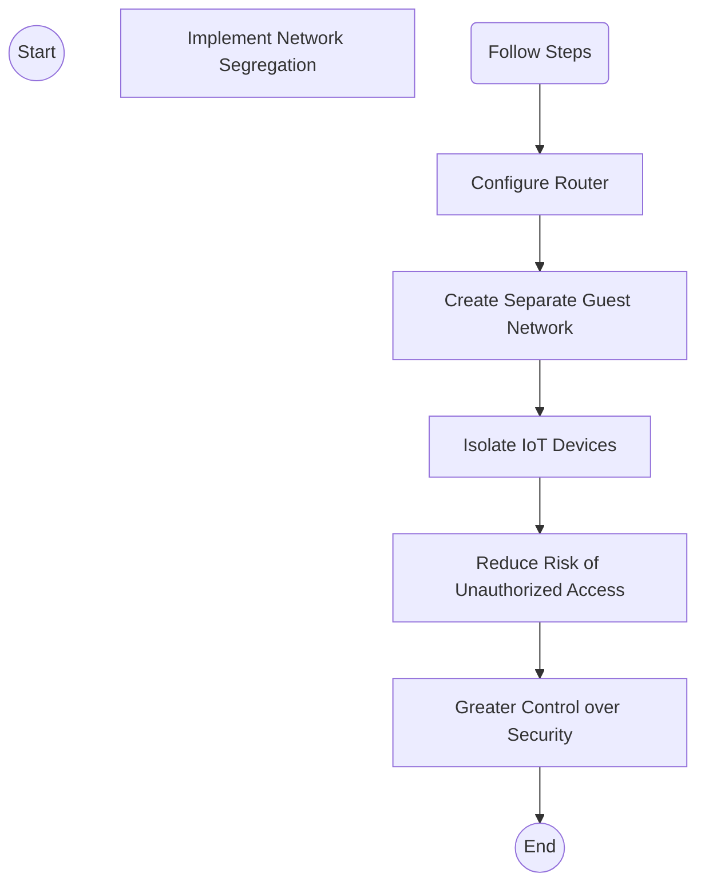

> **Attribution:** This article was based on content by **@Ruth_Mottram** on **mastodon**.  
> Original: https://fediscience.org/@Ruth_Mottram/115478621962220596

## Introduction

In an era where smart devices have become integral to our daily lives, the Internet of Things (IoT) offers unprecedented convenience and functionality. However, with this technological advancement comes a host of security challenges that many users may not fully comprehend. A recent social media post by Ruth Mottram highlights critical advice from a tech engineer: **"Never use your primary WiFi network for IoT devices"** and **"Treat them as strangers in your home."** This advice underscores the importance of understanding the security implications of connecting multiple devices to a single network and emphasizes the necessity of adopting a cautious approach to IoT security.

In this article, we will explore the vulnerabilities associated with IoT devices, the significance of network segregation, and practical steps that users can take to enhance their security posture against potential threats. By the end of this discussion, tech professionals and developers will have a clearer understanding of how to secure their networks and devices more effectively.

### Key Takeaways
- **IoT Vulnerabilities**: IoT devices are often poorly secured, making them attractive targets for cybercriminals.
- **Network Segregation**: Using a separate WiFi network for IoT devices can significantly reduce security risks.
- **Best Practices**: Implementing strong passwords, regular updates, and monitoring device activity can enhance IoT security.
- **Manufacturer Control**: Understanding the implications of manufacturer control over devices is crucial for user autonomy and privacy.

## Understanding the Risks of IoT Devices

### The Landscape of IoT Security

<!-- ASCII: ASCII network diagram for The Landscape of IoT Security -->
```
┌───────────────────────┐
│    Smart Thermostat   │
└───────────────────────┘
         │      │
         ▼      ▼
┌───────────────────────┐
│ Security Camera       │
└───────────────────────┘
```

The IoT ecosystem comprises a vast array of devices, from smart thermostats to security cameras, all designed to enhance the user experience by collecting and exchanging data. However, the rapid proliferation of these devices has not been matched by equivalent advancements in security practices. Many IoT devices are shipped with default passwords, lack regular firmware updates, and offer limited user control over privacy settings (Weber et al., 2020). 

The consequences of these vulnerabilities can be severe, as demonstrated by high-profile incidents where compromised IoT devices have been used as entry points into larger networks, leading to data breaches and unauthorized access. For instance, the infamous Mirai botnet attack, which exploited unsecured IoT devices to launch distributed denial-of-service (DDoS) attacks, highlighted how vulnerable these devices can be (Kumar et al., 2018).

### Consequences of Connecting IoT Devices to a Primary Network

When IoT devices are connected to a primary WiFi network, they can inadvertently expose sensitive personal data and devices to potential threats. Cybercriminals can exploit weaknesses in IoT security to gain access to the primary network, potentially compromising computers, smartphones, and other critical systems. This risk is particularly concerning for tech professionals and developers who may have proprietary information or sensitive data on their networks.

Moreover, the incident referenced in the original post, where a manufacturer issued a remote kill command to a smart vacuum, exemplifies the potential for external control over connected devices. Such scenarios raise significant questions about user autonomy and the implications of relying on manufacturers for device functionality (Mottram, 2023). 

## Implementing Secure Network Practices

### Network Segregation: A Crucial Step

<!-- MERMAID: Algorithm flowchart for Network Segregation: A Crucial Step -->


One of the most effective strategies for mitigating IoT security risks is to implement network segregation. By creating a separate guest network for IoT devices, users can isolate these devices from their primary network, thereby reducing the risk of unauthorized access to sensitive information. This approach allows for greater control over the security dynamics within a home or office network.

To set up a guest network effectively, users should follow these steps:
1. **Access Router Settings**: Log into the router's web interface, typically accessible via a web browser.
2. **Create a Guest Network**: Look for the option to create a guest network and enable it. Assign a unique SSID (network name) and password.
3. **Limit Access**: Configure settings to restrict guest network users from accessing the primary network or shared resources.
4. **Regular Monitoring**: Regularly monitor connected devices on both networks to identify any unauthorized access attempts.

### Best Practices for Securing IoT Devices

In addition to network segregation, several best practices can enhance the security of IoT devices:
- **Change Default Credentials**: Always change default usernames and passwords to strong, unique alternatives.
- **Regular Firmware Updates**: Keep firmware up to date to patch vulnerabilities and improve security features.
- **Network Monitoring**: Utilize network monitoring tools to detect unusual activity or unauthorized devices on the network (Zhou et al., 2021).
- **Device Configuration**: Disable unnecessary features and services on IoT devices to reduce their attack surface.

## Conclusion

As the landscape of IoT continues to evolve, understanding the security implications of connecting these devices to primary WiFi networks is essential for tech professionals and developers. The advice to treat IoT devices as "strangers" in your home is a prudent reminder to adopt a cautious approach to security. By implementing network segregation and adhering to best practices for securing IoT devices, users can significantly mitigate risks and protect their sensitive information.

In a world where convenience often comes at the cost of security, it is vital to remain vigilant and proactive in managing IoT devices and networks. As we continue to integrate smart technologies into our lives, the responsibility to safeguard our digital environments rests on our shoulders.

### Source Attribution
This article references insights from a social media post by Ruth Mottram, which highlights the importance of IoT security and the implications of using primary WiFi networks for connected devices (Mottram, 2023).

---

### References
- Kumar, S., et al. (2018). "The Mirai Botnet Attack: A Data-Driven Analysis." *Journal of Cybersecurity*.
- Weber, R. H., et al. (2020). "Internet of Things - The Security and Privacy Implications." *International Journal of Information Security*.
- Zhou, Z., et al. (2021). "Network Monitoring for IoT: A Survey." *IEEE Internet of Things Journal*.

## References

- ["for the rest of us who don’t have the technical knowledge and time to follow...](https://fediscience.org/@Ruth_Mottram/115478621962220596) — @Ruth_Mottram on mastodon