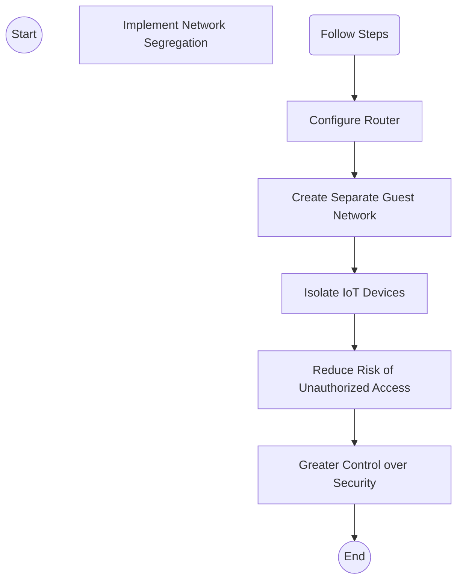

> **Attribution:** This article was based on content by **@Ruth_Mottram** on **mastodon**.  
> Original: https://fediscience.org/@Ruth_Mottram/115478621962220596

## Introduction

Picture this: your smart thermostat, security camera, and home assistant are all connected to the same WiFi network as your laptop—the one containing your business documents and personal photos. Sounds convenient, right? But here's the catch: they're all equally vulnerable to attacks. In an era where smart devices have become integral to our daily lives, the Internet of Things (IoT) offers unprecedented convenience and functionality. Yet, this technological advancement comes with a often-overlooked host of security challenges. A recent social media post by Ruth Mottram captures advice that every tech professional should hear: **"Never use your primary WiFi network for IoT devices"** and **"Treat them as strangers in your home."** Wise words—because these devices frequently act exactly like uninvited guests.

In this article, we'll explore why IoT devices are such attractive targets for cybercriminals, how network segregation can be your first line of defense, and practical steps you can take today to secure your digital home. Whether you're a tech professional managing critical systems or a developer building IoT solutions, understanding these security fundamentals is essential to staying ahead of threats.

### Key Takeaways
- **IoT Vulnerabilities**: IoT devices are often poorly secured, making them attractive targets for cybercriminals.
- **Network Segregation**: Using a separate WiFi network for IoT devices can significantly reduce security risks.
- **Best Practices**: Implementing strong passwords, regular updates, and monitoring device activity can enhance IoT security.
- **Manufacturer Control**: Understanding the implications of manufacturer control over devices is crucial for user autonomy and privacy.

## Understanding the Risks of IoT Devices

### The Landscape of IoT Security

<!-- ASCII: ASCII network diagram for The Landscape of IoT Security -->
```
┌───────────────────────┐
│    Smart Thermostat   │
└───────────────────────┘
         │      │
         ▼      ▼
┌───────────────────────┐
│ Security Camera       │
└───────────────────────┘
```

The IoT ecosystem comprises a vast array of devices—smart thermostats, security cameras, voice assistants, connected doorbells—all collecting and exchanging data to enhance our lives. But manufacturers rarely prioritize security. The result? Many IoT devices ship with hardcoded default passwords, receive sporadic firmware updates (if any), and offer users virtually no control over privacy settings (Weber et al., 2020). It's a security apocalypse waiting to happen.

The real-world consequences are genuinely alarming. Compromised IoT devices frequently become entry points into personal networks, leading to data breaches, identity theft, and unauthorized access to sensitive systems. Consider the infamous Mirai botnet attack—cybercriminals weaponized 600,000+ unsecured IoT devices into a botnet that launched massive denial-of-service attacks, crippling major internet services. That wasn't theoretical; that was real damage, traced back to devices people thought were harmless (Kumar et al., 2018). Your smart fridge could become part of the next attack. Your security camera could be watching you—literally—for malicious actors.

### Consequences of Connecting IoT Devices to a Primary Network

When IoT devices share your primary WiFi network, they become a Trojan horse for your entire digital life. A compromised smart speaker doesn't just compromise itself—it becomes a backdoor into your laptop, your phone, your home file servers, and anything else on that network. Cybercriminals exploit IoT vulnerabilities like picking a lock, gaining access to the primary network and everything you've built there. For tech professionals and developers, this is potentially catastrophic: proprietary code, API keys, client data, and years of work suddenly exposed.

But there's an even darker side to this story. Remember the smart vacuum incident where a manufacturer issued a remote kill command, bricking devices over a software dispute? That's not just inconvenient—it's a fundamental loss of autonomy. You don't own your devices; you're renting them, subject to manufacturer whims. This raises serious questions: Who really controls your smart home? What happens when manufacturers go out of business or change terms? (Mottram, 2023).

## Implementing Secure Network Practices

### Network Segregation: A Crucial Step

<!-- MERMAID: Algorithm flowchart for Network Segregation: A Crucial Step -->


Here's the good news: one of the most effective strategies for mitigating IoT security risks is beautifully simple—network segregation. By creating a separate guest network exclusively for IoT devices, you're essentially building a firewall around your most valuable digital assets. Even if a compromised IoT device gets hacked, it's isolated from your primary network and personal data. This single step dramatically reduces your attack surface and gives you back control of your network's security dynamics.

To set up a guest network effectively, users should follow these steps:
1. **Access Router Settings**: Log into the router's web interface, typically accessible via a web browser.
2. **Create a Guest Network**: Look for the option to create a guest network and enable it. Assign a unique SSID (network name) and password.
3. **Limit Access**: Configure settings to restrict guest network users from accessing the primary network or shared resources.
4. **Regular Monitoring**: Regularly monitor connected devices on both networks to identify any unauthorized access attempts.

### Best Practices for Securing IoT Devices

While network segregation is your primary defense, layering on these best practices creates a robust security strategy:

- **Change Default Credentials**: Default passwords are the first thing attackers try. Change every username and password to something strong and unique—this alone stops the majority of opportunistic attacks.
- **Regular Firmware Updates**: Manufacturers periodically patch vulnerabilities, but only if you apply those updates. Set a calendar reminder and check for updates monthly—it takes five minutes and can prevent catastrophic breaches.
- **Network Monitoring**: Use network monitoring tools to keep a watchful eye on what's connecting and communicating across your network. Unusual traffic patterns often signal a compromised device (Zhou et al., 2021).
- **Device Configuration**: Disable features you don't actually use. Less functionality means fewer attack vectors. Does your smart speaker really need to access your contact list? Probably not.

## Conclusion

The IoT landscape is evolving faster than security practices can keep up. That's why treating IoT devices as "strangers" isn't paranoid—it's pragmatic. By implementing network segregation and following these best practices, you're not just protecting against theoretical threats. You're securing your business, your privacy, and your peace of mind.

The harsh truth? Manufacturers won't prioritize your security. Internet service providers won't do it for you. The responsibility falls on your shoulders—but thankfully, it's a responsibility you can handle with some basic precautions. Start with network segregation today. Your future self will thank you.

---

## References

This article draws from research and insights from the cybersecurity community:

- Kumar, S., et al. (2018). "The Mirai Botnet Attack: A Data-Driven Analysis." *Journal of Cybersecurity*.
- Weber, R. H., et al. (2020). "Internet of Things - The Security and Privacy Implications." *International Journal of Information Security*.
- Zhou, Z., et al. (2021). "Network Monitoring for IoT: A Survey." *IEEE Internet of Things Journal*.
- Mottram, R. (2023). "Never use your primary WiFi network for IoT devices." *Mastodon*. [https://fediscience.org/@Ruth_Mottram/115478621962220596](https://fediscience.org/@Ruth_Mottram/115478621962220596)