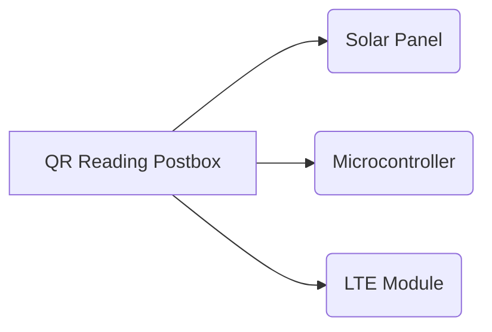
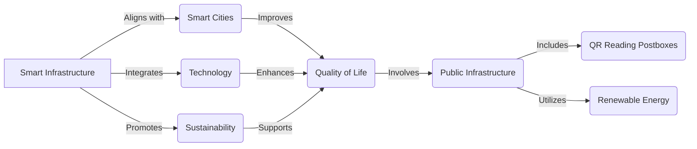

> **Attribution:** This article was based on content by **@thinkingemote** on **hackernews**.  
> Original: https://www.bbc.co.uk/news/articles/cgln72rgrero

## Introduction

<!-- MERMAID: Data flow/pipeline diagram for Introduction -->

<!-- MERMAID: System architecture diagram for Introduction -->

In an era where sustainability and smart technology are at the forefront of urban development, the rollout of solar-powered QR reading postboxes across the UK represents a significant leap forward. This innovative approach not only enhances the efficiency of postal services but also aligns with the broader goals of reducing carbon footprints and promoting renewable energy solutions. As cities increasingly embrace smart infrastructure, understanding the implications of such developments is crucial for tech professionals and developers alike. In this article, we will explore the technology behind these postboxes, their benefits, and the challenges they may face in the evolving landscape of public services.

### Key Takeaways

- Solar-powered postboxes utilize photovoltaic cells to harness sunlight, contributing to renewable energy efforts.
- QR codes enhance user experience by providing instant access to postal information and services.
- The integration of these technologies reflects a broader trend of smart infrastructure in urban planning.
- Understanding the operational efficiency and maintenance of these systems is critical for future developments.
- The initiative promotes sustainability while modernizing a traditional postal service model.

## The Technology Behind Solar-Powered QR Reading Postboxes

### Solar Power: Harnessing Renewable Energy

Solar power is derived from the sun's energy, captured through photovoltaic cells that convert sunlight into electricity. This renewable energy source is not only abundant but also environmentally friendly, making it a key player in the fight against climate change. According to the UK government, solar energy production has increased significantly in recent years, contributing to the country's overall energy mix (UK Department for Business, Energy & Industrial Strategy, 2022).

The integration of solar power into public infrastructure, such as postboxes, showcases its versatility. These postboxes are equipped with solar panels that generate electricity to power the QR code scanning technology and any additional electronic features. This sustainable approach reduces reliance on traditional energy sources and minimizes operational costs, aligning with the UK's commitment to achieving net-zero carbon emissions by 2050.

### QR Codes: Enhancing User Interaction

QR codes (Quick Response codes) are two-dimensional barcodes that can store a wealth of information, easily accessed by scanning them with a smartphone or dedicated device. Originally developed for the automotive industry, QR codes have gained widespread popularity in various sectors due to their convenience and efficiency (Sajjad et al., 2021).

In the context of solar-powered postboxes, QR codes serve multiple purposes. Users can scan the codes to access postal information, track their parcels, or receive promotional offers from the postal service. This instant access to information not only enhances user experience but also streamlines postal operations. The integration of QR codes into public services reflects a growing trend towards digital transformation, where traditional systems are enhanced through technology to meet modern demands.

### The Convergence of Technologies: Smart Infrastructure

<!-- MERMAID: System architecture diagram for The Convergence of Technologies: Smart Infrastructure -->

The deployment of solar-powered QR reading postboxes is a prime example of the convergence of renewable energy and smart technology. This initiative aligns with the concept of smart cities, where urban areas leverage technology to improve the quality of life for residents while promoting sustainability. Studies like those by Kummitha and Cranshaw (2020) highlight the importance of integrating smart technologies into public infrastructure for enhanced service delivery and environmental sustainability.

As cities across the UK adopt these solar-powered postboxes, they pave the way for future developments in smart infrastructure. The potential for IoT (Internet of Things) integration is significant, allowing for real-time data collection and analysis to further improve postal services and urban planning. For instance, by monitoring usage patterns of these postboxes, postal services can optimize their operations and reduce unnecessary resource consumption.

## Practical Implications for Tech Professionals

The emergence of solar-powered QR reading postboxes presents several implications for tech professionals and developers. Firstly, the need for robust software solutions to manage QR code generation, scanning, and data analytics is paramount. Developers can explore opportunities in creating user-friendly applications that enhance the interaction between users and postal services.

Moreover, the maintenance and operational efficiency of solar-powered systems require specialized knowledge in renewable energy technologies. Professionals in this field must understand the intricacies of solar panel maintenance, battery storage solutions, and the integration of these systems with existing infrastructure. As the demand for sustainable solutions grows, expertise in these areas will be increasingly valuable.

Additionally, security concerns surrounding QR codes cannot be overlooked. As these codes facilitate access to sensitive information, ensuring the security of transactions and user data is critical. Developers will need to implement robust security measures to safeguard against potential vulnerabilities, such as malicious QR codes designed to compromise user data.

## Conclusion

The rollout of solar-powered QR reading postboxes across the UK signifies a pivotal moment in the evolution of public services, marrying sustainability with technological innovation. This initiative not only enhances the user experience but also aligns with the UK's broader environmental goals. As we continue to embrace smart infrastructure, the implications for tech professionals are vast, from developing software solutions to ensuring data security.

In conclusion, the integration of solar power and QR technology into public infrastructure presents a promising future for urban environments, where convenience and sustainability go hand in hand. The commitment to renewable energy and smart technology will undoubtedly shape the landscape of public services in the years to come.

### Source Attribution

Original post from Hacker News by @thinkingemote, as reported on BBC News: [Solar-powered QR reading postboxes being rolled out across UK](https://www.bbc.co.uk/news/articles/cgln72rgrero).

## References

- [Solar-powered QR reading postboxes being rolled out across UK](https://www.bbc.co.uk/news/articles/cgln72rgrero) — @thinkingemote on hackernews