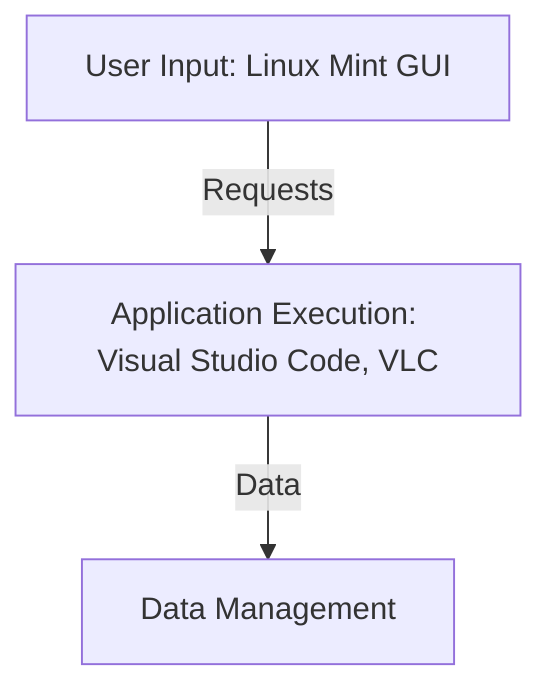

> **Attribution:** This article was based on content by **@wingsylver** on **mastodon**.  
> Original: https://hachyderm.io/@wingsylver/115481756174535655

# Comprehensive Guide to Transitioning from Windows 10 to Linux Mint Cinnamon

As Windows 10 support has officially ended, many users are seeking alternatives that provide a secure, efficient, and user-friendly environment. One such option is [Linux Mint Cinnamon](https://linuxmint.com/), a popular Linux distribution known for its ease of use and aesthetic appeal. Transitioning to Linux not only revitalizes older hardware but also opens up a world of learning and customization. This guide will delve into the value of Linux Mint Cinnamon, explore its capabilities, and provide practical steps for users eager to make the switch.

## Key Takeaways

- **User-Friendly Interface**: Linux Mint Cinnamon offers a familiar desktop environment, making it ideal for users transitioning from Windows.
- **Community Support**: Repair cafes and installation events provide hands-on assistance for new users.
- **Sustainability**: Embracing Linux aligns with the solarpunk ethos of sustainable technology.
- **Educational Opportunity**: Users can learn more about their machines and the underlying technology.
- **Diverse Software Ecosystem**: A wide range of applications and tools are available to meet various needs.

## Why This Matters

The end of Windows 10 support signifies a pivotal moment for many users, especially those on older hardware. By transitioning to Linux Mint Cinnamon, users not only avoid the risks associated with unsupported software but also engage with a vibrant community focused on open-source solutions. This guide will explore the tools available to ease this transition, categorized into distinct sections that highlight their functionality and use cases.

## Tool Taxonomy

### 1. **Operating Systems**

Operating systems form the backbone of any computing environment. They manage hardware resources and provide a platform for applications.

#### **Linux Mint Cinnamon**

- **Problem Solved**: Provides a user-friendly interface for users migrating from Windows.
- **Key Features**:
  - Familiar desktop layout resembling Windows.
  - Built-in software manager for easy installation of applications.
  - Regular updates and community support.
- **Trade-offs**: While it’s easy to use, advanced users may find it less customizable than other distributions.
- **When to Choose**: Ideal for users seeking a straightforward transition from Windows.
- **Link**: [Linux Mint](https://linuxmint.com/)

#### **Ubuntu**

- **Problem Solved**: Offers a robust platform with extensive community support.
- **Key Features**:
  - Large repository of software.
  - Regular updates and long-term support (LTS) versions.
- **Trade-offs**: The default interface may not appeal to users accustomed to Windows.
- **When to Choose**: Suitable for users who want a popular and well-supported Linux distribution.
- **Link**: [Ubuntu](https://ubuntu.com/)

### 2. **Installation and Support Events**

Repair cafes and installation events provide hands-on support for users transitioning to Linux.

#### **Repair Cafes**

- **Problem Solved**: Offer community-driven support for troubleshooting and installation.
- **Key Features**:
  - Volunteer experts available for assistance.
  - Opportunities to learn about hardware and software.
- **Trade-offs**: Availability may vary by location.
- **When to Choose**: Great for users who prefer face-to-face support and community engagement.

#### **Linux Install Fests**

- **Problem Solved**: Provide a structured environment for users to install Linux.
- **Key Features**:
  - Group installations with expert guidance.
  - Access to resources and documentation.
- **Trade-offs**: Limited to scheduled events; not always accessible.
- **When to Choose**: Perfect for users who want a guided installation experience.
- **Link**: Check local Linux user groups for events.

### 3. **Software Management**

Software management tools simplify the process of installing and maintaining applications.

#### **Software Manager (Linux Mint)**

- **Problem Solved**: Streamlines the installation of software packages.
- **Key Features**:
  - User-friendly interface.
  - Categories for easy navigation.
- **Trade-offs**: Limited to software available in the repository.
- **When to Choose**: Best for users looking for ease of use in managing applications.

#### **Flatpak**

- **Problem Solved**: Allows users to install applications in a sandboxed environment.
- **Key Features**:
  - Access to a wide range of applications, including those not in the repository.
  - Isolation from system dependencies.
- **Trade-offs**: Larger disk space usage due to bundled dependencies.
- **When to Choose**: Ideal for users who want the latest versions of applications.
- **Link**: [Flatpak](https://flatpak.org/)

### 4. **Learning Resources**

Educational resources help users get acquainted with Linux and its ecosystem.

#### **Linux Documentation Project**

- **Problem Solved**: Provides comprehensive documentation for Linux users.
- **Key Features**:
  - Guides on various topics, from installation to advanced usage.
- **Trade-offs**: May require some technical knowledge to navigate effectively.
- **When to Choose**: Excellent for users who prefer self-directed learning.
- **Link**: [Linux Documentation Project](https://www.tldp.org/)

#### **YouTube Tutorials**

- **Problem Solved**: Visual learning through instructional videos.
- **Key Features**:
  - Diverse range of topics covered by community members.
- **Trade-offs**: Quality and depth of content can vary.
- **When to Choose**: Great for users who learn best through visual aids.

## Example Stacks for Common Use-Cases

### 1. **Basic Desktop Usage**

- **Components**: Linux Mint Cinnamon, LibreOffice, GIMP, Firefox
- **Rationale**: This stack caters to everyday tasks such as document editing, image editing, and web browsing.

### 2. **Development Environment**

- **Components**: Linux Mint Cinnamon, Visual Studio Code, Docker, Git
- **Rationale**: This stack is perfect for developers who need a robust coding environment with version control and containerization.

### 3. **Media Center**

- **Components**: Linux Mint Cinnamon, VLC, Kodi, Plex
- **Rationale**: Ideal for users looking to set up a media center for streaming and organizing media content.

## Integration Points and Data Flow

<!-- MERMAID: System architecture diagram for Integration Points and Data Flow -->


<!-- MERMAID: Data flow/pipeline diagram for Integration Points and Data Flow -->



The integration between these components is essential for a seamless user experience. For instance, a development environment using Docker allows for isolated application environments, while Git provides version control for code. The data flow between these components typically involves:

1. **User Input**: Users interact with the Linux Mint GUI.
1. **Application Execution**: Applications like Visual Studio Code or VLC process user requests.
1. **Data Management**: Data is managed through file systems or databases, depending on the application.

### ASCII Diagram of Integration Architecture

```
+----------------+          +-------------------+
|   Linux Mint   |          |   Software Manager |
|   Cinnamon     | <------> |   (Package Updates)|
+----------------+          +-------------------+
        |                             |
        |                             |
+----------------+          +-------------------+
|   User Input   |          |   Learning Resources|
|   (GUI)        |          |   (Documentation)  |
+----------------+          +-------------------+
```

## Getting Started with Linux Mint Cinnamon

To begin your journey with Linux Mint Cinnamon, follow these steps:

1. **Download the ISO**: Visit [Linux Mint](https://linuxmint.com/download.php) and download the latest version.
1. **Create a Bootable USB**: Use a tool like [Rufus](https://rufus.ie/) or [Etcher](https://www.balena.io/etcher/) to create a bootable USB drive.
1. **Boot from USB**: Insert the USB drive into your laptop and boot from it. You may need to adjust BIOS settings.
1. **Install Linux Mint**: Follow the on-screen instructions to install Linux Mint on your laptop.

### Example Docker Compose Snippet for Development Stack

```yaml
version: '3.8'
services:
  app:
    image: your-docker-image
    volumes:
      - ./app:/app
    ports:
      - "3000:3000"
```

## Practical Evaluation Criteria

When choosing tools and components for your Linux Mint setup, consider the following criteria:

- **User-Friendliness**: How easy is it for a newcomer to navigate?
- **Community Support**: Is there a vibrant community for troubleshooting?
- **Documentation**: Is there sufficient documentation available?
- **Compatibility**: Does it work well with other tools in your stack?
- **Performance**: Does it run efficiently on your hardware?

## Further Resources

- [Linux Mint Documentation](https://linuxmint.com/documentation.php)
- [Linux User Groups](https://linux.org/groups/)
- [Flatpak Documentation](https://docs.flatpak.org/en/latest/)

This guide was inspired by [I did a successful install of Linux Mint Cinnamon on a laptop at one of the r...](https://hachyderm.io/@wingsylver/115481756174535655) curated by @wingsylver. For a comprehensive list of options and resources, consider checking the original source.


## References

- [I did a successful install of Linux Mint Cinnamon on a laptop at one of the r...](https://hachyderm.io/@wingsylver/115481756174535655) — @wingsylver on mastodon