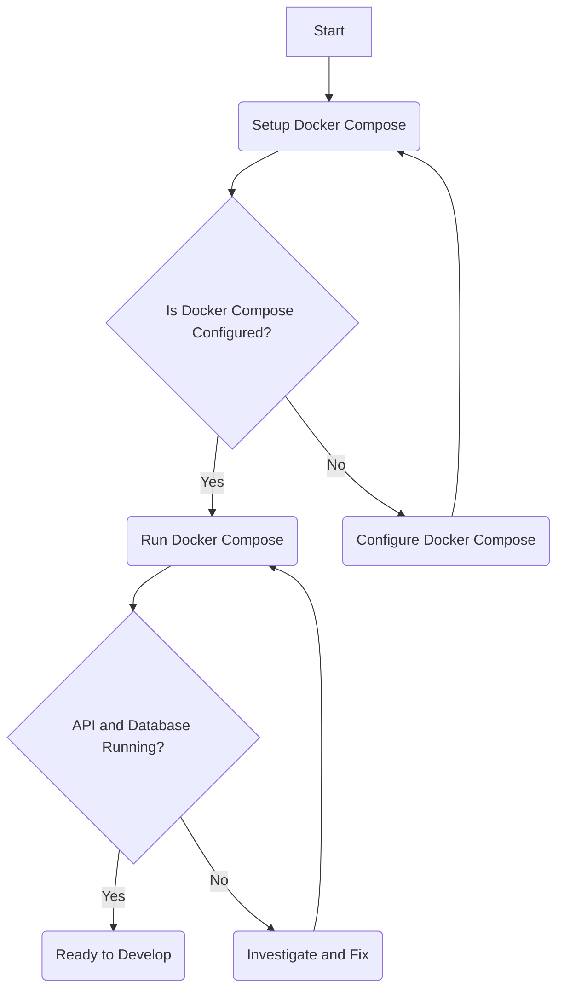

> **Attribution:** This article was based on content by **@avelino** on **GitHub**.  
> Original: https://github.com/avelino/awesome-go

# An Integrative Guide to Awesome Go Frameworks, Libraries, and Software

The Go programming language, commonly referred to as Golang, has gained immense popularity among developers due to its simplicity, efficiency, and powerful concurrency features. As software development increasingly demands speed and scalability, Go provides an ideal solution for building robust applications. The curated list of Go frameworks, libraries, and software—found in the [awesome-go repository](https://github.com/avelino/awesome-go)—serves as a valuable resource for developers looking to enhance their projects with high-quality tools. This guide will delve into the various categories of Go tools, their specific use cases, and practical examples to help you navigate this rich ecosystem effectively.

## Key Takeaways
- Go's concurrency model and performance make it suitable for a wide range of applications.
- A diverse array of frameworks and libraries can significantly speed up development processes.
- Choosing the right tool depends on specific project needs, integration capabilities, and community support.
- Understanding the architecture and data flow between components is crucial for building scalable applications.

## Taxonomy of Go Tools

To help you navigate the vast landscape of Go tools, we can categorize them into several key areas: **Web Frameworks**, **Database Libraries**, **Testing Tools**, **API Frameworks**, and **DevOps Tools**. Each category addresses specific problems and offers unique features.

### 1. Web Frameworks

Web frameworks are essential for developing web applications quickly and efficiently. They provide the foundational structure for handling HTTP requests, routing, and middleware support.

#### **Gin**
- **Problem Solved**: Gin is a high-performance web framework that simplifies building RESTful APIs.
- **Key Features**: Gin is known for its speed and low memory footprint. It supports middleware, JSON validation, and routing.
- **Trade-offs**: While Gin is fast, it may lack some of the features found in more extensive frameworks like Echo.
- **When to Choose**: Opt for Gin when performance is critical, and you need a lightweight solution.
- **Link**: [Gin](https://github.com/gin-gonic/gin)

#### **Echo**
- **Problem Solved**: Echo provides a robust framework for building web applications with a focus on extensibility.
- **Key Features**: It includes built-in middleware, a flexible routing system, and support for WebSocket.
- **Trade-offs**: Echo is heavier than Gin, which may not be ideal for microservices requiring minimal overhead.
- **When to Choose**: Choose Echo for larger applications that require extensive features and flexibility.
- **Link**: [Echo](https://github.com/labstack/echo)

### 2. Database Libraries

Database libraries facilitate interactions with various database systems, enabling developers to perform CRUD (Create, Read, Update, Delete) operations seamlessly.

#### **GORM**
- **Problem Solved**: GORM is an Object Relational Mapping (ORM) library that simplifies database interactions.
- **Key Features**: It supports multiple databases, provides model relationships, and includes migrations.
- **Trade-offs**: GORM's abstraction can lead to performance overhead compared to raw SQL queries.
- **When to Choose**: Use GORM when you prefer working with Go structs and want to minimize SQL boilerplate.
- **Link**: [GORM](https://gorm.io)

#### **sqlx**
- **Problem Solved**: sqlx extends the standard database/sql library, providing additional features for working with SQL databases.
- **Key Features**: It offers named parameter support, scanning into structs, and additional convenience methods.
- **Trade-offs**: Unlike GORM, sqlx requires more manual SQL handling, which may be less convenient for some developers.
- **When to Choose**: Choose sqlx for applications that need fine-grained control over SQL queries without the overhead of an ORM.
- **Link**: [sqlx](https://github.com/jmoiron/sqlx)

### 3. Testing Tools

Testing tools are vital for ensuring the reliability and functionality of applications through automated tests.

#### **Testify**
- **Problem Solved**: Testify provides a comprehensive toolkit for writing unit tests in Go.
- **Key Features**: It includes assertions, mocks, and a suite for organizing tests.
- **Trade-offs**: While Testify is feature-rich, it may introduce complexity for simple test cases.
- **When to Choose**: Use Testify when you need a robust testing framework for larger projects.
- **Link**: [Testify](https://github.com/stretchr/testify)

#### **Ginkgo**
- **Problem Solved**: Ginkgo is a BDD (Behavior Driven Development) testing framework that allows for expressive test writing.
- **Key Features**: It supports nested contexts, asynchronous testing, and rich reporting.
- **Trade-offs**: Ginkgo's BDD style may have a steeper learning curve for developers accustomed to traditional testing approaches.
- **When to Choose**: Opt for Ginkgo when you want to write tests in a more human-readable format.
- **Link**: [Ginkgo](https://github.com/onsi/ginkgo)

### 4. API Frameworks

API frameworks help developers create and manage APIs more effectively, often simplifying the process of defining endpoints and handling requests.

#### **Gorilla Mux**
- **Problem Solved**: Gorilla Mux is a powerful URL router and dispatcher for building HTTP servers.
- **Key Features**: It supports variables in routes, middleware, and subrouting.
- **Trade-offs**: While robust, it may be overkill for simple applications with few routes.
- **When to Choose**: Use Gorilla Mux for applications that require complex routing logic.
- **Link**: [Gorilla Mux](https://github.com/gorilla/mux)

#### **Go kit**
- **Problem Solved**: Go kit is a framework for building microservices that provides tools for service discovery, transport, and load balancing.
- **Key Features**: It emphasizes best practices for microservices architecture, including support for metrics and logging.
- **Trade-offs**: Go kit can be complex and may introduce overhead for smaller applications.
- **When to Choose**: Choose Go kit for building scalable microservices with a focus on maintainability.
- **Link**: [Go kit](https://gokit.io)

### 5. DevOps Tools

DevOps tools streamline the deployment and management of applications, making it easier to maintain operational efficiency.

#### **Docker**
- **Problem Solved**: Docker enables developers to package applications and their dependencies into containers for consistent deployment.
- **Key Features**: It provides isolation, scalability, and environment consistency across different stages of development.
- **Trade-offs**: Docker can introduce complexity in managing containers and orchestration.
- **When to Choose**: Use Docker when you need to ensure consistency across development, testing, and production environments.
- **Link**: [Docker](https://www.docker.com)

#### **Kubernetes**
- **Problem Solved**: Kubernetes is an orchestration tool for automating the deployment, scaling, and management of containerized applications.
- **Key Features**: It supports load balancing, self-healing, and scaling.
- **Trade-offs**: Kubernetes can be complex to set up and manage, especially for smaller projects.
- **When to Choose**: Opt for Kubernetes when you need to manage large-scale containerized applications.
- **Link**: [Kubernetes](https://kubernetes.io)

## Example Stacks

### Example Stack 1: RESTful API Service
- **Components**: Gin (web framework), GORM (database library), Testify (testing tool), Docker (containerization)
- **Rationale**: This stack provides a lightweight and efficient way to build RESTful services with easy database interactions and robust testing capabilities.

### Example Stack 2: Microservices Architecture
- **Components**: Go kit (API framework), PostgreSQL (database), Kubernetes (orchestration), Ginkgo (testing tool)
- **Rationale**: This setup is ideal for building scalable microservices that require reliable communication, service discovery, and automated deployment.

### Example Stack 3: Full-Stack Web Application
- **Components**: Echo (web framework), sqlx (database library), Gorilla Mux (API framework), Docker (containerization)
- **Rationale**: This stack combines a powerful web framework with a flexible database library, allowing developers to build comprehensive web applications.

## Integration Architecture

```plaintext
+----------------+       +-----------------+       +-----------------+
|    Client App   | <--->|    API Layer    | <--->|    Database     |
| (Frontend/UI)   |       | (Gin/Echo)      |       |   (Postgres)    |
+----------------+       +-----------------+       +-----------------+
                                  |
                                  |
                         +-----------------+
                         |    Testing      |
                         | (Testify/Ginkgo)|
                         +-----------------+
```

## Getting Started

<!-- MERMAID: Algorithm flowchart for Getting Started -->

```

To get started with a simple RESTful API using Gin and GORM, you can set up a basic Docker Compose configuration as follows:

```yaml
version: '3'
services:
  app:
    image: golang:1.18
    volumes:
      - .:/go/src/app
    working_dir: /go/src/app
    command: ["go", "run", "main.go"]
    ports:
      - "8080:8080"
  
  db:
    image: postgres:latest
    environment:
      POSTGRES_USER: user
      POSTGRES_PASSWORD: password
      POSTGRES_DB: mydb
    ports:
      - "5432:5432"
```

In your `main.go`, you can set up a simple API endpoint:

```go
package main

import (
    "github.com/gin-gonic/gin"
    "gorm.io/driver/postgres"
    "gorm.io/gorm"
)

func main() {
    r := gin.Default()

    // Database connection
    dsn := "host=db user=user password=password dbname=mydb port=5432 sslmode=disable"
    db, err := gorm.Open(postgres.Open(dsn), &gorm.Config{})
    if err != nil {
        panic("failed to connect database")
    }

    r.GET("/ping", func(c *gin.Context) {
        c.JSON(200, gin.H{"message": "pong"})
    })

    r.Run()
}
```

This simple setup demonstrates how to connect to a PostgreSQL database and expose a basic API endpoint.

## Conclusion

The Go programming ecosystem is rich with frameworks and libraries that cater to a variety of development needs. By understanding the tools available and their specific use cases, developers can make informed decisions that streamline their workflows and enhance their applications. 

This guide was inspired by [avelino/awesome-go: A curated list of awesome Go frameworks, libraries and software](https://github.com/avelino/awesome-go) curated by @avelino. For a comprehensive list of options and further exploration, be sure to check the original repository.

## Further Resources
- [Go Documentation](https://golang.org/doc/)
- [Golang Blog](https://blog.golang.org/)
- [Golang Community](https://golang.org/help/)

## References

- [avelino/awesome-go: A curated list of awesome Go frameworks, libraries and software](https://github.com/avelino/awesome-go) — @avelino on GitHub