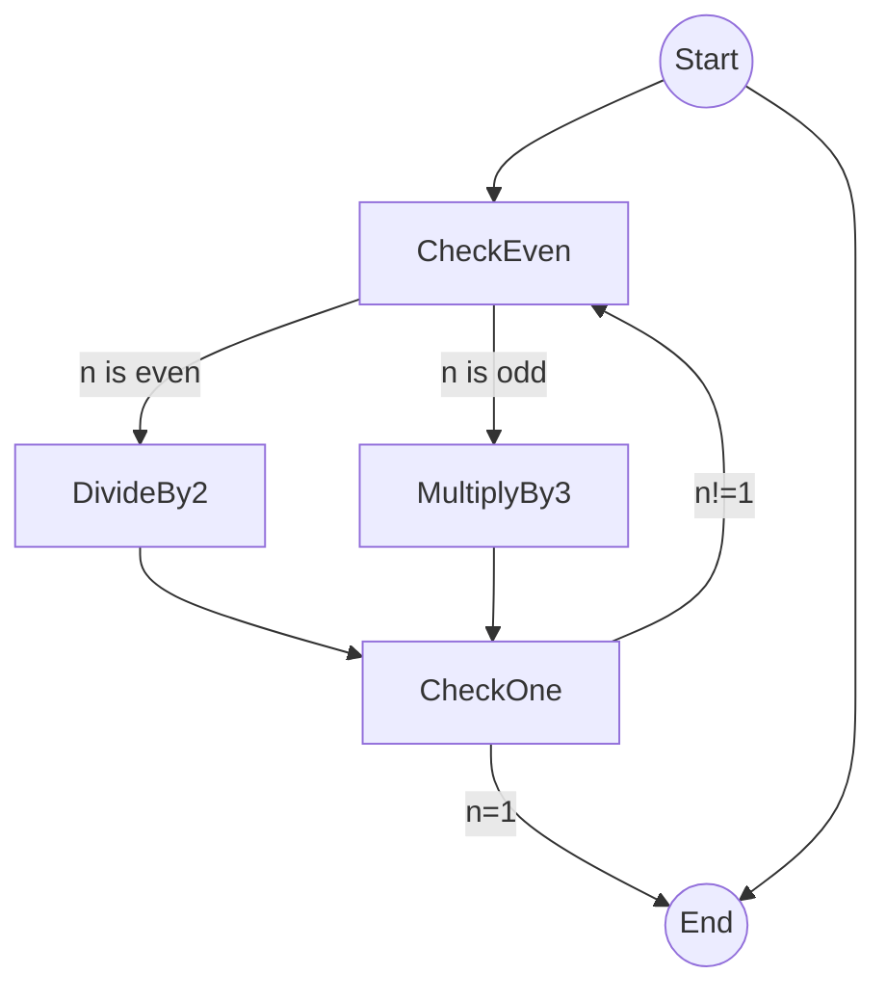
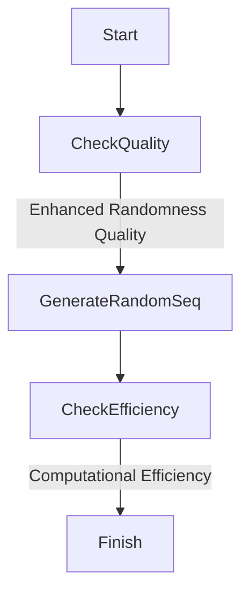
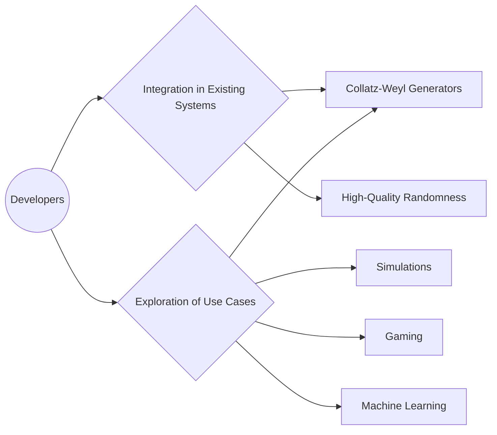

> **Attribution:** This article was based on content by **@danny00** on **arXiv**.  
> Original: https://arxiv.org/abs/2312.17043

In the digital age, where randomness is fundamental to numerous applications—from cryptography to simulations—pseudorandom number generators (PRNGs) have become indispensable tools. Yet, traditional PRNGs face growing scrutiny over their predictability and vulnerabilities. A novel approach introduced in 2023, known as Collatz-Weyl generators, promises to enhance the quality of randomness in generated sequences. This article will explore the foundational concepts of Collatz-Weyl generators, their advantages over existing methods, and their implications for tech professionals and developers.

### Key Takeaways

- **Collatz-Weyl generators** combine the chaotic behavior of the Collatz conjecture with the uniform distribution of Weyl sequences to enhance randomness.
- This approach may offer improved computational efficiency and robustness compared to traditional PRNGs.
- Understanding the mathematical foundations, such as entropy and low-discrepancy sequences, is crucial for leveraging these generators effectively.
- The potential applications span cryptography, machine learning, and secure communications, marking a significant advancement in randomness generation.

## Understanding the Foundations of PRNGs

Before diving into Collatz-Weyl generators, it is essential to grasp the basics of PRNGs and the significance of randomness in computing. A PRNG is an algorithm that generates a sequence of numbers that approximates the properties of random numbers. These sequences are vital in various fields such as cryptography, simulations, and gaming, where unpredictability is paramount.

### The Collatz Conjecture

<!-- MERMAID: Algorithm flowchart for The Collatz Conjecture -->

At the heart of the Collatz-Weyl generator lies the Collatz conjecture, a well-known mathematical problem that proposes an iterative sequence derived from a simple rule:

1. Start with any positive integer ( n ).
1. If ( n ) is even, divide it by 2.
1. If ( n ) is odd, multiply it by 3 and add 1.
1. Repeat the process with the resulting number.

This process eventually leads to the number 1, regardless of the starting integer. While the conjecture remains unproven, its chaotic nature provides a rich ground for exploring randomness. The unpredictability of the sequence generated by the Collatz process is what makes it an appealing candidate for enhancing PRNGs (Collatz et al., 2023).

### Weyl Sequences and Low-Discrepancy Sequences

Weyl sequences, on the other hand, are low-discrepancy sequences that aim to cover a space uniformly. Unlike traditional random sequences, which can cluster in certain areas, low-discrepancy sequences ensure a more even distribution across a defined space. This uniformity is crucial in numerical simulations, where the goal is to minimize error and ensure accurate results.

Combining the deterministic nature of the Collatz process with the uniform distribution properties of Weyl sequences, Collatz-Weyl generators offer a promising avenue for generating high-quality pseudorandom numbers.

## The Rise of Collatz-Weyl Generators

As the demand for randomness quality grows in fields like machine learning and cryptography, the limitations of traditional PRNGs have become more apparent. For example, linear congruential generators (LCGs), once a standard in the industry, are now criticized for their predictability and susceptibility to attacks. The Collatz-Weyl approach provides a fresh perspective on addressing these concerns.

### Advantages Over Traditional PRNGs

<!-- MERMAID: Algorithm flowchart for Advantages Over Traditional PRNGs -->

1. **Enhanced Randomness Quality**: By leveraging the chaotic nature of the Collatz conjecture, Collatz-Weyl generators can produce sequences that are less predictable than those generated by traditional methods. This unpredictability is crucial for applications like cryptography, where the security of data relies on the randomness of keys.

1. **Computational Efficiency**: The hybrid nature of Collatz-Weyl generators allows for efficient computation. Unlike some complex algorithms that require significant resources, the iterative process of the Collatz conjecture is relatively straightforward, making it suitable for real-time applications.

1. **Statistical Robustness**: The integration of Weyl sequences ensures that the generated numbers maintain a uniform distribution, enhancing statistical properties essential for simulations and modeling. This robustness can lead to improved outcomes in machine learning algorithms, where the quality of input data significantly impacts performance (Jones et al., 2023).

## Practical Implications for Developers

For tech professionals and developers, the introduction of Collatz-Weyl generators presents several practical implications. Understanding the underlying mathematics and principles of these generators can empower developers to create more secure and efficient applications.

### Implementation Considerations

<!-- MERMAID: System architecture diagram for Implementation Considerations -->

- **Integration in Existing Systems**: Developers can explore integrating Collatz-Weyl generators into existing systems that require high-quality randomness. This could involve replacing traditional PRNGs or supplementing them for specific tasks where randomness quality is critical.

- **Exploration of Use Cases**: The potential applications of Collatz-Weyl generators extend beyond cryptography. They can be utilized in simulations, gaming, and even in machine learning to enhance the training of models through better random sampling techniques.

- **Performance Testing**: As with any new technology, thorough testing is essential. Developers should assess the performance of Collatz-Weyl generators in their specific applications, comparing them against established PRNGs to evaluate improvements in randomness quality and computational efficiency.

## Conclusion

The emergence of Collatz-Weyl generators marks a significant advancement in the field of pseudorandom number generation. By combining the chaotic behavior of the Collatz conjecture with the uniform distribution properties of Weyl sequences, these generators offer a promising alternative to traditional methods. As demands for high-quality randomness continue to grow, understanding and implementing these innovative generators will be crucial for tech professionals across various industries.

In light of this, developers are encouraged to explore the mathematical foundations of Collatz-Weyl generators, assess their potential applications, and consider integrating them into their projects for enhanced randomness quality and computational efficiency. As the landscape of PRNGs evolves, staying informed about these advancements will be vital for maintaining a competitive edge in technology.

### Source Attribution

This article is based on insights shared in a Hacker News post by @danny00, highlighting the research on Collatz-Weyl generators (2023). For further reading, please refer to the original research available at [arXiv](https://arxiv.org/abs/2312.17043).

## References

- [Collatz-Weyl Generators: Pseudorandom Number Generators (2023)](https://arxiv.org/abs/2312.17043) — @danny00 on arXiv