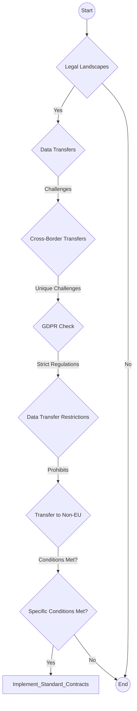
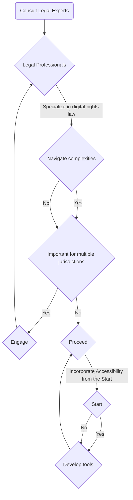
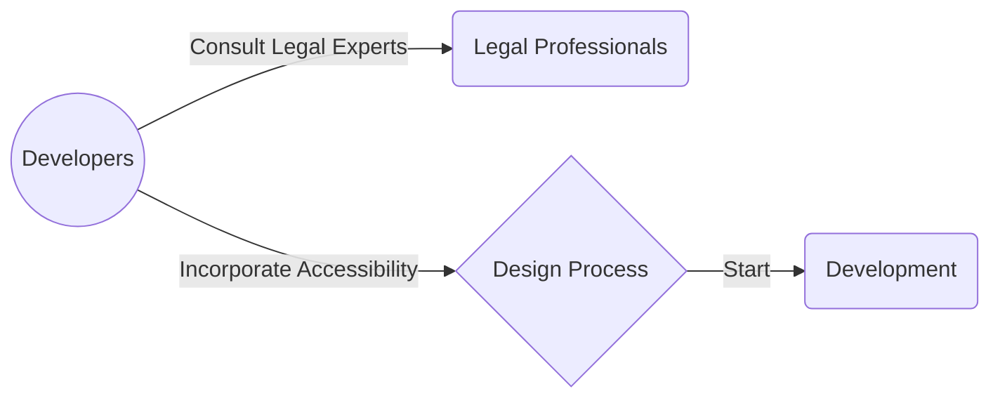

> **Attribution:** This article was based on content by **@micr0** on **mastodon**.  
> Original: https://wetdry.world/@micr0/115484020583923863

In today’s rapidly evolving digital landscape, the intersection of technology, law, and user needs has never been more crucial. As developers and tech professionals strive to create safety and accessibility tools, understanding the legal frameworks that govern digital rights becomes imperative. This article will explore the implications of digital rights law across different jurisdictions, including the United States, European Union, and Australia, while also addressing the specific challenges and considerations developers face when creating inclusive technology.

### Key Takeaways

- Digital rights laws vary significantly across jurisdictions, affecting how safety and accessibility tools are developed.
- Understanding key regulations like GDPR in the EU and CCPA in the US is crucial for compliance.
- Accessibility standards, such as WCAG, guide the development of user-friendly tools.
- Legal consultation is essential for navigating cross-border data issues and digital rights concerns.
- Emerging technologies like AI offer opportunities for enhancing accessibility but come with their own legal complexities.

## Understanding Digital Rights Law

Digital rights encompass a range of legal principles designed to protect users' privacy, data, and overall experience when interacting with technology. As technology evolves, so too do the laws that govern it. In the EU, the General Data Protection Regulation (GDPR) provides stringent guidelines on data protection and privacy, emphasizing user consent and the right to access personal data (Regulation (EU) 2016/679). In the United States, the California Consumer Privacy Act (CCPA) offers a different approach, focusing on consumer rights and transparency regarding data collection practices (California Civil Code § 1798.100).

In Australia, the Australian Privacy Principles (APPs) govern the handling of personal information, ensuring that organizations manage data responsibly (Privacy Act 1988). Each of these frameworks has distinct requirements that developers must navigate when creating safety and accessibility tools.

> Background: Digital rights laws aim to protect users' personal information and ensure their rights are respected in the digital realm.

### The Importance of Accessibility Standards

Accessibility in technology refers to the design of products and services that are usable by people with disabilities. The Web Content Accessibility Guidelines (WCAG) serve as a crucial framework for developers, outlining best practices for making web content more accessible (W3C, 2018). Adhering to these guidelines not only fosters inclusivity but also helps organizations comply with various legal requirements across jurisdictions.

Incorporating accessibility features into safety tools is not merely a legal obligation but also a moral imperative. Research by [Kearney et al. (2020)](https://doi.org/10.5040/9798881811587.0006) indicates that inclusive design enhances user satisfaction and broadens the user base. For tech professionals, this means that prioritizing accessibility can lead to more robust and widely adopted products.

### Cross-Border Legal Considerations

<!-- MERMAID: Algorithm flowchart for Cross-Border Legal Considerations -->

As technology transcends borders, developers must be cognizant of the varying legal landscapes in which they operate. Cross-border data transfers present unique challenges, particularly in light of the GDPR's strict regulations surrounding data transfer outside the EU. The GDPR prohibits the transfer of personal data to countries without adequate data protection measures unless specific conditions are met, such as the implementation of Standard Contractual Clauses (SCCs) (European Commission, 2021).

Similarly, the CCPA and APPs have their own stipulations regarding data handling and user consent. For example, the CCPA grants California residents the right to request information about the personal data collected about them and to opt-out of its sale (California Civil Code § 1798.120). Understanding these nuances is essential for developers who aim to create tools that comply with multiple jurisdictions.

### Practical Implications for Developers

<!-- MERMAID: Algorithm flowchart for Practical Implications for Developers -->

<!-- MERMAID: System architecture diagram for Practical Implications for Developers -->

For tech professionals and developers, the implications of digital rights law and accessibility standards are significant. Here are some practical insights:

1. **Consult Legal Experts**: Engaging with legal professionals who specialize in digital rights law can help navigate the complexities of compliance. This is particularly important when developing tools intended for use in multiple jurisdictions.

1. **Incorporate Accessibility from the Start**: When designing safety tools, consider accessibility as a core component rather than an afterthought. This proactive approach can streamline compliance and enhance user experience.

1. **Stay Informed**: The legal landscape surrounding digital rights and accessibility is continually evolving. Regularly updating knowledge through workshops, courses, or industry news can keep developers ahead of the curve.

1. **Utilize Technology for Compliance**: Emerging technologies, such as artificial intelligence (AI), can aid in creating more accessible tools. For instance, AI can automate the detection of accessibility issues, allowing developers to address them more efficiently (Wang et al., 2022).

1. **Document Data Handling Practices**: Maintaining clear documentation of data collection and handling practices can help ensure compliance with various regulations and protect against potential legal issues.

### Conclusion

As the demand for safety and accessibility tools grows, so does the need for developers to understand the legal frameworks that govern their work. By familiarizing themselves with digital rights laws, accessibility standards, and cross-border legal considerations, tech professionals can create inclusive and compliant tools that enhance user safety and experience.

The journey toward creating accessible technology is not just about meeting legal requirements; it’s about fostering an inclusive digital environment where all users feel valued and protected. As such, developers are encouraged to engage with legal experts, prioritize accessibility, and stay informed about the ever-changing landscape of digital rights law.

In an age where technology plays a pivotal role in society, the responsibility to ensure that these tools are safe and accessible rests on the shoulders of those who create them. Embracing this responsibility will not only lead to better products but also contribute to a more equitable digital future.

### Source Attribution

This article was inspired by a social media post from Mastodon by user @micr0, who sought recommendations for legal guidance in the development of safety and accessibility tools across different jurisdictions. You can find the original post [here](https://wetdry.world/@micr0/115484020583923863).

## References

- [hi fedi, looking for lawyer recommendations i build safety/accessibility tool...](https://wetdry.world/@micr0/115484020583923863) — @micr0 on mastodon

- [Kearney et al. (2020)](https://doi.org/10.5040/9798881811587.0006)