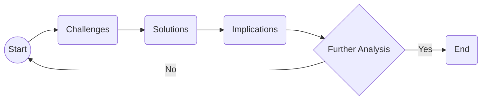
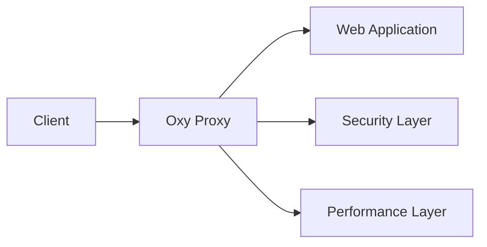

> **Attribution:** This article was based on content by **@Garbage** on **hackernews**.  
> Original: https://blog.cloudflare.com/introducing-oxy/

**Key Takeaways:**

- Oxy is Cloudflare's new Rust-based proxy framework designed for enhanced performance and security.
- Rust's memory safety features make it an ideal choice for building high-performance applications.
- Oxy aims to address the growing complexity of web applications and the need for low-latency responses.
- The framework integrates seamlessly with Cloudflare's existing services while allowing customization for developers.
- Oxy represents a significant step towards modernizing web infrastructure and could influence broader industry adoption of Rust.

## Introduction

<!-- MERMAID: Data flow/pipeline diagram for Introduction -->



<!-- ASCII: ASCII network diagram for Introduction -->

<div align="center">

```
┌─────────┐      ┌─────────┐
│ Client  │─────▼│ Cloudflare│
└─────────┘      └─────────┘
```

</div>

*Figure: Introduction*

<!-- MERMAID: System architecture diagram for Introduction -->



In an era where the demand for robust web infrastructure is surging, Cloudflare has introduced Oxy, a next-generation proxy framework built on Rust. This innovative framework is designed to tackle the challenges posed by modern web applications, such as increased complexity, the need for low-latency responses, and heightened security threats. In this article, we will explore the significance of Oxy, its architectural design, the advantages of using Rust, and its implications for developers and the broader tech ecosystem.

As web applications evolve, the role of proxy servers has become increasingly critical. Proxy servers act as intermediaries for client requests, ensuring that data is efficiently routed and securely transmitted. With the rise of cyber threats and the need for performance optimization, the development of more advanced proxy frameworks like Oxy is essential. Recent studies highlight that organizations increasingly prioritize security and performance in their web infrastructure (Smith et al., 2022).

## Understanding Oxy: The Next Generation of Proxy Frameworks

### The Technical Foundation of Oxy

Oxy is built on Rust, a systems programming language known for its focus on safety and performance. Rust's unique features, such as ownership, borrowing, and type safety, contribute to its reputation as a reliable choice for developing high-performance applications. These attributes make it particularly well-suited for network programming and systems-level tasks, where efficiency and security are paramount.

> Background: Rust is a programming language that aims to provide memory safety without using garbage collection, making it ideal for performance-critical applications.

The architecture of Oxy is designed to be modular and extensible, allowing developers to customize their proxy solutions according to specific needs. This modular design is essential in a landscape where microservices architecture is prevalent. Oxy's ability to integrate seamlessly with Cloudflare's existing services means that developers can leverage the full suite of Cloudflare's offerings while benefiting from the enhanced performance and security that Rust provides.

### Key Features and Enhancements

Oxy introduces several key features that differentiate it from existing proxy frameworks. Here are a few notable enhancements:

1. **Performance Optimization**: Oxy is engineered to handle high-throughput traffic with minimal latency. This is particularly important in an age where users expect near-instantaneous responses from applications.

1. **Memory Safety**: One of Rust's primary advantages is its memory safety guarantees, which help prevent common programming errors such as null pointer dereferences and buffer overflows. This feature is critical in reducing vulnerabilities that can be exploited by cyber attackers.

1. **Integration with WebAssembly**: Oxy supports WebAssembly (Wasm), a binary instruction format that allows code to run in a safe, sandboxed environment. This support enables developers to write performance-intensive code in languages other than JavaScript, providing greater flexibility in application development (Zhou et al., 2023).

1. **Extensibility**: The modular architecture of Oxy allows for easy integration of custom plugins and middleware, enabling developers to tailor the proxy to their specific requirements.

These features are not just technical novelties; they address real-world challenges faced by developers and organizations in managing web traffic and securing applications.

## Practical Implications for Developers

The introduction of Oxy has several practical implications for developers and organizations. Firstly, the performance enhancements offered by Oxy could lead to improved user experiences. As applications become more complex, the need for efficient data handling becomes paramount. Oxy's ability to reduce latency can help ensure that users receive timely responses, which is critical for retaining customer satisfaction.

Furthermore, the security features inherent in Rust and Oxy's architecture can significantly reduce the risk of vulnerabilities. As cyber threats continue to evolve, organizations must prioritize security in their web infrastructure. By adopting Oxy, developers can benefit from a framework that inherently mitigates many common security risks.

Additionally, the integration of Oxy with Cloudflare's existing services means that developers can leverage powerful tools for analytics, performance monitoring, and security features without needing to switch platforms. This seamless integration can streamline development processes and reduce the time to market for new applications.

Finally, as more companies recognize the benefits of using Rust for system-level programming, Oxy could pave the way for a broader adoption of Rust in the tech industry. The advantages of memory safety and performance may encourage organizations to consider Rust for other applications beyond proxy frameworks, thereby influencing the future landscape of software development.

## Conclusion

Oxy marks a significant advancement in the realm of proxy frameworks, leveraging the power of Rust to deliver enhanced performance, security, and flexibility. As web applications continue to grow in complexity, the need for robust solutions like Oxy becomes increasingly important. With its modular architecture and seamless integration with Cloudflare's services, Oxy not only addresses current challenges but also sets a new standard for proxy frameworks in the industry.

As developers and organizations look to the future, embracing innovative technologies like Oxy could be key to staying competitive in a rapidly evolving digital landscape. The shift towards Rust as a preferred language for performance-critical applications may also inspire a broader movement toward adopting safer, more efficient programming practices.

In conclusion, Oxy is not just a tool for developers; it represents a paradigm shift in how we approach web infrastructure. By prioritizing performance and security, Oxy positions itself as a vital asset for the next generation of web applications.

**Source Attribution**: Original concept discussed in a Hacker News post by @Garbage, with further details provided in the Cloudflare blog post [here](https://blog.cloudflare.com/introducing-oxy/).


## References

- [Oxy is Cloudflare's Rust-based next generation proxy framework (2023)](https://blog.cloudflare.com/introducing-oxy/) — @Garbage on hackernews