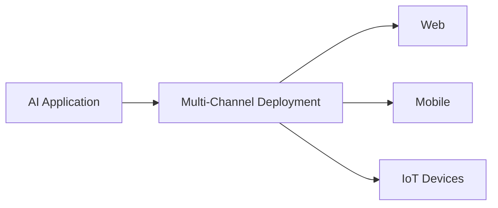

> **Attribution:** This article was based on content by **@achushankar** on **hackernews**.  
> Original: https://www.syllabi-ai.com/

In recent years, the field of artificial intelligence (AI) has witnessed transformative shifts, particularly with the emergence of open-source agentic AI. This innovative approach not only democratizes access to advanced AI technologies but also empowers developers to create systems that can autonomously operate in dynamic environments. In this article, we will explore the nuances of open-source agentic AI, its key components—namely Retrieval-Augmented Generation (RAG) and multi-channel deployment—and the implications for professionals in the tech industry.

### Key Takeaways

- Open-source agentic AI allows for community-driven development, enhancing transparency and flexibility in AI applications.
- Retrieval-Augmented Generation (RAG) improves the relevance and accuracy of AI-generated content by integrating external knowledge sources.
- Multi-channel deployment enables AI applications to function seamlessly across various platforms, including web, mobile, and IoT devices.
- The rise of open-source solutions reflects a broader trend towards democratization and collaborative innovation in the tech industry.
- Understanding the challenges of implementation, such as data privacy and infrastructure requirements, is crucial for successful deployment.

## Understanding Open-Source Agentic AI

<!-- MERMAID: System architecture diagram for Understanding Open-Source Agentic AI -->

```mermaid
graph LR
A[Open-Source Agentic AI] --> B[Traditional AI Systems]
A --> C[Systems that make autonomous decisions]
A --> D[Systems that take actions based on real-time data]
A --> E[Intelligent systems with agency]
E --> F[Learning from environment]
E --> G[Adapting behaviors]
B -.-> Rules & Models
C -.-> Real-time Data
D -.-> Autonomous Decisions
```

Open-source agentic AI represents a paradigm shift from traditional AI systems, which operate primarily through pre-defined rules and models, to systems that can make autonomous decisions and take actions based on real-time data. The term **agentic AI** refers to these intelligent systems that possess a degree of agency, capable of learning from their environment and adapting their behaviors accordingly.

> Background: **Open-source software** is software with source code that anyone can inspect, modify, and enhance, promoting collaborative development.

The open-source nature of agentic AI fosters a community-driven approach, allowing developers to contribute to and enhance AI frameworks collaboratively. This trend aligns with the broader movement in the tech industry towards transparency and democratization, providing more organizations with the tools they need to innovate and compete.

### The Role of Retrieval-Augmented Generation (RAG)

<!-- MERMAID: System architecture diagram for The Role of Retrieval-Augmented Generation (RAG) -->

```mermaid
graph LR
A((Retrieval Component))
B((Generation Component))
C((Retrieval-Augmented Generation (RAG)))
A --> C
B --> C
```

One of the most significant advancements in the field of AI is the incorporation of **Retrieval-Augmented Generation (RAG)**. RAG combines the strengths of retrieval-based methods and generative models to enhance the capabilities of AI systems, particularly in natural language processing (NLP) tasks. Traditional generative models, while powerful, can sometimes produce irrelevant or inaccurate outputs due to a lack of contextual knowledge. RAG addresses this by allowing AI systems to access external knowledge bases, thereby improving the accuracy and relevance of generated content (Lewis et al., 2020).

In practical terms, RAG can be implemented in various applications, such as chatbots, virtual assistants, and content generation tools. By leveraging external data sources, these systems can provide users with more accurate answers, making them invaluable in sectors like healthcare, finance, and customer service. For example, a healthcare chatbot powered by RAG can pull the latest research and medical guidelines from databases to provide patients with accurate information about their conditions.

### Multi-Channel Deployment

<!-- MERMAID: System architecture diagram for Multi-Channel Deployment -->



Another critical aspect of open-source agentic AI is **multi-channel deployment**, which allows AI applications to operate seamlessly across various platforms, including web, mobile, and Internet of Things (IoT) devices. This capability is essential as organizations increasingly seek to engage users across diverse touchpoints.

Multi-channel deployment not only enhances user experience but also ensures that AI systems can function effectively in different environments. For instance, a customer service AI could interact with users through a mobile app, a website, or even a smart speaker, adapting its responses based on the platform and the user's context (Kumar et al., 2021).

However, implementing multi-channel deployment presents its own challenges. Organizations must ensure that their AI systems are robust and can handle varying data inputs and user interactions. Additionally, considerations around data privacy and security become more complex as AI systems operate across multiple platforms (Wang et al., 2022).

## Practical Implications for Tech Professionals

For tech professionals and developers, the rise of open-source agentic AI presents both opportunities and challenges. Understanding the frameworks and tools available for developing agentic AI systems is crucial. Platforms such as Hugging Face’s Transformers and OpenAI’s models offer powerful resources for building AI applications that leverage RAG and support multi-channel deployment.

Furthermore, developers must be prepared to navigate the complexities associated with these technologies. This includes addressing data privacy concerns, ensuring compliance with regulations, and developing robust infrastructure to support AI applications. As organizations increasingly adopt AI technologies, the demand for skilled professionals who can implement these solutions effectively will continue to grow.

### Conclusion

Open-source agentic AI is reshaping the landscape of artificial intelligence, providing powerful tools for developers and organizations alike. By harnessing the capabilities of Retrieval-Augmented Generation and enabling multi-channel deployment, these systems can deliver more accurate and relevant outputs while enhancing user engagement across various platforms. As the tech industry moves towards greater transparency and collaboration, understanding the implications of open-source technologies will be essential for professionals looking to innovate and excel in this rapidly evolving field.

In summary, the future of open-source AI is bright, with the potential to disrupt traditional proprietary solutions and create a more inclusive technological ecosystem. As we continue to explore the possibilities of agentic AI, it will be vital to remain vigilant about the ethical implications of autonomous decision-making and to prioritize responsible AI development.

### Source Attribution

This article is inspired by a post on Hacker News by @achushankar titled "Syllabi – Open-source agentic AI with tools, RAG, and multi-channel deploy." For more information, visit [Syllabi AI](https://www.syllabi-ai.com/).


## References

- [Syllabi – Open-source agentic AI with tools, RAG, and multi-channel deploy](https://www.syllabi-ai.com/) — @achushankar on hackernews