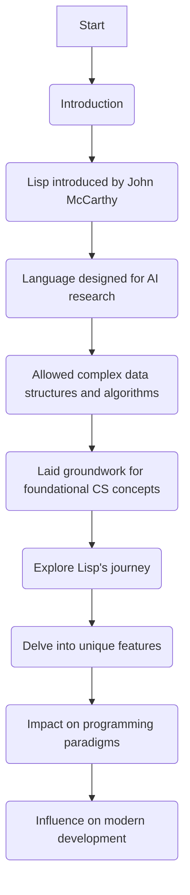
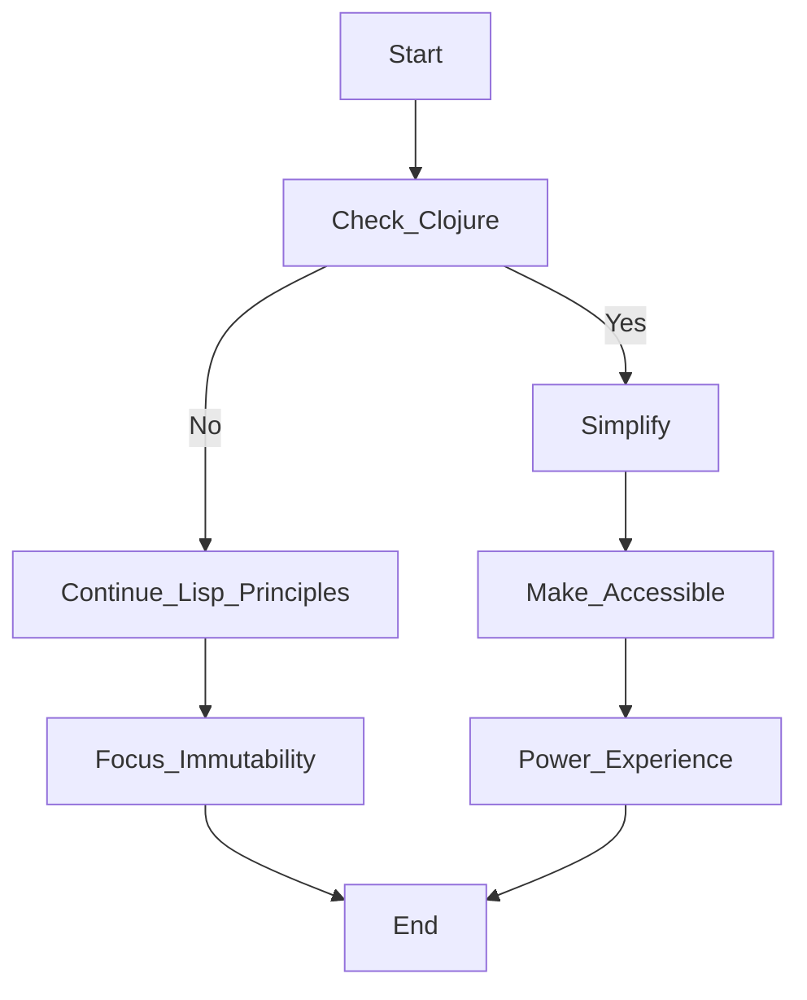
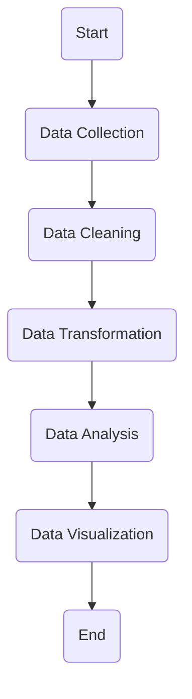

> **Attribution:** This article was based on content by **@birdculture** on **hackernews**.  
> Original: https://www-formal.stanford.edu/jmc/lisp20th/lisp20th.html

Lisp, one of the oldest programming languages still in use today, has a storied history that spans over six decades. Its innovative concepts have shaped not only the field of artificial intelligence (AI) but also the broader landscape of programming languages. In this article, we will explore the origins of Lisp, its evolution, and the potential future developments that could shape its role in modern software development.

### Key Takeaways

- Lisp introduced groundbreaking concepts like symbolic expression manipulation and garbage collection, influencing many modern programming languages.
- Despite being less mainstream today, Lisp dialects like Common Lisp and Clojure are actively used in specialized fields, particularly AI and functional programming.
- The unique syntax of Lisp, characterized by its heavy use of parentheses, offers powerful metaprogramming capabilities that are valuable in rapid prototyping and software development.

## Introduction

<!-- MERMAID: Algorithm flowchart for Introduction -->

Lisp, short for "LISt Processing," was introduced by John McCarthy in the late 1950s as a language designed primarily for AI research. It allowed for complex data structures and algorithms, laying the groundwork for many foundational concepts in computer science. As we explore Lisp's journey from its inception to its current state and future potential, we will delve into its unique features, its impact on programming paradigms, and how it continues to influence modern development practices.

> Background: Lisp is one of the earliest programming languages, known for its unique syntax and focus on symbolic computation.

## The Historical Significance of Lisp

The development of Lisp in the late 1950s marked a significant turning point in programming languages. McCarthy's vision was to create a language that could manipulate symbolic expressions, a necessity for AI research. This led to the introduction of several key features:

1. **Symbolic Expression Manipulation**: Lisp's ability to treat code as data (and vice versa) was revolutionary. This feature laid the groundwork for metaprogramming, where programs can generate or modify other programs dynamically (Graham, 2009).

1. **Garbage Collection**: Lisp was among the first languages to implement automatic memory management through garbage collection, allowing developers to focus on building applications without manual memory management concerns (Baker, 2017).

1. **Interactive Development**: The language's REPL (Read-Eval-Print Loop) environment allows for interactive coding and debugging, which has become a staple in modern development workflows.

Over the decades, Lisp has influenced many other programming languages, including Python, Ruby, and JavaScript. Its concepts have permeated through functional programming languages, contributing to the rise of languages like Haskell and Scala (Hudak et al., 2007).

## Current State of Lisp

As of 2023, Lisp may not dominate the programming landscape like Python or Java, but it maintains a dedicated community and relevance in specialized fields. Variants like Common Lisp and Scheme are still taught in academic settings, primarily due to their educational value in understanding fundamental programming concepts and paradigms.

### The Rise of Modern Lisp Dialects

<!-- MERMAID: Algorithm flowchart for The Rise of Modern Lisp Dialects -->

<!-- MERMAID: Data flow/pipeline diagram for The Rise of Modern Lisp Dialects -->

One of the most notable developments in recent years is the emergence of Clojure, a modern Lisp dialect that runs on the Java Virtual Machine (JVM). Clojure has gained popularity for several reasons:

- **Simplicity and Power**: Clojure retains Lisp's core principles while simplifying many aspects, making it accessible to new developers while still being powerful enough for experienced programmers.
- **Concurrency**: Clojure's focus on immutability and concurrency has made it a strong candidate for building scalable applications in today's multi-core computing environments (Hickey, 2009).
- **Interoperability**: Being built on the JVM allows Clojure to leverage Java's vast ecosystem, making it a practical choice for enterprise-level applications.

The resurgence of interest in functional programming has also contributed to Lisp's ongoing relevance. As developers seek to build more robust and maintainable systems, many are revisiting the concepts that Lisp pioneered, such as higher-order functions, lazy evaluation, and state management through immutability (Marlow et al., 2013).

## Practical Implications for Developers

Lisp's unique features offer valuable insights for modern developers. Here are some key takeaways on how Lisp can influence current software development practices:

1. **Metaprogramming**: Lisp's macro system allows developers to write code that generates code, streamlining repetitive tasks and enabling the creation of domain-specific languages (DSLs). This capability can enhance productivity and code maintainability.

1. **Rapid Prototyping**: The interactive development environment of Lisp encourages experimentation. Developers can quickly test ideas and iterate on designs, which is particularly useful in agile development settings.

1. **Functional Programming Paradigms**: Embracing Lisp's functional programming concepts can lead to cleaner, more maintainable code. By leveraging immutability and first-class functions, developers can build applications that are easier to reason about and less prone to bugs.

1. **AI and Symbolic Computation**: For those interested in AI, Lisp's historical roots make it a natural choice for projects involving symbolic reasoning, natural language processing, and complex algorithm development.

## Conclusion

Lisp's journey from a niche academic language to a foundational pillar of modern programming is a testament to its enduring relevance. Its innovative concepts have shaped the development of countless programming languages and paradigms, influencing how software is built today. While it may not be as mainstream as other languages, Lisp continues to thrive in specialized domains and has seen a resurgence through modern dialects like Clojure.

As developers and tech professionals, revisiting Lisp can provide valuable insights into software design and development. Whether through its powerful metaprogramming capabilities or its emphasis on functional programming, the lessons learned from Lisp can help shape the future of software development.

### Source Attribution

This article is based on insights from the original post "Lisp: Notes on its [Past and Future (1980)](https://doi.org/10.1016/c2013-0-03336-1)" shared by @birdculture on Hacker News. For more details, visit [Stanford's Lisp 20th Anniversary page](https://www-formal.stanford.edu/jmc/lisp20th/lisp20th.html).

### References

- Baker, H. G. (2017). *Garbage Collection: Algorithms for Automatic Memory Management*.
- Graham, P. (2009). *On Lisp: Advanced Techniques for Common Lisp*.
- Hickey, R. (2009). *The Clojure Programming Language*.
- Hudak, P., et al. (2007). *The Haskell School of Expression: Learning Functional Programming through Multimedia*.
- Marlow, S., et al. (2013). *Real World Haskell: Functional Programming for the Real World*.

## References

- [Lisp: Notes on its Past and Future (1980)](https://www-formal.stanford.edu/jmc/lisp20th/lisp20th.html) — @birdculture on hackernews

- [Past and Future (1980)](https://doi.org/10.1016/c2013-0-03336-1)