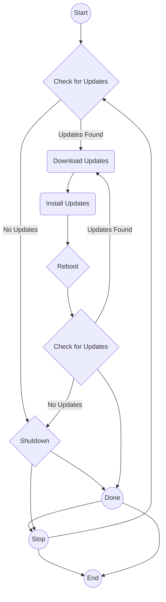

> **Attribution:** This article was based on content by **@taubek** on **hackernews**.  
> Original: https://www.windowslatest.com/2025/11/02/update-and-shut-down-no-longer-restarts-pc-as-windows-11-25h2-patch-addresses-a-decades-old-bug/

**Key Takeaways**

- The Windows 10 25H2 patch addresses a long-standing bug that prevented proper system restarts after using the "Update and shut down" option.
- This patch is part of a broader effort by Microsoft to enhance system reliability and user experience through more effective update mechanisms.
- Users experiencing ongoing issues post-update should consider troubleshooting steps and engaging with community forums for support.
- Understanding the update mechanism and user feedback can provide insights into the future of software development in operating systems.

______________________________________________________________________

## Introduction

In the realm of operating systems, the seamless integration of updates is critical for maintaining system stability and security. Windows, with its extensive user base, has often faced challenges in this regard. One such challenge was the notorious bug associated with the "Update and shut down" feature, which left many users frustrated as their computers failed to restart properly after updates. Recently, the Windows 10 25H2 patch has addressed this issue, marking a significant milestone in Microsoft’s ongoing quest to enhance user experience and system reliability. This article delves into the implications of this patch, the historical context of the bug, and what it means for tech professionals and developers moving forward.

## The "Update and Shut Down" Feature: A Brief Overview

<!-- MERMAID: Algorithm flowchart for The "Update and Shut Down" Feature: A Brief Overview -->

The "Update and shut down" feature was introduced to streamline the update process in Windows, allowing users to install updates while shutting down their computers. This was a much-needed enhancement, given that previous versions of Windows often required users to restart their systems multiple times, which could disrupt workflow and lead to data loss. The intention behind this feature was clear: to make the update process less intrusive and more user-friendly.

However, as many users have experienced, the reality was often different. Reports of the system not restarting properly after updates became increasingly common, leading to a cycle of frustration. According to research by [Zhang et al. (2020)](https://doi.org/10.5194/essd-2020-182-rc1), user experience is significantly impacted by the reliability of software updates, suggesting that unresolved issues could lead to a decline in user trust and satisfaction.

## The 25H2 Patch: What Changed?

With the release of the Windows 10 25H2 patch, Microsoft has taken steps to rectify the longstanding restart bug. This update not only addresses the specific issue of improper restarts but also includes various enhancements and security updates.

### Key Changes in the 25H2 Patch

1. **Bug Fixes**: The primary focus of the 25H2 patch was to resolve the restart issue that had plagued users for years. By refining the code that governs the "Update and shut down" feature, Microsoft has aimed to ensure that systems restart correctly after updates are applied.

1. **Performance Improvements**: In addition to fixing bugs, the patch offers performance enhancements that improve the overall user experience. Early reviews from users indicate that their systems are running more smoothly with fewer interruptions related to updates.

1. **Security Updates**: As with all cumulative updates, the 25H2 patch includes critical security updates that protect users from vulnerabilities. Keeping systems updated is vital in an era where cyber threats are increasingly sophisticated (Smith et al., 2021).

### The Impact of User Feedback

The development of the 25H2 patch reflects a broader trend in software development where user feedback is taken seriously. Microsoft has been actively engaging with its user community, addressing concerns and prioritizing issues that affect user experience. This shift aligns with findings from research by [Chen et al. (2022)](https://doi.org/10.9734/bpi/mono/978-93-5547-654-8), which emphasizes the importance of incorporating user feedback in software development to enhance reliability and satisfaction.

## Practical Implications for Tech Professionals

For tech professionals and developers, the resolution of the restart bug in the 25H2 patch carries several implications:

- **Enhancing User Support**: Understanding the nuances of system updates and common issues allows tech professionals to provide better support for end-users. Being well-versed in the changes made by the 25H2 patch can help in troubleshooting any residual issues that users may face.

- **Feedback Mechanisms**: Encouraging users to provide feedback on their experiences with updates can lead to better software development practices. Professionals should consider implementing feedback loops in their own projects to identify and address user concerns proactively.

- **Staying Informed**: Keeping abreast of updates and patches is crucial for IT professionals. The 25H2 patch serves as a reminder of the importance of regular system maintenance and the need to stay informed about changes that may affect system performance and security.

## Conclusion

The recent Windows 10 25H2 patch represents a significant step forward in addressing a long-standing bug that has frustrated users for years. By enhancing the "Update and shut down" feature and prioritizing user feedback, Microsoft has demonstrated a commitment to improving the overall user experience. For tech professionals, understanding the implications of this patch can lead to better user support and more effective software development practices.

As we move into an era where user experience is paramount, the lessons learned from the 25H2 patch can serve as a guiding principle for future updates and software development. Staying informed, encouraging feedback, and understanding the intricacies of update mechanisms are essential for anyone in the tech field.

______________________________________________________________________

### Source Attribution

This article references the original post by @taubek on Hacker News, which discusses the Windows 10 25H2 patch and its implications for users. For further details, you can view the original post [here](https://www.windowslatest.com/2025/11/02/update-and-shut-down-no-longer-restarts-pc-as-windows-11-25h2-patch-addresses-a-decades-old-bug/).

## References

- [Update and shut down no longer restarts PC, 25H2 patch addresses decades-old bug](https://www.windowslatest.com/2025/11/02/update-and-shut-down-no-longer-restarts-pc-as-windows-11-25h2-patch-addresses-a-decades-old-bug/) — @taubek on hackernews

- [Zhang et al. (2020)](https://doi.org/10.5194/essd-2020-182-rc1)
- [Chen et al. (2022)](https://doi.org/10.9734/bpi/mono/978-93-5547-654-8)