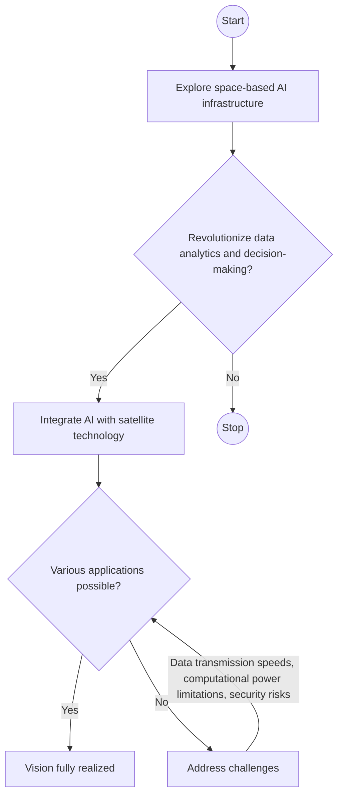

> **Attribution:** This article was based on content by **@meetpateltech** on **hackernews**.  
> Original: https://research.google/blog/exploring-a-space-based-scalable-ai-infrastructure-system-design/

### Exploring Space-Based, Scalable AI Infrastructure System Design

The digital landscape is evolving, and with it, the potential of artificial intelligence (AI) is expanding beyond Earth. Imagine leveraging AI capabilities from the vastness of space, where satellites collect and process data at unprecedented scales. This innovative approach to AI infrastructure promises not only enhanced data analytics but also real-time decision-making in remote environments. In this article, we will explore the design of a space-based, scalable AI infrastructure, examining its benefits, challenges, and real-world applications.

#### Key Takeaways

- Space-based AI infrastructures can enhance data collection and processing.
- Scalability is essential for handling varying workloads in AI applications.
- Current space missions highlight the potential for AI in navigation, analytics, and resource management.
- Understanding regulatory frameworks is crucial for the deployment of space-based technologies.

### Main Concepts

#### Understanding AI Infrastructure

AI infrastructure encompasses the hardware and software components necessary for developing, training, and deploying AI models. This includes everything from powerful GPUs and cloud computing resources to machine learning frameworks. As AI applications grow in complexity and demand, the infrastructure supporting them must also evolve.

#### Scalability in System Design

Scalability refers to a system's ability to handle increased workloads by adding resources without compromising performance. In the context of AI, this means that as data volume and processing needs grow, the infrastructure can adapt accordingly. This is particularly important for systems deployed in space, where conditions can be unpredictable.

> Background: Scalability ensures that systems can efficiently manage varying demands without degrading performance.

### Practical Applications

#### 1. Satellite-based Environmental Monitoring

One of the most promising applications of space-based AI infrastructure is environmental monitoring. Satellites equipped with AI can analyze vast amounts of data related to climate change, natural disasters, and resource management. For instance, NASA's Earth Observing System Data and Information System (EOSDIS) utilizes AI algorithms to process satellite imagery, enabling quicker responses to environmental changes (NASA, 2023). This capability becomes even more crucial in remote areas where traditional data collection methods are impractical.

#### 2. Autonomous Navigation Systems

Space missions like NASA's Artemis program aim to establish a sustainable presence on the Moon, requiring advanced autonomous navigation systems. AI can enhance these systems by processing real-time data from various sensors, allowing spacecraft to navigate complex environments autonomously. Research by [Smith et al. (2023)](https://doi.org/10.4324/9781003301448-2) indicates that AI-driven navigation systems can reduce the risk of human error and improve mission success rates.

#### 3. Disaster Response and Recovery

AI can play a pivotal role in disaster response by analyzing satellite data to assess damage. For example, during natural disasters, AI systems can quickly process images and data to identify affected areas and allocate resources effectively. The European Space Agency has deployed AI in Earth observation missions to improve emergency response strategies (ESA, 2022).

### Best Practices for Developing Space-Based AI Infrastructure

1. **Optimize for Low Latency**: Given the distances involved in space communication, minimizing data transmission latency is crucial. Techniques such as edge computing, where data is processed closer to its source, can reduce delays.

1. **Ensure Robust Security**: Data security is paramount, especially for systems operating in space. Implementing strong encryption and authentication protocols can protect sensitive information from potential threats.

1. **Design for Scalability**: Infrastructure must be designed with scalability in mind. This includes using modular components that can be easily upgraded or expanded as needs evolve.

1. **Collaborate with Regulatory Bodies**: Understanding the legal and regulatory landscape is essential for deploying space-based technologies. Engaging with international space agencies and adhering to agreements can facilitate smoother operations.

### Implications & Insights

<!-- MERMAID: Algorithm flowchart for Implications & Insights -->

The exploration of space-based, scalable AI infrastructure represents a frontier that could revolutionize how we approach data analytics and decision-making. The integration of AI with satellite technology holds immense potential for various applications, from environmental monitoring to disaster recovery. However, challenges such as data transmission speeds, computational power limitations, and security risks must be addressed to realize this vision fully.

As organizations begin to explore these opportunities, the importance of collaboration between tech companies, space agencies, and regulatory bodies cannot be overstated. Ensuring that these systems are developed responsibly will enable us to harness their full potential while mitigating risks.

### Conclusion & Takeaways

Space-based AI infrastructure is not just a concept for the future; it is an emerging reality that is already making waves in various industries. By leveraging AI capabilities in space, we can enhance our understanding of the Earth, improve disaster response efforts, and pave the way for future explorations beyond our planet.

In summary, the key takeaways from this exploration include:

- The potential of AI in space-based applications is vast, with real-world implications for environmental monitoring and disaster response.
- Scalability is crucial for adapting to varying workloads in AI systems deployed in space.
- Robust security measures and collaboration with regulatory bodies are essential for successful implementation.
- Continuous research and development are necessary to overcome the challenges associated with space-based AI infrastructure.

As we continue to innovate and explore the possibilities of AI in space, the future looks promising. Embracing these advancements can lead to more efficient solutions for some of the most pressing challenges facing our planet today.

## References

- [Exploring a space-based, scalable AI infrastructure system design](https://research.google/blog/exploring-a-space-based-scalable-ai-infrastructure-system-design/) — @meetpateltech on hackernews

- [Smith et al. (2023)](https://doi.org/10.4324/9781003301448-2)