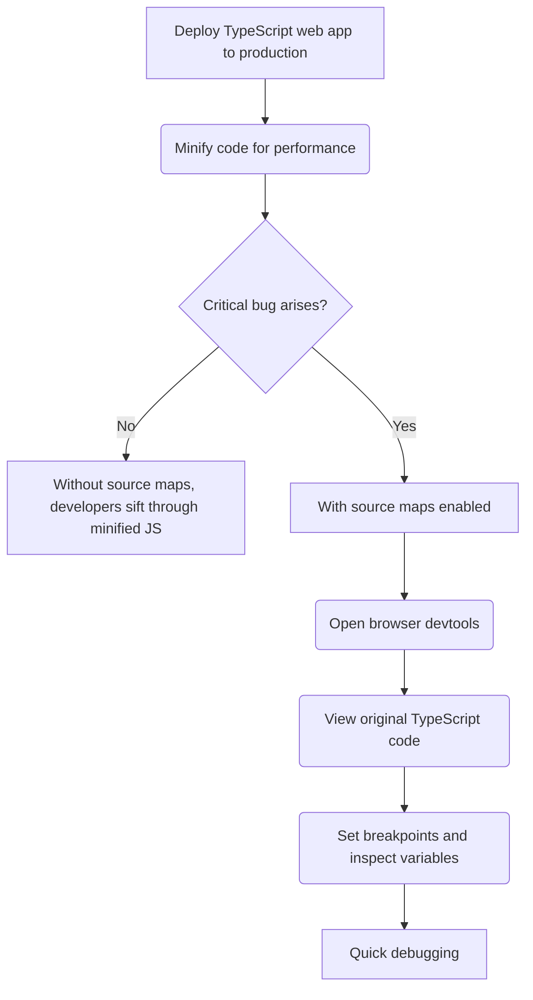

> **Attribution:** This article was based on content by **@manojvivek** on **hackernews**.  
> Original: https://www.polarsignals.com/blog/posts/2025/11/04/javascript-source-maps-internals

In the fast-evolving landscape of web development, understanding how to effectively debug applications is crucial. One of the most powerful tools in this regard is the ability to map minified JavaScript (JS) code back to its original TypeScript source code. This capability, facilitated by modern developer tools (devtools) and source maps, empowers developers to maintain high-quality code even in production environments. In this article, we will explore how this mapping works, the significance of source maps, and best practices for effectively utilizing them.

### Key Takeaways

- **Source Maps**: Essential for debugging minified code by linking it back to the original source.
- **Build Tools**: Popular tools like Webpack, Rollup, and Parcel can automatically generate source maps during the build process.
- **Debugging Efficiency**: Using source maps significantly enhances debugging efficiency, especially in production environments.
- **Best Practices**: Implement best practices for managing source maps securely and ensuring they work correctly.
- **Growing Popularity of TypeScript**: TypeScript's adoption in modern frameworks is on the rise, making source maps increasingly relevant.

### Understanding the Basics

#### What Are Source Maps?

Source maps are files that act as a bridge between minified code and its original source. When developers write TypeScript, it often gets transpiled into JavaScript, which may then be minified to optimize load times. However, minification can make debugging a nightmare, as the original naming and structure of variables and functions are obscured. Source maps solve this problem by providing a way for browsers to understand how to map the minified code back to the original TypeScript source.

> Background: Minification involves removing unnecessary characters from code, such as whitespace and comments, to reduce file size.

#### Why TypeScript?

TypeScript is a superset of JavaScript that introduces static typing, making it easier to catch errors during development. Its popularity has surged, particularly in large-scale applications developed using frameworks like Angular, React, and Vue (Bergström, 2022). As developers increasingly adopt TypeScript, understanding how to leverage source maps becomes essential for effective debugging.

### Practical Applications

#### Example 1: Debugging in Production

<!-- MERMAID: Algorithm flowchart for Example 1: Debugging in Production -->



Consider a scenario where a web application built with TypeScript is deployed to production. The code is minified for performance, but a critical bug arises. Without source maps, developers would have to sift through the minified JS file, which can be nearly impossible. However, with source maps enabled, they can open the browser's devtools, view the original TypeScript code, set breakpoints, and inspect variables. This capability allows for a much quicker resolution of issues, improving overall productivity.

#### Example 2: Working with Build Tools

Using build tools like Webpack, Rollup, or Parcel simplifies the process of generating source maps. For instance, in a Webpack configuration, developers can enable source maps by adding the following line to their configuration file:

```javascript
module.exports = {
  devtool: 'source-map',
  // other configurations...
};
```

This simple addition tells Webpack to create a corresponding source map for each minified file, making debugging straightforward. Rollup and Parcel offer similar configurations, enhancing the developer experience.

### Best Practices for Using Source Maps

1. **Generate Source Maps in Development**: Always generate source maps during development to facilitate debugging. This is crucial for identifying issues early on.

1. **Secure Source Maps in Production**: While source maps are invaluable for debugging, they can expose your original source code. Consider serving them conditionally or using a separate subdomain to mitigate security risks.

1. **Monitor Source Map Performance**: Source maps can increase load times if not handled properly. Use tools like Chrome's Lighthouse to analyze performance and ensure that source maps do not hinder application speed.

1. **Utilize Error Tracking Tools**: Integrate error tracking tools like Sentry or Rollbar with source maps to automatically map stack traces back to the original TypeScript code, facilitating efficient debugging in production.

1. **Stay Updated on Tooling**: The ecosystem around TypeScript and source maps is constantly evolving. Keep abreast of updates to tools like Webpack and Parcel to take advantage of new features and best practices.

### Implications & Insights

The ability to map minified JavaScript back to TypeScript source code represents a significant advancement in debugging practices. As TypeScript continues to gain traction in the web development community, the importance of source maps cannot be overstated. By enabling developers to navigate their code easily, source maps bridge the gap between performance optimization and maintainability. This is particularly vital in production environments, where quick resolution of issues can lead to enhanced user experiences and lower downtime.

The ongoing development of modern browsers also enhances the debugging experience. For instance, Chrome's devtools now provide intuitive interfaces for working with source maps, allowing developers to inspect and debug their applications efficiently. This evolution reflects the industry's commitment to improving developer productivity and the overall quality of web applications.

### Conclusion & Takeaways

In conclusion, understanding how to effectively use source maps is essential for any web developer working with TypeScript. By leveraging the capabilities of modern devtools and build tools, developers can significantly enhance their debugging process.

**Key Takeaways**:

- Source maps are crucial for mapping minified code back to its original TypeScript source.
- Build tools like Webpack and Rollup simplify the generation of source maps.
- Implement security measures when deploying source maps in production.
- Continuous monitoring and updates to tooling can optimize performance and debugging efficiency.

As the web development landscape continues to evolve, mastering these techniques will empower developers to create more robust, maintainable, and high-performance applications.


## References

- [How devtools map minified JS code back to your TypeScript source code](https://www.polarsignals.com/blog/posts/2025/11/04/javascript-source-maps-internals) — @manojvivek on hackernews