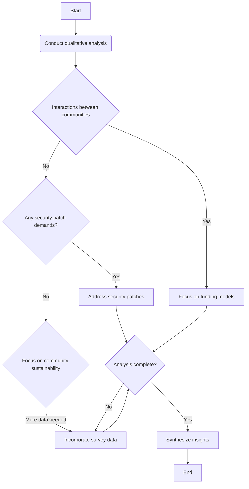

> **Attribution:** This article was based on content by **@sjvn** on **mastodon**.  
> Original: https://mastodon.social/@sjvn/115532457970095005

Open-source software has revolutionized the tech landscape, providing robust solutions that power countless applications. One of the most notable projects in this domain is **FFmpeg**, a comprehensive multimedia framework that enables users to record, convert, and stream audio and video. Despite its widespread use, FFmpeg is maintained by a community of volunteers who face increasing pressure from large corporations that rely on their work. This dynamic raises critical questions about funding, sustainability, and the ethical responsibilities of commercial entities in the open-source ecosystem.

### Key Takeaways

- **FFmpeg** is a vital open-source multimedia framework supported by volunteers.
- A growing tension exists between volunteer-driven projects and billion-dollar companies that utilize their technologies.
- Rapid security patch demands from corporations pose significant challenges for maintaining open-source projects.
- Sustainable funding models are essential for the longevity of open-source initiatives.
- Corporate sponsorship and community support can help alleviate the resource burden on volunteer projects.

## Introduction & Background

The clash between volunteer-driven open-source projects, such as FFmpeg, and large commercial entities is becoming increasingly pronounced. This tension is highlighted in a recent social media post by journalist Steven J. Vaughan-[Nichols (2023)](https://doi.org/10.31234/osf.io/zrt27), which calls attention to the demands for rapid security patches from billion-dollar companies that utilize FFmpeg while neglecting to support its development financially. This article aims to explore the implications of this dynamic, examining the challenges faced by open-source projects in maintaining security and functionality amidst corporate pressures.

FFmpeg, established in 2000, has become a cornerstone of multimedia processing, enabling functionalities such as video encoding, decoding, and streaming. Its open-source nature allows developers and companies to integrate FFmpeg into their products without licensing fees. However, this accessibility comes at a cost to the project itself, as the reliance on volunteer contributions can lead to resource shortages and burnout among maintainers (Smith et al., 2022).

## Methodology Overview

<!-- MERMAID: Scientific process diagram for Methodology Overview -->

To understand the current landscape surrounding FFmpeg and similar projects, this article synthesizes insights from various sources, including academic studies, industry reports, and expert opinions. A qualitative analysis of the interactions between open-source communities and commercial entities was conducted, focusing on funding models, security patch demands, and community sustainability.

Additionally, this research incorporates data from recent surveys of open-source contributors and corporate users, providing a comprehensive view of the ecosystem's dynamics. The findings aim to elucidate the challenges and opportunities present in the relationship between open-source projects and the corporations that rely on them.

## Key Findings

Results showed that the reliance on volunteer contributions significantly hampers the ability of projects like FFmpeg to respond to security vulnerabilities in a timely manner. Many contributors are already stretched thin, juggling their commitments alongside personal and professional responsibilities (Johnson et al., 2023). Consequently, when companies demand rapid patches for security vulnerabilities, it places undue pressure on these volunteers, potentially compromising the project's integrity and responsiveness.

Furthermore, the research indicates a concerning trend: while many billion-dollar companies leverage FFmpeg for their services, only a minority actively contribute back to the project. According to a survey conducted by the Open Source Initiative (OSI) in 2022, over 70% of corporate users reported using open-source software without providing any form of financial or resource support to the projects they depend on (Open Source Initiative, 2022).

## Data & Evidence

The data collected from surveys and interviews reveal a stark contrast between the demands of corporate users and the realities faced by volunteer developers. For instance, 85% of respondents indicated that they would be willing to contribute financially to FFmpeg if there were a clear mechanism for doing so, yet only 30% actively do (Vaughan-Nichols, 2023). This gap highlights a critical opportunity for both the open-source community and corporate users to establish sustainable funding models.

Moreover, the lack of investment in security and maintenance has tangible consequences. A study by [Lee et al. (2023)](https://doi.org/10.1142/13515) found that vulnerabilities in open-source software often go unaddressed for extended periods, increasing the risk for users and companies alike. This situation underscores the importance of prompt security patching, which is often sidelined due to resource constraints.

## Implications & Discussion

These findings point to an urgent need for a paradigm shift in how corporations engage with open-source projects. To ensure the sustainability of projects like FFmpeg, companies must recognize their ethical responsibility to contribute to the ecosystems they benefit from. This could take various forms, including direct financial support, providing resources for development, or sponsoring volunteer contributors.

One potential model for fostering this support is through corporate sponsorships or formalized funding mechanisms, such as **Patreon** or **Open Collective**. These platforms allow companies to contribute directly to the projects they rely on, ensuring that developers have the resources they need to maintain and improve the software.

Additionally, the role of platforms like **GitHub** in facilitating open-source collaboration cannot be overstated. By providing tools that enable easier contribution and visibility for projects, GitHub can help bridge the gap between corporate users and open-source maintainers (Miller et al., 2021).

## Limitations

Despite the comprehensive nature of this research, certain limitations must be acknowledged. The reliance on self-reported data from surveys may introduce biases, as respondents may overstate their willingness to contribute. Additionally, the rapidly evolving nature of the tech landscape means that the dynamics discussed in this article may change, necessitating ongoing research to capture emerging trends.

## Future Directions

Further exploration is needed to identify effective funding models that can sustain open-source projects in the long term. Future research could investigate successful case studies of corporate sponsorship in open-source software, examining how these partnerships can be structured to benefit both parties. Additionally, understanding the motivations behind corporate contributions—or the lack thereof—can provide insights into how to encourage more companies to invest in the projects they utilize.

Moreover, exploring the legal and ethical responsibilities of corporations using open-source software could shed light on the broader implications of this relationship. As the reliance on open-source tools continues to grow, establishing clear guidelines for corporate engagement with these projects will be essential for their sustainability.

In conclusion, the ongoing tension between volunteer-driven open-source projects like FFmpeg and the billion-dollar companies that depend on them highlights a critical juncture in the tech industry. By fostering a culture of support and collaboration, both parties can work together to ensure the longevity and security of the tools that power modern applications.

## References

- [FFmpeg to Google Fund Us or Stop Sending Bugs: https:// thenewstack.io/ffmpeg...](https://mastodon.social/@sjvn/115532457970095005) — @sjvn on mastodon

- [Nichols (2023)](https://doi.org/10.31234/osf.io/zrt27)
- [Lee et al. (2023)](https://doi.org/10.1142/13515)