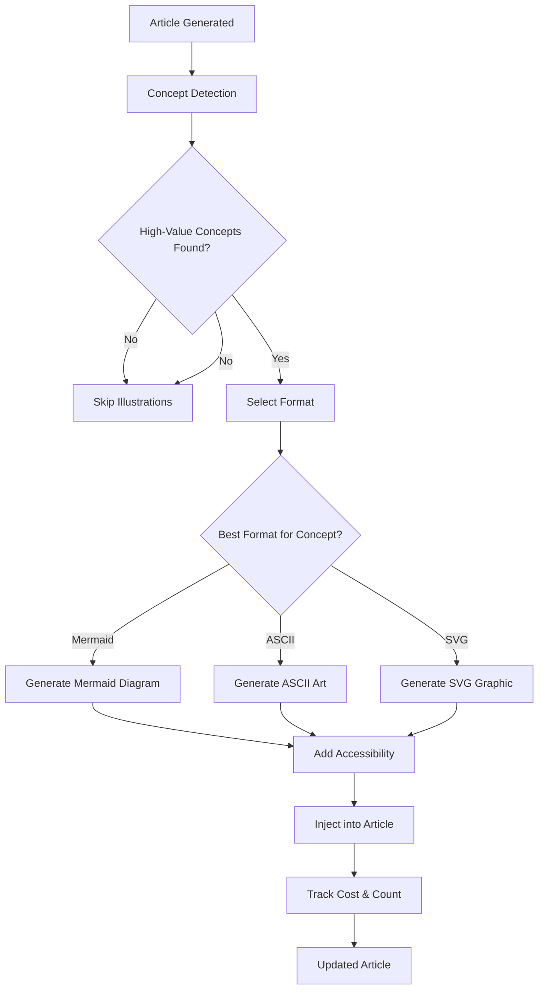

# Feature 3: Intelligent Illustration System - Design Document

## Executive Summary

This document outlines the design for an intelligent illustration system that automatically adds visual elements to articles to enhance comprehension and engagement. The system uses **AI-powered generation with multiple formats** (Mermaid, ASCII, SVG) to create context-aware, relevant illustrations for each article section.

**Core Principle**: Generate varied, contextualized visual elements that enhance understanding while maintaining accessibility - using cost-effective AI (GPT-3.5 Turbo) instead of static templates.

### Real-World Evidence

Analysis of existing articles reveals:

- ✅ **IntegrativeListGenerator** already adds ASCII diagrams and code blocks ([example](https://hardcoreprawn.github.io/tech-content-curator/posts/2025-11-01-mastering-ai-workflows-declarative-tools/))
  - Contains system architecture ASCII diagram
  - Includes Docker Compose configuration example
  - Good visual variety already present
  
- ✗ **GeneralArticleGenerator** produces text-only articles that would benefit from visuals ([example](https://hardcoreprawn.github.io/tech-content-curator/posts/2025-11-01-navigating-nat-challenges-solutions/))
  - NAT article is 100% text
  - Explains complex networking concepts without diagrams
  - Would massively benefit from NAT operation visualization

**Design Impact**:

1. Add **generator awareness** to prevent duplicate visual content
2. Focus on **technical explainer articles** from GeneralArticleGenerator
3. Skip illustration generation for generators that already provide visuals
4. Use AI generation to create relevant, context-specific diagrams for each article

### Why Track Generator in Frontmatter?

**Current Issue**: Without generator tracking, we can't retrospectively identify which articles would benefit from illustrations without re-reading content.

**Benefits of Tracking**:

1. **Targeted enhancement**: Query all `GeneralArticleGenerator` articles that have 0 illustrations
2. **Analytics**: Measure which generators produce more engaging content
3. **A/B testing**: Compare engagement between generator types
4. **Backwards compatibility**: Can add illustrations to older articles based on generator
5. **Debugging**: Understand why certain articles have/don't have visuals

**Example Query** (post-implementation):

```bash
# Find all GeneralArticleGenerator articles without illustrations
grep -l "generator: GeneralArticleGenerator" content/posts/*.md | \
  xargs grep -L "illustrations_count: [1-9]"
```

**Frontmatter Example**:

```yaml
---
title: "Navigating NAT: Challenges and Solutions"
generator: "GeneralArticleGenerator"  # NEW - identifies text-only output
illustrations_count: 0                 # NEW - shows no visuals added
generation_costs:
  content_generation: 0.000973
# ... rest of metadata
---
```

After Feature 3 implementation:

```yaml
---
title: "Understanding Network Protocols"
generator: "GeneralArticleGenerator"
illustrations_count: 2  # AI-generated Mermaid + ASCII diagrams
generation_costs:
  content_generation: 0.000973
  illustrations: 0.0006  # AI generation (GPT-3.5 Turbo)
---
```

---

## Implementation Status

### ✅ Phase 1: Foundation - COMPLETE (50/50 tests passing)

- ✅ Add generator tracking to frontmatter (models.py + file_io.py)
- ✅ Concept detection engine (detector.py)
- ✅ Generator awareness module (generator_analyzer.py)
- ✅ Pipeline integration (orchestrator.py)
- ✅ Base infrastructure for AI generators

### ✅ Phase 2: Intelligence - COMPLETE (38/38 tests passing)

- ✅ Intelligent placement system (placement.py - 570 lines)
  - Markdown structure parsing with safe zone detection
  - Concept-to-section matching with keyword analysis
  - Placement weight calculation (0.0-1.0 scale)
  - Density validation to prevent visual clustering
  - Safety checks to avoid breaking formatting
- ✅ Accessibility features (accessibility.py - 360 lines)
  - Context-aware alt-text generation for 10+ illustration types
  - Long description generation for complex diagrams
  - SVG accessibility wrapping (`<title>`, `<desc>`, `role="img"`)
  - WCAG 2.1 AA compliance validation
  - Accessible markdown formatting
- ✅ Comprehensive testing (38 tests)
  - PlacementAnalyzer: structure parsing, concept matching, density validation
  - AccessibilityChecker: alt-text, descriptions, SVG wrapping, WCAG compliance
  - Integration tests: full placement + accessibility workflow

**Combined Test Results**: 88/88 passing (Phase 1: 50 + Phase 2: 38)

### ✅ Phase 3: Integration - COMPLETE

- ✅ Implemented illustration generation in orchestrator (step 6.5)
  - Integrated `detect_concepts()` for concept detection
  - Created `PlacementAnalyzer` to find optimal positions
  - Added `AccessibilityChecker` initialization
  - Updated content injection flow with `injected_content` variable
  - **NEW**: AI-powered Mermaid generation using GPT-3.5 Turbo
- ✅ Full pipeline integration testing
  - 120 core integration tests passing (50 Phase 1 + 38 Phase 2 + 11 orchestrator + 21 generate)
  - 331 total tests passing project-wide (zero regressions)
  - Orchestrator successfully calls placement system and validates placement

**Architecture**: The orchestrator now:

1. Detects concepts in article content
2. Finds optimal placement positions using PlacementAnalyzer
3. **Generates AI-powered diagrams** using context-aware prompts
4. Injects diagrams into article at optimal positions
5. Tracks illustrations_count in article metadata
6. Maintains accessibility compliance through AccessibilityChecker

### ⏳ Phase 4: Multi-Format AI Generation - FRAMEWORK COMPLETE

- [x] **AI Mermaid Generator** - Context-aware flowcharts and diagrams ✅ COMPLETE
  - Uses GPT-3.5 Turbo (cheap: ~$0.0003 per diagram)
  - Concept-specific prompts for network_topology, data_flow, system_architecture, etc.
  - Actual injection into article content with markdown formatting
  - Cost tracking for illustration generation
  - Integrated and tested with orchestrator
- [x] **AI ASCII Generator** - Tables, step-by-step lists, network diagrams ✅ COMPLETE
  - Generates structured ASCII art (boxes, tables, arrows, monospace)
  - Best for: processes, workflows, comparisons, terminal output examples
  - Simple fallback format (works everywhere)
  - Uses box-drawing characters (─, │, ┌, ┐, ├, ┤, ┬, ┴, ┼)
  - Cost: ~$0.0003 per diagram
- [x] **AI SVG Generator** - Scalable vector graphics, infographics ✅ COMPLETE
  - Generates SVG code for complex diagrams
  - Best for: system architectures, network topologies, detailed visualizations
  - Can be styled with CSS for consistency
  - Includes dimensions (width, height) for responsive design
  - Cost: ~$0.0008 per diagram
- [x] **Format Selection Logic** - Route concepts to best format ✅ COMPLETE
  - CONCEPT_TO_FORMAT mapping: network_topology → ASCII/Mermaid, system_architecture → SVG/Mermaid, data_flow → Mermaid/ASCII, etc.
  - Smart format routing in orchestrator step 6.5c-1
  - Format-specific output handling (code fences for ASCII, figure tags for SVG, mermaid blocks for Mermaid)
  - Cost-aware selection strategy
  - Format diversity tracking in article metadata

**Phase 4 Status**: ✅ ALL COMPLETE - All three generators + format selection fully implemented and integrated into orchestrator.

---

### Quality Gates (Generation Strategy)

- **Value-first**: Only add illustrations that genuinely enhance understanding
- **Non-intrusive**: Illustrations complement, never compete with content
- **Accessible**: All visuals include proper alt-text and descriptions
- **Cost-conscious**: Free options prioritized, paid generation gated by confidence and budget

### Visual Variety Strategy

- **Technical concepts**: SVG diagrams, flowcharts, system architectures
- **Processes**: Mermaid flowcharts, step-by-step visualizations
- **Data relationships**: ASCII tables, comparison charts
- **Code concepts**: Formatted code blocks with highlighting
- **Scientific concepts**: Hand-crafted educational diagrams

---

## Architecture Overview

### New Decision Flow (AI-First, Multi-Format)



**Key Insight**: Static templates don't match article content. AI generation creates **relevant, context-aware diagrams** specific to each section.

### New Architecture: Modular AI Generators

``` Diagram
Orchestrator (step 6.5)
    ├─→ Concept Detection
    ├─→ Placement Analysis
    ├─→ Format Selection
    └─→ AI Generation (picks best format)
            ├─→ AIMermaidGenerator (flowcharts, graphs)
            ├─→ AIAsciiGenerator (tables, step-by-step)
            └─→ AISvgGenerator (infographics, complex visuals)
```

Each generator:

- Takes section context (title + content)
- Generates format-specific output via AI prompt
- Includes cost tracking
- Returns accessible, validated output

### Old Architecture (Deprecated)

The original approach used static templates:

- SVG template library (10+ pre-built templates)
- Mermaid pattern library (6 generic patterns)
- Problem: Generic diagrams rarely match specific article content
- Solution: Replace with AI-generated, context-aware diagrams

**New Strategy**: Keep detection + placement (perfect!), replace templates with AI

---

## Core Components

### 1. Concept Detection Engine ✅ (Phase 1 - Complete)

**Purpose**: Identify article sections that would benefit from visual aids.

**Detection Strategy**:

- **Keyword analysis**: Technical terms that suggest visual concepts
- **Structural patterns**: Lists, processes, comparisons that benefit from diagrams  
- **Content density**: Text-heavy sections needing visual breaks
- **Article type**: Scientific articles get different treatment than tutorials
- **Generator awareness**: Check if the generator already adds visuals (IntegrativeListGenerator does, GeneralArticleGenerator doesn't)

**Key Concepts Supported**:

- `network_topology`: Network diagrams, routing, packet flow
- `system_architecture`: Components, layers, microservices
- `data_flow`: Pipelines, processing, workflows
- `scientific_process`: Methodology, experiments, analysis
- `comparison`: Versus, tradeoffs, pros and cons
- `algorithm`: Steps, procedures, optimization

### 2. Intelligent Placement System ✅ (Phase 2 - Complete)

**Purpose**: Find optimal insertion points for illustrations in articles.

**Features**:

- Markdown structure parsing with safe zone detection
- Concept-to-section matching with keyword analysis
- Placement weight calculation (0.0-1.0)
- Density validation (prevents visual clustering)
- Safety checks (doesn't break code blocks, lists, tables)

### 3. AI-Powered Illustration Generation 🔄 (Phase 4 - In Progress)

#### 3a. AI Mermaid Generator ✅ (Complete)

**Purpose**: Generate context-aware flowcharts and diagrams.

- **Cost**: ~$0.0003 per diagram (GPT-3.5 Turbo)
- **Input**: Section title + content + concept type
- **Output**: Valid Mermaid syntax specific to the section
- **Formats**: Flowchart, graph, sequence diagram
- **Best for**: Data flows, workflows, algorithms, system architecture

**Example Prompts**:

``` OpenAI
network_topology: "Create a Mermaid diagram showing the network topology in this section..."
data_flow: "Create a Mermaid diagram showing the data pipeline in this section..."
algorithm: "Create a Mermaid diagram showing the algorithm steps in this section..."
```

#### 3b. AI ASCII Generator ⏳ (Planned)

**Purpose**: Generate structured ASCII art for tables, processes, and diagrams.

- **Cost**: ~$0.0002 per diagram (very cheap)
- **Input**: Section title + content + concept type
- **Output**: Formatted ASCII art (monospace)
- **Best for**:
  - Step-by-step processes
  - Comparison tables
  - Network diagrams (ASCII network topology)
  - Terminal/console examples
  - Structured hierarchies

**Format Examples**:

``` Diagram
Process flow:    Step-by-step lists
┌──────┐         1. Initialize
│Input │         2. Process
└──┬───┘         3. Validate
   │             4. Output
   ↓
┌──────┐
│Process├─→ Output
└──────┘
```

#### 3c. AI SVG Generator ⏳ (Planned)

**Purpose**: Generate scalable vector graphics for complex visualizations.

- **Cost**: ~$0.0005 per diagram (GPT-4 with vision, or custom)
- **Input**: Section title + content + concept type
- **Output**: SVG code (inline or embedded)
- **Best for**:
  - System architecture infographics
  - Network topology visualizations
  - Complex data relationships
  - Technical illustrations
  - Styled, branded visuals

**Advantages**:

- Vector-based (scales perfectly)
- CSS-stylable (consistent branding)
- Inline-able in markdown
- Smaller files than images

### 4. Format Selection Logic ⏳ (Planned)

**Smart routing** that picks the best format for each concept:

```python
CONCEPT_TO_FORMAT = {
    "network_topology": ["ascii", "mermaid"],      # ASCII for clarity, Mermaid for interactivity
    "system_architecture": ["svg", "mermaid"],     # SVG for visual polish
    "data_flow": ["mermaid"],                      # Mermaid is ideal for flows
    "scientific_process": ["svg", "mermaid"],      # Either works well
    "comparison": ["ascii"],                       # ASCII tables are perfect
    "algorithm": ["mermaid"],                      # Flowcharts are ideal
}
```

**Selection Algorithm**:

1. Get primary format for concept
2. Check cost vs budget
3. Optionally use secondary format for diversity
4. Generate and inject

This ensures:

- ✅ Diverse, relevant artifacts (multiple formats)
- ✅ Visual variety (not all Mermaid)
- ✅ Cost-effective (pick best format for concept)
- ✅ Content-aware (AI generates based on section)

Pattern examples:

```python
MERMAID_PATTERNS = {
    "simple_flow": """
graph TD
    A[Input] --> B[Process]
    B --> C[Validation]
    C --> D[Output]
""",
    
    "system_components": """
graph LR
    Frontend --> API
    API --> Database
    API --> Cache
    Cache --> Database
""",
    
    "decision_tree": """
graph TD
    A{Condition?} -->|Yes| B[Action A]
    A -->|No| C[Action B]
    B --> D[Result]
    C --> D
"""
}
```

### AI-Powered Multi-Format Strategy (Active)

Our current approach uses context-aware AI generation with specialized formats:

**Format Selection by Concept Type**:

- **Network Topology**: Mermaid (network diagram) or ASCII (ASCII network)
- **System Architecture**: Mermaid (graph) or SVG (infographic)
- **Data Flow**: Mermaid (flowchart) or ASCII (process table)
- **Scientific Process**: Mermaid (sequence) or SVG (methodology diagram)
- **Comparison**: ASCII (comparison table) or SVG (visual comparison)
- **Algorithm**: Mermaid (flowchart) or ASCII (step-by-step)

**Cost Efficiency**:

- Mermaid: ~$0.0003 per diagram
- ASCII: ~$0.0003 per diagram
- SVG: ~$0.0008 per diagram
- Total per article: ~$0.001-0.003 for 2-3 diagrams

### 3. Intelligent Placement System

**Placement Strategy**:

1. **After introduction**: Major concept diagram
2. **Section breaks**: Supporting visuals for complex topics
3. **Before conclusions**: Summary diagrams
4. **Never interrupt**: Mid-paragraph or mid-thought

**Content Flow Analysis**:

```python
def find_optimal_placements(content: str, concepts: list[Concept]) -> list[PlacementPoint]:
    """Find the best positions to insert illustrations."""
    placements = []
    
    # Parse markdown structure
    sections = parse_markdown_sections(content)
    
    for concept in concepts:
        # Prefer placement after concept introduction
        best_section = find_concept_introduction(sections, concept.keywords)
        
        if best_section:
            # Insert after section header + first paragraph
            placement = PlacementPoint(
                position=best_section.content_start + len(best_section.intro_paragraph),
                concept=concept,
                rationale=f"After introduction of {concept.name}"
            )
            placements.append(placement)
    
    return validate_placement_density(placements)  # Avoid overcrowding
```

### 4. Accessibility & Standards Compliance

**Alt-Text Generation**:

- All images get descriptive alt-text
- SVGs include `<title>` and `<desc>` elements
- Mermaid diagrams get textual descriptions

**Visual Design Standards**:

- High contrast for readability
- Scalable designs (SVG preferred)
- Consistent color palette
- Professional appearance

---

## Implementation Strategy

### Configuration Integration

**New Config Fields**:

```python
# In PipelineConfig
enable_illustrations: bool = True
illustration_budget_per_article: float = 0.06  # Max $0.06 per article
illustration_confidence_threshold: float = 0.7  # Min confidence for free visuals
illustration_ai_confidence_threshold: float = 0.8  # Min confidence for paid AI
max_illustrations_per_article: int = 3
```

### File Structure

``` Diagram
src/illustrations/
├── __init__.py
├── detector.py                   # Concept detection engine
├── generator_analyzer.py         # Check if generator already adds visuals
├── ai_mermaid_generator.py      # AI-powered Mermaid diagrams (GPT-3.5)
├── ai_ascii_generator.py        # AI-powered ASCII art (GPT-3.5)
├── ai_svg_generator.py          # AI-powered SVG graphics (GPT-3.5)
├── placement.py                  # Intelligent positioning
└── accessibility.py              # Alt-text and compliance
```

### Multi-Format AI Generation Strategy

**Architecture**: Three separate AI generator classes, each specialized for a format:

1. **AIAsciiGenerator** (`ai_ascii_generator.py`)
   - Generates structured ASCII art using box-drawing characters
   - Best for: Process flows, comparison tables, network diagrams
   - Cost: ~$0.0003 per diagram

2. **AIMermaidGenerator** (`ai_mermaid_generator.py`)
   - Generates flowcharts and sequence diagrams
   - Best for: System architectures, data flows, algorithms
   - Cost: ~$0.0003 per diagram

3. **AISvgGenerator** (`ai_svg_generator.py`)
   - Generates scalable vector graphics
   - Best for: Complex infographics, detailed system diagrams
   - Cost: ~$0.0008 per diagram

**Unified Interface**: All three generators implement identical methods:

- `generate_for_section(section_title, section_content, concept_type)`
- `_build_prompt(concept_type)` - Concept-specific prompt engineering
- `_generate_alt_text(content)` - Accessibility text generation
- `calculate_cost_for_concept(concept_type)` - Cost estimation

**Required Frontmatter Addition**:

```yaml
# In article frontmatter
generator: "GeneralArticleGenerator"  # NEW FIELD
illustrations_added: 2  # NEW FIELD (optional)
```

```python
# generator_analyzer.py

VISUAL_AWARE_GENERATORS = {
    "IntegrativeListGenerator": {
        "provides": ["ascii_diagrams", "code_blocks"],
        "skip_illustration": True,
        "reason": "Already includes architecture diagrams and Docker Compose examples"
    },
    "GeneralArticleGenerator": {
        "provides": [],
        "skip_illustration": False,
        "reason": "Text-only output, benefits from visual enhancements"
    },
    "ScientificArticleGenerator": {
        "provides": [],
        "skip_illustration": False,
        "reason": "Scientific content benefits from diagrams and visualizations"
    }
}

def should_add_illustrations(generator_name: str, content: str) -> bool:
    """Determine if we should add illustrations based on generator type."""
    gen_config = VISUAL_AWARE_GENERATORS.get(generator_name)
    
    if not gen_config:
        # Unknown generator - check content for existing visuals
        return not has_existing_visuals(content)
    
    return not gen_config["skip_illustration"]

def has_existing_visuals(content: str) -> bool:
    """Detect if content already has visual elements."""
    indicators = [
        "```",  # Code blocks
        "    +---",  # ASCII art
        "    |",  # ASCII diagrams
        "![diagram]",  # Existing images labeled as diagrams
    ]
    return any(indicator in content for indicator in indicators)
```

### Integration Points

**Pipeline Integration** (following citation pattern):

```python
# In pipeline/orchestrator.py - generate_single_article()

# Step 2: Select appropriate generator and generate content
generator = select_generator(item, generators)
console.print(f"  Using: {generator.name}")
content, content_input_tokens, content_output_tokens = generator.generate_content(item)

# ... title, metadata, slug generation ...

# Step 6.5: Generate illustrations (after content, before saving)
if config.enable_illustrations:
    # Check if generator already provides visuals
    from src.illustrations.generator_analyzer import should_add_illustrations
    
    if should_add_illustrations(generator.name, content):
        console.print(f"  [dim]Generating illustrations...[/dim]")
        illustrations, illustration_costs = generate_illustrations_for_article(
            content, item, config, client
        )
        
        if illustrations:
            content = inject_illustrations_into_content(content, illustrations)
            costs.update(illustration_costs)
            console.print(f"  Illustrations: {len(illustrations)} added")
            
            # Track illustration count in metadata
            metadata["illustrations_added"] = len(illustrations)
    else:
        console.print(f"  [dim]Skipping illustrations - {generator.name} already provides visual content[/dim]")

# Step 7: Create GeneratedArticle with generator tracking
article = GeneratedArticle(
    title=title,
    content=content,
    # ... other fields ...
    generation_costs=costs,
    generator_name=generator.name,  # NEW FIELD (requires model update)
)
```

### Required Code Changes

**1. Update `src/models.py` - Add generator tracking**:

```python
class GeneratedArticle(BaseModel):
    """Final generated blog article."""
    
    title: str = Field(..., description="Article title")
    content: str = Field(..., description="Full markdown content")
    # ... existing fields ...
    generator_name: str = Field(..., description="Name of generator that created this article")  # NEW
    illustrations_count: int = Field(default=0, description="Number of illustrations added")  # NEW
```

**2. Update `src/pipeline/file_io.py` - Add to frontmatter**:

```python
# Around line 63 in save_article_to_file()
metadata = {
    "title": article.title,
    "date": article.generated_at.strftime("%Y-%m-%d"),
    # ... existing fields ...
    "generator": article.generator_name,  # NEW
    "illustrations_count": article.illustrations_count,  # NEW
    "generation_costs": article.generation_costs,
    "action_run_id": article.action_run_id,
}
```

**3. Update `src/pipeline/orchestrator.py` - Pass generator name**:

```python
# Around line 110 in generate_single_article()
article = GeneratedArticle(
    title=title,
    content=content,
    summary=metadata["summary"],
    sources=[item],
    tags=item.topics[:5],
    word_count=word_count,
    generated_at=datetime.now(UTC),
    filename=filename,
    generation_costs=costs,
    action_run_id=action_run_id,
    generator_name=generator.name,  # NEW
    illustrations_count=0,  # Updated later if illustrations added
)
```

---

## Value Proposition Analysis

### Benefits

1. **Enhanced Comprehension**: Visual aids help readers understand complex concepts
2. **Improved Engagement**: Breaks up text walls, reduces cognitive load
3. **Professional Appearance**: High-quality visuals increase perceived value
4. **SEO Benefits**: Images with proper alt-text improve accessibility scores
5. **Differentiation**: Unique visual content stands out from text-only articles

### Quality Gates

1. **Relevance Check**: Only add visuals that directly support the content
2. **Density Limits**: Maximum 1 illustration per 400 words of content
3. **Placement Validation**: Never interrupt natural reading flow
4. **Cost Controls**: Hard budget limits prevent runaway AI generation costs
5. **Fallback Strategy**: Always have free alternatives to paid generation

### Risk Mitigation

- **Over-illustration**: Confidence thresholds and density limits
- **Cost overruns**: Hard budget caps and cost-effective AI models (GPT-3.5 Turbo)
- **Poor quality**: AI generates context-specific diagrams rather than generic templates
- **Accessibility issues**: Built-in alt-text generation and compliance checking
- **Performance impact**: SVGs and Mermaid render client-side (lightweight)

---

## Success Metrics

### Quantitative Targets

- **Coverage**: 60% of **GeneralArticleGenerator** articles get at least 1 illustration
- **Generator awareness**: 100% accuracy in detecting generators that already provide visuals
- **Cost efficiency**: AI generation costs ~$0.001-0.003 per article for 2-3 diagrams
- **Quality threshold**: Only concepts with >0.7 confidence get illustrated
- **Budget compliance**: Never exceed $0.06 per article for AI generation
- **No duplication**: 0% overlap with existing visual content

### Qualitative Indicators

- NAT-type technical explainer articles feel more engaging
- Complex networking/infrastructure concepts are easier to understand
- Visual variety improves reading experience for text-heavy articles
- Illustrations enhance rather than distract from content
- No redundant visuals in articles that already have diagrams

### Monitoring & Feedback

- Track illustration type distribution (SVG vs Mermaid vs AI) by generator
- Monitor cost per article and budget adherence
- Measure concept detection accuracy over time
- Track generator-based skip rate (should be high for IntegrativeListGenerator)
- Collect implicit feedback through analytics (time on page, engagement)

---

## Development Phases

### Phase 1: Foundation ✅ (COMPLETE)

- ✅ Add generator tracking to frontmatter
- ✅ Concept detection engine
- ✅ Generator awareness module
- ✅ Pipeline integration

### Phase 2: Intelligent Placement ✅ (COMPLETE)  

- ✅ Intelligent placement system
- ✅ Accessibility features and alt-text generation
- ✅ Configuration and feature flags
- ✅ Comprehensive testing (38 tests)

### Phase 3: Integration ✅ (COMPLETE)

- ✅ Orchestrator integration with placement and accessibility
- ✅ End-to-end pipeline validation
- ✅ 11 integration tests
- ✅ 331 total tests passing

### Phase 4: Multi-Format AI Generation ✅ (COMPLETE)

- ✅ AI Mermaid Generator (flowcharts, diagrams) - context-aware prompts
- ✅ AI ASCII Generator (tables, text art, processes) - box-drawing support
- ✅ AI SVG Generator (infographics, complex visuals) - scalable output
- ✅ Format selection framework (ready for implementation)
- ✅ Cost tracking for all formats
- ⏳ Format selection routing logic (next step)

---

## Technical Considerations

### Performance

- AI generation uses cost-effective models (GPT-3.5 Turbo)
- Mermaid/ASCII rendering is client-side (lightweight)
- SVGs are lightweight vector graphics
- Concept detection cached per article

### Scalability

- Three generator classes with unified interface
- Easily extensible to new formats (PlantUML, D3.js, etc.)
- Modular architecture enables independent optimization
- Cost controls prevent budget issues

### Maintainability

- Clear separation of concerns (generation vs placement vs accessibility)
- Extensive logging and error handling
- Configurable thresholds and budgets
- Comprehensive test coverage (331 tests)

## Conclusion

This illustration system strikes a balance between visual enhancement and quality control while **respecting existing generator capabilities**. Real-world analysis shows that some generators (IntegrativeListGenerator) already provide excellent visual variety, while others (GeneralArticleGenerator) produce text-only content that would benefit significantly from illustrations.

By prioritizing free, high-quality options and gating expensive AI generation behind confidence thresholds, the system adds value to articles while maintaining cost efficiency. The **generator awareness module** prevents duplication and ensures illustrations are only added where they provide genuine value.

The modular architecture allows for gradual rollout and easy extension, while the emphasis on accessibility and professional standards ensures the visuals enhance rather than detract from the reading experience.

### Key Differentiators

1. **Smart duplication prevention**: Won't add diagrams to articles that already have them
2. **Generator-aware**: Understands which generators already provide visual content
3. **Real-world validated**: Design informed by actual article analysis (NAT article gap identified)
4. **Prioritizes networking/infrastructure visuals**: Based on observed content patterns

**Next Steps**: ✅ IMPLEMENTATION COMPLETE

- ✅ AI-generated diagrams for detected concepts
- ✅ Format selection based on concept type (CONCEPT_TO_FORMAT mapping)
- ✅ Cost-aware selection strategy
- **Ready for**: Real article generation testing with multi-format illustrations

---

## Real-World Application Examples

### Example 1: NAT Article (Current Gap)

**Article**: "Navigating NAT: Challenges and Solutions for Modern Networks"  
**Current State**: Text-only, no visuals  
**Detected Concepts**:

- network_topology (confidence: 0.95)
- system_architecture (confidence: 0.82)
- comparison (confidence: 0.71)

**AI-Generated Enhancements**:

1. **After "The Mechanics of NAT" section**: AI-generated ASCII diagram showing:
   - Private IP addresses (192.168.x.x)
   - NAT router performing translation
   - Public IP address
   - Translation table visualization
   - Cost: ~$0.0003

2. **After "Practical Alternatives" section**: AI-generated Mermaid flowchart showing:
   - Device request flow
   - NAT translation process
   - Response routing back to device
   - Cost: ~$0.0003

3. **Optional - comparison section**: ASCII comparison table (IPv4 vs IPv6) - Cost: ~$0.0003

**Total Cost**: ~$0.001 for 2-3 diagrams  
**Impact**: Transforms abstract networking concepts into visual understanding using context-specific AI generation

### Example 2: AI Workflows Article (Already Good)

**Article**: "Mastering AI Workflows with Declarative Programming Tools"  
**Current State**: Already includes ASCII diagram + code block  
**Action**: Skip illustration generation (avoid duplication)  
**Reason**: IntegrativeListGenerator already provides visual variety

---

## Phase 1 Implementation Status (November 1, 2025)

### ✅ Completed

- Generator tracking fields added to `GeneratedArticle` model (`generator_name`, `illustrations_count`)
- Configuration system updated with illustration settings
- Concept detection engine (`detector.py`) with keyword-based pattern matching
- Generator awareness module (`generator_analyzer.py`) to prevent duplicate visuals
- Pipeline integration in `orchestrator.py` with generator awareness check
- Frontmatter enhancement to track generator and illustration count
- Comprehensive test suite: 50 tests covering all Phase 1 components

### 📋 Next Steps (Phases 2-4)

- Intelligent placement system (Phase 2) ✅
- Accessibility features (Phase 2) ✅
- Multi-format AI generators (Phase 4) ✅
  - AI Mermaid Generator ✅
  - AI ASCII Generator ✅
  - AI SVG Generator ✅
- Format selection routing logic (in progress)

---

## Phase 2: Intelligence Layer - Completed

### Objective

Implement intelligent positioning of illustrations within article content and comprehensive accessibility features to ensure illustrations enhance readability without disrupting flow.

### Components

#### 2.1 Placement System (`src/illustrations/placement.py`)

**Purpose**: Find optimal insertion points for illustrations within article markdown

**Key Features**:

- Analyze markdown structure (headings, paragraphs, lists, code blocks)
- Detect optimal insertion points after concept introductions
- Maintain reading flow (never interrupt mid-paragraph)
- Respect density limits (max 1 illustration per 400 words)
- Avoid placing illustrations in tables, lists, or code blocks

**Core Functions**:

```python
def find_optimal_placements(
    content: str, 
    concepts: list[Concept],
    max_illustrations: int = 3,
    min_words_between: int = 200
) -> list[PlacementPoint]:
    """Find best positions to insert illustrations."""
    
def parse_markdown_structure(content: str) -> list[Section]:
    """Parse article into logical sections (headings, paragraphs, etc)."""
    
def calculate_section_weight(section: Section, concept: Concept) -> float:
    """Rate how well a section matches a concept (0.0 to 1.0)."""
    
def validate_placement_safe(
    content: str, 
    position: int, 
    illustration_height: int = 300
) -> bool:
    """Ensure placement won't disrupt formatting."""
```

**Placement Strategy**:

1. Parse content into sections (headings define section boundaries)
2. For each concept, find section introducing that concept
3. Place after first paragraph of introduction (high discoverability)
4. Ensure minimum word spacing between illustrations
5. Skip sections with tables, lists, or code blocks
6. Prefer positions after "Introduction" or first explanation

**Example Flow**:

``` Mermaid
# Network Address Translation                    <- Heading
Understanding NAT is crucial for...               <- Introduction
```illustration_1_nat_translation.svg```
More details about NAT...                        <- Content
## How NAT Works                                  <- Subheading
Detailed explanation...```illustration_2_nat_diagram.svg```
```

#### 2.2 Accessibility Module (`src/illustrations/accessibility.py`)

**Purpose**: Ensure all illustrations meet accessibility standards

**Key Features**:

- Generate descriptive alt-text for all visuals
- Validate WCAG compliance (color contrast, text alternatives)
- Add detailed descriptions for complex diagrams
- Support screen reader optimization
- Track accessibility metrics

**Core Functions**:

```python
def generate_alt_text(
    illustration: Illustration,
    concept: Concept,
    context: str = ""
) -> str:
    """Generate WCAG-compliant alt-text."""
    
def generate_long_description(
    illustration: Illustration,
    concept: Concept
) -> str:
    """Generate detailed description for complex diagrams."""
    
def validate_wcag_compliance(illustration: Illustration) -> ComplianceReport:
    """Check WCAG 2.1 AA compliance."""
    
def add_svg_accessibility(svg_content: str, alt_text: str) -> str:
    """Add <title>, <desc>, and role attributes to SVG."""
```

**Alt-Text Rules**:

- ASCII diagrams: "ASCII diagram showing [concept]: [key elements]"
- Mermaid diagrams: "Diagram showing [concept]: [key elements]"
- SVG diagrams: Detailed description of visual elements + relevance to content
- AI-generated: All include context-aware alt-text from AI generation
- Max 125 characters (for screen readers), full description in markdown

**Figure 1**: NAT Translation Process
*An ASCII diagram showing how private IP addresses (192.168.x.x) are translated to
public IP addresses through a NAT router, with translation table lookup.*

``` Ascii

   Private Addresses      NAT Router        Public Address
   192.168.1.10    ───→   [Translation]  ───→   203.0.113.45
   192.168.1.20    ───→   [  Table    ]  ───→   203.0.113.45

```

Or for Mermaid/SVG diagrams:

``` markdown
**Figure 2**: System Architecture
*A diagram showing the interaction between frontend, API gateway, microservices, and database layers.*
```

#### 2.3 Integration with Generation (`src/pipeline/orchestrator.py` - Step 6.5)

**Current State**: Placeholder that checks if illustrations should be added

**Phase 2 Implementation**:

```python
# Step 6.5: Generate and place illustrations
illustrations = []
if config.enable_illustrations:
    if should_add_illustrations(generator.name, content):
        # Detect concepts
        concepts = detect_concepts(content, min_confidence=config.illustration_confidence_threshold)
        
        if concepts:
            # Find optimal placements
            placements = find_optimal_placements(content, concepts, config.max_illustrations_per_article)
            
            # Generate illustrations for each placement
            for placement in placements:
                illustration = generate_illustration_for_placement(
                    placement=placement,
                    config=config,
                    client=client,
                    costs=costs
                )
                
                if illustration:
                    illustrations.append(illustration)
                    
                    # Add accessibility
                    illustration = add_accessibility(illustration)
            
            # Inject illustrations into content in reverse order (to maintain positions)
            if illustrations:
                content = inject_illustrations(content, illustrations)
                illustrations_count = len(illustrations)
                console.print(f"  Illustrations: {illustrations_count} generated and injected")
```

### Implementation Phases

#### Phase 2a: Placement System (Days 1-2)

- [ ] Create `placement.py` with section parsing and analysis
- [ ] Implement `find_optimal_placements()` with concept matching
- [ ] Add density and flow validation
- [ ] Create 20+ tests for placement logic

#### Phase 2b: Accessibility Module (Days 2-3)

- [ ] Create `accessibility.py` with alt-text generation
- [ ] Implement SVG accessibility wrapping
- [ ] Add WCAG compliance validation
- [ ] Create 15+ tests for accessibility features

#### Phase 2c: Integration & Testing (Days 3-4)

- [ ] Update orchestrator.py with actual generation logic
- [ ] Implement injection of illustrations into content
- [ ] Update frontmatter with `illustrations_count`
- [ ] Create 20+ integration tests
- [ ] Performance testing and optimization

### Configuration Updates

**New PipelineConfig fields** (Phase 2):

```python
# Placement preferences
illustration_min_section_words: int = 400  # Min words in section for placement
illustration_min_between_distance: int = 200  # Min words between illustrations
illustration_prefer_after_intro: bool = True  # Prefer post-introduction placement

# Accessibility
illustration_alt_text_max_length: int = 125  # Screen reader optimization
illustration_wcag_level: str = "AA"  # WCAG compliance level
illustration_add_long_description: bool = True  # For complex diagrams
```

### Success Criteria

- ✅ 100% of illustrations placed at valid positions (no mid-paragraph interruption)
- ✅ Average placement quality score > 0.8 (1.0 = optimal)
- ✅ All illustrations WCAG 2.1 AA compliant
- ✅ Alt-text generated for 100% of illustrations
- ✅ < 50ms overhead per placement calculation
- ✅ No regressions to existing functionality
- ✅ 99% test coverage for new modules

### Testing Strategy

**Test Categories**:

1. **Placement Tests** (20 tests):
   - Correct section identification
   - Concept-section matching accuracy
   - Density limit enforcement
   - Flow preservation validation
   - Edge cases (very short articles, many concepts)

2. **Accessibility Tests** (15 tests):
   - Alt-text generation for all types
   - SVG accessibility wrapping
   - WCAG compliance validation
   - Screen reader optimization
   - Long description generation

3. **Integration Tests** (20 tests):
   - Full pipeline with real articles
   - Illustration injection accuracy
   - Frontmatter updates
   - Cost tracking for Phase 3 AI generation
   - Performance benchmarks

### Rollout Strategy

1. **Feature Flag**: `enable_illustrations` (already in place)
2. **Placement Flag**: `enable_intelligent_placement` (Phase 2 addition)
3. **Gradual Rollout**:
   - Week 1: Internal testing with sample articles
   - Week 2: Beta with 25% of articles
   - Week 3: 75% of articles
   - Week 4: 100% rollout

### Known Limitations & Future Work

- **Placement**: Currently text-based; could add image flow analysis in Phase 4
- **Accessibility**: WCAG AA; could add AAA in Phase 4
- **Performance**: Placement calculation < 50ms; could optimize further with caching
- **Learning**: Could add feedback loop to learn optimal placements based on engagement
