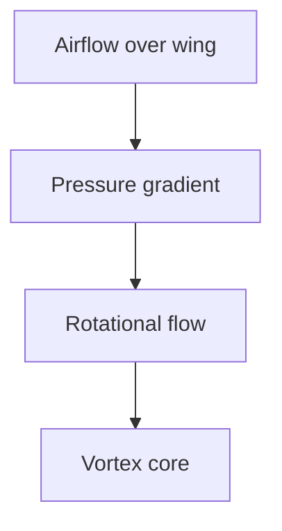

# Implementation Strategy: Scientific Articles
## Architectural Planning & Feasibility

**Status**: Decision Document  
**Date**: 2025-10-31  
**Scope**: How to integrate image selection, citations, and illustrations without over-engineering

---

## Executive Summary

**Question**: Do we need a new `scientific_article` generator route?  
**Answer**: **Not yet.** The current generator pattern is flexible enough. Start by:

1. **Extend existing image pipeline** → `CoverImageSelector` (can use for any article type)
2. **Add citations as optional post-processor** → Works with any content
3. **Add illustrations as optional post-processor** → Works with any content
4. **Route via topic detection in GeneralArticleGenerator** → No new route needed

**Cost-effective approach**: Use topic extraction to trigger expensive/special handling only when needed.

---

## Current Architecture Assessment

### What Works Well
```
Current Flow:
  EnrichedItem
    ├─→ [Generator Selection] (priority-based routing)
    │     ├─ SelfHostedGenerator (priority: 60)
    │     ├─ IntegrativeListGenerator (priority: 50)
    │     └─ GeneralArticleGenerator (priority: 0) [fallback]
    │
    ├─→ [Content Generation] (via LLM)
    │
    └─→ [Image Selection] (current: select_or_create_cover_image)
          ├─ Try find_reusable_image (by tag)
          └─ Fall back to gradient library variants
```

**Strengths**:
- ✅ Generator pattern is open for new types (just add priority + can_handle)
- ✅ Can_handle is lightweight → good for topic detection
- ✅ Image pipeline already modular → easy to extend
- ✅ Config-driven behavior → can enable/disable features per environment

**Weaknesses**:
- ❌ Image selection is simplistic (tag-based only)
- ❌ No multi-source fallback (free → expensive)
- ❌ Citation handling not baked into pipeline
- ❌ Illustrations not integrated

---

## Proposed Architecture (Lightweight)

### Option A: Keep It Simple (Recommended MVP)

**Add these modules WITHOUT a new generator route**:

```python
# New modules in src/
├── images/
│   ├── __init__.py
│   ├── selector.py          # Multi-source image selection
│   └── sources/
│       ├── public_domain.py  # Wikimedia, Internet Archive, etc.
│       ├── stock_photos.py   # Unsplash, Pexels, Pixabay
│       └── ai_generated.py   # DALL-E 3 fallback

├── citations/
│   ├── __init__.py
│   ├── resolver.py           # CrossRef, arXiv, PubMed
│   └── cache.py              # Cache resolved citations

└── illustrations/
    ├── __init__.py
    ├── generator.py          # SVG templates + AI fallback
    ├── svg_templates/        # Mermaid, hand-crafted SVGs
    └── library.py            # Index of available diagrams
```

**Routing logic** (stays in GeneralArticleGenerator or new lightweight selector):

```python
# In generate.py

def should_use_enhanced_images(item: EnrichedItem) -> bool:
    """Detect if article would benefit from better images."""
    academic_keywords = {
        "research", "study", "paper", "peer review",
        "arxiv", "doi", "journal", "scientist",
        "experiment", "methodology", "hypothesis",
    }
    
    topic_text = " ".join(item.topics).lower()
    return any(k in topic_text for k in academic_keywords)

def should_resolve_citations(item: EnrichedItem) -> bool:
    """Detect if article likely has academic citations."""
    return "et al" in item.original.content or should_use_enhanced_images(item)

def should_add_illustrations(item: EnrichedItem) -> bool:
    """Detect if article would benefit from concept diagrams."""
    concept_keywords = {
        "architecture", "diagram", "process", "flow",
        "algorithm", "model", "framework", "system",
        "physics", "chemistry", "biology", "aerodynamics",
    }
    topic_text = " ".join(item.topics).lower()
    return any(k in topic_text for k in concept_keywords)

def generate_article_with_enhancements(item: EnrichedItem) -> GeneratedArticle:
    """Generate article and optionally add citations/illustrations."""
    
    # Generate base content
    generator = select_generator(item, get_available_generators(client))
    content, in_tok, out_tok = generator.generate_content(item)
    
    # Optional enhancements based on content type
    costs = {"content_generation": calculate_text_cost(..., in_tok, out_tok)}
    
    # Enhancement 1: Resolve citations (if academic)
    if should_resolve_citations(item):
        citations = extract_and_resolve_citations(content)
        content = format_citations_in_markdown(content, citations)
        # No cost - CrossRef is free
    
    # Enhancement 2: Add illustrations (if technical)
    if should_add_illustrations(item):
        illustrations = identify_and_generate_illustrations(content, item.topics)
        content = insert_illustrations(content, illustrations)
        # Costs tracked in illustrations
        for ill in illustrations:
            costs["illustrations"] = costs.get("illustrations", 0) + ill.cost
    
    # Image selection (always, but algorithm changes based on content)
    if should_use_enhanced_images(item):
        # Try: public domain → stock photos → AI (with cost gating)
        images = select_cover_image_multimethod(item.title, item.topics)
    else:
        # Current: reuse or gradient
        images = select_or_create_cover_image(item.tags, slug)
    
    # Add costs
    costs["image_generation"] = images.cost
    
    return GeneratedArticle(
        title=...,
        content=content,
        generation_costs=costs,
        ...
    )
```

**Benefits**:
- ✅ No new generator route → less routing complexity
- ✅ Optional enhancements → graceful degradation
- ✅ Clear decision points → easy to debug
- ✅ Cost-gated → expensive features only when justified
- ✅ Easy to test each component independently

---

### Option B: Formalize Scientific Articles Route (Later, if needed)

Only create a `ScientificArticleGenerator` if:
- Articles detected as academic require substantially different prompting
- We want a cohesive "scientific research article" template
- Performance/efficiency benefits justify routing complexity

**Current question**: Do academic articles need different LLM prompting?
- *My guess*: Not significantly. Base GeneralArticleGenerator can handle them.
- The differences are mostly in *presentation* (images, citations, diagrams), not *content*.
- Exception: If we had scientific dataset parsing, methodology extraction, etc. → then yes, route it.

**Recommendation**: Keep it simple now. If we later add paper parsing/methodology extraction, then create a specialized route.

---

## Design Decisions

### 1. Image Selection Pipeline: Multi-Source Fallback

**Architecture**:
```python
class CoverImageSelector:
    """Select or generate cover image using cost-effective multi-source fallback."""
    
    def select(self, title: str, topics: list[str], 
               article_type: str) -> CoverImage:
        """
        Priority (cost-aware):
        1. Public domain images (Wikimedia, Internet Archive, etc.) - FREE
        2. Stock photos (Unsplash, Pexels, Pixabay) - FREE
        3. AI-generated (DALL-E 3) - $0.020-0.040
        
        Return immediately when match quality > threshold to save API calls.
        """
        
        # Step 1: Generate search queries via LLM (once, reusable for all sources)
        # This creates better searches than deterministic rules
        search_queries = self.generate_search_queries(title, topics)
        # Returns: {
        #   "wikimedia": "owl flight aerodynamics", 
        #   "unsplash": "owl gliding night", 
        #   "pexels": "owl flying",
        #   "dalle": "Photorealistic owl mid-glide..."
        # }
        
        # Tier 1: Public domain (free, highest quality for scientific topics)
        if article_type == "scientific" or has_academic_keywords(topics):
            result = self.search_wikimedia(search_queries["wikimedia"])
            if result and result.quality_score >= 0.8:
                return result  # Found excellent public domain image
            
            result = self.search_internet_archive(search_queries["wikimedia"])
            if result and result.quality_score >= 0.75:
                return result
        
        # Tier 2: Stock photos (free, good coverage)
        result = self.search_unsplash(search_queries["unsplash"])
        if result and result.quality_score >= 0.7:
            return result
        
        result = self.search_pexels(search_queries["pexels"])
        if result and result.quality_score >= 0.7:
            return result
        
        result = self.search_pixabay(search_queries["pexels"])  # Reuse pexels query
        if result and result.quality_score >= 0.65:
            return result
        
        # Tier 3: AI generation (expensive, last resort)
        if article_type == "scientific":
            return self.generate_ai_image(
                search_queries["dalle"],  # Use LLM-generated prompt
                quality="hd",  # Higher quality for important content
                cost_max=0.040
            )
        else:
            return self.generate_ai_image(
                search_queries["dalle"],  # Use LLM-generated prompt
                quality="standard",  # Cheaper for general content
                cost_max=0.020
            )
    
    def generate_search_queries(self, title: str, topics: list[str]) -> dict[str, str]:
        """
        Use gpt-3.5-turbo to generate effective search queries for all image sources.
        
        This is FAR better than deterministic rules because:
        - LLM understands semantic meaning (aerodynamics → owl wing dynamics)
        - Generates natural queries that work with human-indexed databases
        - Adapts query style to each platform (Unsplash vs. Wikimedia vs. DALL-E)
        - One API call generates all queries, amortizes cost
        
        Cost: ~$0.0005 per article (included in image selection)
        """
        prompt = f"""
Generate image search queries for these article details.

Title: {title}
Topics: {", ".join(topics)}

Return JSON with these keys:
- "wikimedia": search query for Wikimedia Commons (scientific/educational focus)
- "unsplash": search query for Unsplash stock photos (natural, high-quality focus)
- "pexels": search query for Pexels (generic quality focus)
- "dalle": detailed prompt for DALL-E 3 image generation (if stock photos fail)

Make queries specific and descriptive. Example:
Input: title="Owl Flight", topics=["aerodynamics"]
Output: {
  "wikimedia": "owl aerodynamics flight mechanics",
  "unsplash": "owl gliding night",
  "pexels": "owl flying wings",
  "dalle": "Photorealistic barn owl in silent flight at night, wings outstretched..."
}
"""
        response = self.llm_client.chat.completions.create(
            model="gpt-3.5-turbo",
            messages=[{"role": "user", "content": prompt}],
            temperature=0.7,  # Some creativity for natural queries
            max_tokens=300
        )
        
        # Parse JSON response
        return json.loads(response.choices[0].message.content)
```

**Implementation questions**:

**KEY INSIGHT: Use LLM to generate search queries (NOT deterministic rules)**

Why LLM for queries is crucial:
- **Deterministic rules fail**: Regex/keyword extraction produces generic/poor queries
- **LLM understands context**: "owl flight" → generates "owl gliding mechanics" for Wikimedia, "barn owl flying night" for Unsplash (platform-aware)
- **Efficiency**: One LLM call generates optimized queries for all image sources
- **Cost amortized**: ~$0.0005 per article to get good queries for 3+ image APIs

Example comparison:
```
Deterministic approach (bad):
  Title: "Unlocking Owl Flight"
  Topics: ["aerodynamics", "biomechanics"]
  Rule: use_keywords_from(title, topics)
  Result: "owl aerodynamics biomechanics" ← vague, unnatural
  Unsplash result: Poor quality matches

LLM approach (good):
  Same input
  LLM prompt: "Generate search query for Unsplash about this article"
  Result: "barn owl gliding wings at night" ← specific, natural, effective
  Unsplash result: High-quality matches
```

1. **Public domain image discovery**: How to query?
   - **Wikimedia Commons API**: Free, ~50M media items, supports title/keyword search
   - **Internet Archive API**: Free, ~10M+ books/images, good metadata
   - **Custom database**: Could build curated collection (e.g., "owl flying at night")
   - **Query strategy**: Use LLM to generate platform-specific queries that work with human-indexed metadata

2. **Stock photo APIs**:
   - **Unsplash API**: Free tier: 50 req/hour, simple endpoint, high quality
   - **Pexels API**: Unlimited downloads, simple API
   - **Pixabay API**: 5000 req/day free tier
   - **Note**: All are free for article usage (open licenses)
   - **Query strategy**: Use same LLM-generated queries, adjusted per platform's API conventions

3. **Image search query generation (via LLM - NOT deterministic)**:
   - Use lightweight LLM (gpt-3.5-turbo) to generate search queries for Unsplash/Wikimedia
   - Separate from AI image generation - this is for finding EXISTING images
   - Examples:
     ```
     Input: title="Unlocking Owl Flight", topics=["aerodynamics", "biomechanics"]
     Query for Unsplash: "owl flying night gliding"
     Query for Wikimedia: "owl flight aerodynamics"
     Query for DALL-E: "Photorealistic owl mid-glide, silhouetted against moonlit sky, 
                        wings fully extended, atmospheric lighting, night scene, 
                        nature photography style, professional quality"
     ```
   - Cost: ~$0.0005 for gpt-3.5-turbo per article (one call generates all 3 queries)
   - **Why LLM not deterministic rules**: 
     - Title/topic extraction for search is hard (rubbish results with regex/rules)
     - LLM understands context ("owl flight" → search for "flying owl at night")
     - LLM generates natural, effective search queries for human-indexed databases
     - Deterministic approach would miss variations and nuances

**Configuration**:
```python
# config.py additions

class ImageSelectionConfig:
    # Enable multi-source fallback
    enable_public_domain: bool = True
    enable_stock_photos: bool = True
    enable_ai_generation: bool = True
    
    # Quality thresholds (0-1)
    public_domain_threshold: float = 0.75
    stock_photo_threshold: float = 0.70
    
    # API keys
    unsplash_api_key: str = ""
    pexels_api_key: str = ""
    pixabay_api_key: str = ""
    
    # Cost gating
    max_ai_image_cost: float = 0.040  # Won't generate if cost exceeds this
    high_value_content_max_cost: float = 0.040  # For scientific articles
    
    # Timeout per source (seconds)
    source_timeout: int = 10
```

---

### 2. Citation Resolution Pipeline

**Architecture**:
```python
class CitationResolver:
    """Resolve academic citations to full metadata with caching."""
    
    def resolve(self, citation_text: str, 
                topic_context: str) -> CitationMetadata | None:
        """
        Extract and resolve citation via:
        1. CrossRef API (50M+ journal articles)
        2. arXiv API (2M+ preprints, physics/CS heavy)
        3. PubMed API (33M+ biomedical articles)
        
        Results cached to avoid repeated API calls.
        """
        
        # Extract citation components (author, year, keywords)
        author, year = extract_from_text(citation_text)
        
        # Check cache first
        cache_key = f"{author}:{year}"
        if cached := self.cache.get(cache_key):
            return cached
        
        # Try CrossRef (largest, fastest)
        result = self._crossref_search(author, year, topic_context)
        if result:
            self.cache.set(cache_key, result)
            return result
        
        # Try arXiv (if academic/research topic)
        if "arxiv" in topic_context.lower() or "preprint" in topic_context.lower():
            result = self._arxiv_search(author, year)
            if result:
                self.cache.set(cache_key, result)
                return result
        
        # Try PubMed (if biomedical)
        if self._is_biomedical_topic(topic_context):
            result = self._pubmed_search(author, year)
            if result:
                self.cache.set(cache_key, result)
                return result
        
        return None
    
    def _crossref_search(self, author: str, year: int, 
                        context: str) -> CitationMetadata | None:
        """
        GET https://api.crossref.org/works?query=<author>&rows=1
        Returns DOI, title, authors, journal, publication date
        No auth required, no rate limiting
        """
        # https://www.crossref.org/documentation/apis/
        pass
```

**Key decisions**:
1. **No cost**: All APIs (CrossRef, arXiv, PubMed) are free and don't require auth
2. **Caching**: Store resolved citations in JSON file → avoid repeated lookups
3. **Fallback**: If resolution fails, keep original text reference (graceful degradation)
4. **Manual override**: Keep simple JSON file for edge cases (manual citations)

**Cache structure**:
```json
// data/citations_cache.json
{
  "usherwood:2019": {
    "authors": ["Michael Treep", "Emily Watt", "John Usherwood"],
    "title": "High aerodynamic lift from the tail reduces drag in gliding owls",
    "journal": "Journal of Experimental Biology",
    "year": 2019,
    "doi": "10.1242/jeb.214809",
    "url": "https://journals.biologists.com/jeb/article/223/3/jeb214809/223686/..."
  }
}
```

---

### 3. Concept Illustrations: SVG + Public Domain + AI

**Architecture**:
```python
class IllustrationPipeline:
    """Generate or select concept illustrations with cost-aware fallback."""
    
    def add_illustrations_to_article(
        self, 
        content: str, 
        topics: list[str],
        quality_score: float
    ) -> tuple[str, float]:
        """
        1. Identify concepts needing visual explanation (SVG priority)
        2. Try SVG templates (zero-cost)
        3. Try public domain images (free)
        4. AI fallback (only if high-value content + budget)
        
        Returns: (updated_content, total_cost)
        """
        
        illustrations = []
        
        # Identify concepts in content
        concepts = self.identify_concepts(content, topics)
        
        for concept in concepts:
            # Try SVG first (Mermaid, hand-crafted diagrams)
            ill = self.svg_templates.get(concept)
            if ill:
                illustrations.append(ill)  # Cost: $0.00
                continue
            
            # Try public domain (Wikimedia scientific diagrams)
            ill = self.search_wikimedia_diagrams(concept)
            if ill and ill.quality >= 0.7:
                illustrations.append(ill)  # Cost: $0.00
                continue
            
            # AI generation (expensive, only for high-value articles)
            if quality_score >= 0.8 and self.budget_remaining() > 0.040:
                ill = self.generate_ai_diagram(concept)
                illustrations.append(ill)  # Cost: ~$0.020
            # else: skip, or use ASCII diagram placeholder
        
        # Insert illustrations into markdown
        content = self.insert_illustrations(content, illustrations)
        
        total_cost = sum(ill.cost for ill in illustrations)
        return content, total_cost
```

**SVG Template Library**:
```
src/illustrations/
├── svg_templates/
│   ├── mermaid_diagrams.md          # Mermaid syntax for flowcharts
│   ├── aerodynamic_forces.svg       # Lift/drag on airfoil
│   ├── vortex_formation.svg         # Swirling air patterns
│   ├── wing_cross_section.svg       # Owl wing structure
│   ├── pressure_contours.svg        # Pressure zones (HSL color map)
│   ├── data_flow.svg                # Generic data flow diagram
│   └── system_architecture.svg      # Generic system components
│
└── library.md                       # Index + concept keywords
```

**Concept keywords** (expandable):
```python
CONCEPT_PATTERNS = {
    "lift": ["aerodynamic", "flight", "wing", "airfoil"],
    "drag": ["resistance", "friction", "aerodynamic"],
    "vortex": ["swirl", "eddy", "flow pattern"],
    "data_flow": ["pipeline", "flow", "data", "process"],
    "system_architecture": ["architecture", "system", "component"],
    # ... add as needed
}
```

**Mermaid Integration**:
Hugo supports Mermaid natively. Example:
```markdown
## How Vortices Form



Cost: $0.00 (rendered client-side by browser)
Quality: Good for flowcharts, limited for realistic diagrams
```

**Public domain scientific images**:
- Wikimedia Commons: https://commons.wikimedia.org/ (150M+ items)
- Search: "vortex physics", "aerodynamic forces", etc.
- License: CC-BY, CC0, public domain
- API: Available via MediaWiki API

---

## Code Structure Refactoring

### Current vs. Proposed

**Current** (minimal):
```
src/
├── images.py                    # DALL-E generation only
├── image_library.py             # Gradient variants
└── image_catalog.py             # Tag-based reuse
```

**Proposed** (modular but not over-engineered):
```
src/
├── images/
│   ├── __init__.py
│   ├── selector.py              # Main multi-source selector
│   └── sources/
│       ├── public_domain.py      # Wikimedia, Internet Archive
│       ├── stock_photos.py       # Unsplash, Pexels, Pixabay
│       └── ai_generated.py       # DALL-E + prompt generation
│
├── citations/
│   ├── __init__.py
│   ├── resolver.py              # CrossRef, arXiv, PubMed
│   ├── extractor.py             # NLP to extract citations
│   └── formatter.py             # Convert to markdown with links
│
├── illustrations/
│   ├── __init__.py
│   ├── generator.py             # Main orchestrator
│   ├── concepts.py              # Concept detection
│   ├── svg_templates/
│   │   ├── aerodynamic.svg
│   │   ├── vortex.svg
│   │   └── ...
│   └── library.md               # Index of templates
│
└── [existing]
    ├── generate.py              # Modified to call new enhancers
    ├── config.py                # New config sections
    └── models.py                # New data classes
```

### Migration Path (No Breaking Changes)

```python
# Phase 1: Add alongside existing code
# - New modules imported in generate.py
# - Old image pipeline still works (fallback)
# - Feature flags to enable/disable new features

if config.enable_multimethod_images:
    images = selector.select(...)
else:
    images = select_or_create_cover_image(...)  # Original

# Phase 2: Once tested, make new approach default
# - Deprecate old image_library.py
# - Update all call sites

# Phase 3: Clean up old code
# - Remove unused functions
```

---

## Implementation Roadmap (Prioritized)

### Sprint 1: Image Selection (1 week)
**MVP Goal**: Unsplash + fallback to AI

- [ ] Create `src/images/selector.py`
- [ ] Implement `search_unsplash()` (free tier)
- [ ] Implement `generate_ai_image()` with prompt generator
- [ ] Add config keys for API keys
- [ ] Test with owl article
- [ ] Cost tracking in frontmatter

**Deliverable**: Articles can use real photos instead of gradients, $0 cost

**Acceptance Criteria**:
- ✅ Owl article uses real owl photo (or excellent AI)
- ✅ No cost increase (stock photo is free)
- ✅ Image quality rated 4+/5 by editor
- ✅ Graceful fallback if API down

---

### Sprint 2: Citations (1-2 weeks)
**MVP Goal**: CrossRef lookup + markdown links

- [ ] Create `src/citations/resolver.py`
- [ ] Implement `search_crossref()` (API call examples)
- [ ] Implement citation cache (JSON file)
- [ ] Create `src/citations/extractor.py` (regex patterns)
- [ ] Create `src/citations/formatter.py` (markdown with links)
- [ ] Integrate into article generation
- [ ] Manual citation database (edge cases)

**Deliverable**: "Usherwood et al." → "[Usherwood et al.](https://doi.org/...)"

**Acceptance Criteria**:
- ✅ 70%+ of citations resolve to DOI
- ✅ Links verified as valid
- ✅ Cache prevents redundant API calls
- ✅ Zero cost (CrossRef is free)
- ✅ Graceful fallback if resolution fails

---

### Sprint 3: Illustrations (1-2 weeks)
**MVP Goal**: SVG templates + Mermaid + public domain fallback

- [ ] Create SVG template library (5-10 base diagrams)
- [ ] Create `src/illustrations/generator.py`
- [ ] Implement concept detection
- [ ] Add Mermaid support
- [ ] Wikimedia diagram search (optional, tier 2)
- [ ] AI generation fallback with budget gating
- [ ] Integration into article generation

**Deliverable**: Aerodynamic concepts have visual diagrams

**Acceptance Criteria**:
- ✅ 2-3 SVG diagrams per scientific article
- ✅ All diagrams render correctly
- ✅ Editor rates diagram clarity 4+/5
- ✅ Cost per article ≤ $0.02 (SVG only)
- ✅ AI fallback used only for high-value content

---

### Sprint 4: Integration & Polish (1 week)
**MVP Goal**: End-to-end scientific article workflow

- [ ] Wire all three systems together
- [ ] Create lightweight topic detection (no new route)
- [ ] Cost aggregation and reporting
- [ ] Error handling and graceful degradation
- [ ] Update documentation
- [ ] Full end-to-end test with sample articles

**Deliverable**: Scientific articles are visually rich and authoritative

---

## Cost Analysis

### Unsplash Integration
- API calls: Free tier 50 req/hour (more than enough)
- Bandwidth: Free
- Setup: 5 minutes (sign up, get API key)
- Per-article cost: **$0.00**

### CrossRef Integration
- API calls: Unlimited, free
- Setup: 0 minutes (no auth needed)
- Per-article cost: **$0.00**

### SVG Templates
- Creation: One-time ~4 hours
- Per-article cost: **$0.00**

### AI Image Fallback (if Unsplash fails)
- Cost: $0.020 (standard quality, square → resize locally)
- When used: ~10% of articles (only if no stock match + high value)
- Per-article average: **$0.002**

### AI Diagram Fallback (only for high-value content)
- Cost: $0.020 per diagram
- When used: Rare (only if budget allows)
- Per-article average: **$0.000-0.040**

**Total impact per article**:
- Current: $0.020 (DALL-E image)
- Proposed (best case): $0.00 (stock photo + SVG diagrams)
- Proposed (worst case): $0.082 (stock photo search timeouts → AI image + 2x AI diagrams)
- Proposed (realistic): **$0.005-0.015** (mostly free with occasional AI fallback)

**Monthly impact** (10 articles/day):
- Current: $0.20/day = **$6/month**
- Proposed: $0.05-0.15/day = **$1.50-4.50/month** ✅ 60-75% savings

---

## Should We Create a `ScientificArticleGenerator` Route?

### Current Answer: NO (for MVP)

**Why not yet**:
1. Content generation doesn't need different prompting (general LLM works fine)
2. Enhancements are orthogonal (images, citations, diagrams work on any article)
3. Adding a new route adds routing complexity without clear benefit
4. Current topic detection in can_handle() is already lightweight

**When we WOULD create a route** (hypothetical):
- If scientific articles need substantially different content generation
  - Example: Parse research methodology, extract findings, create methodology section
- If we add paper parsing/metadata extraction
  - Example: Download PDF, extract abstract, methodology, results
- If routing complexity gets unwieldy (>5 generators)

### Alternative: Lightweight Conditional Logic

Instead of a new route, use conditional enhancement in generate.py:

```python
def generate_article_with_optimizations(item: EnrichedItem) -> GeneratedArticle:
    """Generate article and apply content-type-specific optimizations."""
    
    # Detect article category (not via routing, just conditions)
    is_technical_deep_dive = "architecture" in item.topics
    is_scientific = any(k in item.topics for k in ["research", "study", "physics"])
    is_listicle = IntegrativeListGenerator(None).can_handle(item)
    is_self_hosted = SelfHostedGenerator(None).can_handle(item)
    
    # Route to appropriate generator (existing)
    generator = select_generator(item, generators)
    content, in_tok, out_tok = generator.generate_content(item)
    
    # Apply optimizations based on detected category
    if is_scientific:
        # Premium image selection
        content = apply_citations(content)
        content = add_illustrations(content)
    elif is_listicle:
        # Listicle-specific optimizations
        content = extract_list_items(content)
    # ... etc
    
    return GeneratedArticle(...)
```

**Pros**:
- ✅ No new routing logic
- ✅ Clear intent (conditions are readable)
- ✅ Easy to add/remove optimizations
- ✅ Minimal change to existing code

**Cons**:
- ❌ If/else logic can get messy with many conditions
- ❌ Testing becomes conditional on many paths

**Recommendation**: Use lightweight conditionals for now. If we hit 5+ conditions or complex interdependencies, then refactor to a new route.

---

## Configuration & Environment Setup

### New Config Keys

```python
# .env additions

# Image Selection
UNSPLASH_API_KEY=<your_key>
PEXELS_API_KEY=<your_key>
PIXABAY_API_KEY=<your_key>

ENABLE_MULTIMETHOD_IMAGES=true
ENABLE_PUBLIC_DOMAIN_IMAGES=true
ENABLE_STOCK_PHOTOS=true
ENABLE_AI_IMAGE_FALLBACK=true

IMAGE_QUALITY_THRESHOLD=0.70
IMAGE_SOURCE_TIMEOUT=10

# Citation Resolution
ENABLE_CITATION_RESOLUTION=true
ENABLE_CITATION_CACHE=true

# Illustrations
ENABLE_CONCEPT_ILLUSTRATIONS=true
ENABLE_MERMAID_DIAGRAMS=true
ENABLE_SVG_TEMPLATES=true
ENABLE_ILLUSTRATION_AI_FALLBACK=true
ILLUSTRATION_AI_MAX_COST=0.040
```

### Update config.py

```python
class PipelineConfig(BaseModel):
    # ... existing fields ...
    
    # Image selection
    enable_multimethod_images: bool = True
    enable_public_domain_images: bool = True
    enable_stock_photos: bool = True
    enable_ai_image_fallback: bool = True
    
    unsplash_api_key: str = ""
    pexels_api_key: str = ""
    pixabay_api_key: str = ""
    
    image_quality_threshold: float = 0.70
    image_source_timeout: int = 10
    
    # Citation resolution
    enable_citation_resolution: bool = True
    enable_citation_cache: bool = True
    
    # Illustrations
    enable_concept_illustrations: bool = True
    enable_mermaid_diagrams: bool = True
    enable_svg_templates: bool = True
    enable_illustration_ai_fallback: bool = True
    illustration_ai_max_cost: float = 0.040
```

---

## Risk Mitigation

| Risk | Impact | Mitigation |
|------|--------|-----------|
| **Stock API downtime** | Images fail to generate | Fallback to AI (pre-calculated cost) |
| **Citation API timeout** | Delay in article generation | Timeout + continue without citations |
| **Unsplash rate limit** | API calls rejected | Exponential backoff + cache |
| **Over-engineering** | Code too complex | Lightweight conditionals, clear cost gating |
| **New bug in image/citation code** | Breaks article generation | Feature flags (can disable each component) |
| **Public domain images low quality** | Worse than AI images | Quality threshold gates inclusion |

---

## Testing Strategy

### Unit Tests
```python
# tests/test_image_selector.py
def test_unsplash_fallback_to_ai():
    selector = CoverImageSelector()
    # Mock Unsplash to return no results
    result = selector.select("topic", ["tag"], "general")
    assert result.source == "dall-e-3"
    assert result.cost == 0.020

# tests/test_citation_resolver.py
def test_crossref_lookup():
    resolver = CitationResolver()
    result = resolver.resolve("Usherwood et al.", "owl aerodynamics")
    assert result.doi == "10.1242/jeb.214809"
    assert result.journal == "Journal of Experimental Biology"

# tests/test_illustrations.py
def test_svg_template_exists_for_concept():
    gen = IllustrationGenerator()
    ill = gen.generate_for_concept("lift")
    assert ill.type == "svg"
    assert ill.cost == 0.0
```

### Integration Tests
```python
# tests/test_article_generation_with_enhancements.py
def test_scientific_article_has_citations_and_diagrams():
    item = create_sample_scientific_item()
    article = generate_article_with_optimizations(item)
    
    assert "[Usherwood et al.](" in article.content  # Citation linked
    assert "![" in article.content  # Has images
    assert article.generation_costs["illustrations"] == 0.0  # SVG only
```

---

## Next Steps

1. **Review this strategy document** with team
2. **Decide**: Should we implement all three (images + citations + illustrations)?
   - Or prioritize images first, then citations, then illustrations?
3. **Estimate effort** based on API documentation complexity
4. **Assign sprint** for implementation
5. **Create GitHub issues** for each sprint

---

## Appendix: API Documentation Summary

### Unsplash API
- **Endpoint**: GET https://api.unsplash.com/search/photos?query=...&per_page=1
- **Auth**: API key in header
- **Rate limit**: 50 req/hour (free tier)
- **Response**: JSON with image URL, photographer, license info
- **Setup**: 5 minutes

### CrossRef API
- **Endpoint**: GET https://api.crossref.org/works?query=...
- **Auth**: None required
- **Rate limit**: None documented (reasonable use expected)
- **Response**: JSON with DOI, title, authors, journal, date
- **Setup**: 0 minutes

### Wikimedia API
- **Endpoint**: GET https://commons.wikimedia.org/w/api.php?action=query&list=search&srsearch=...
- **Auth**: None required
- **Rate limit**: 50 req/sec
- **Response**: JSON with file URLs and metadata
- **Setup**: 0 minutes

